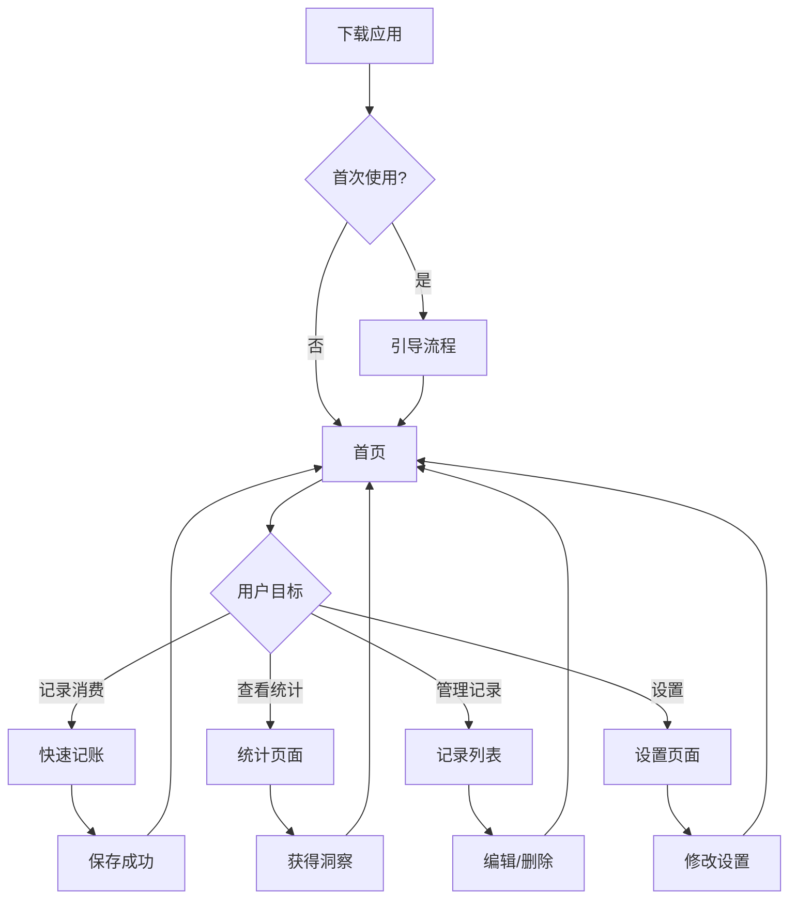
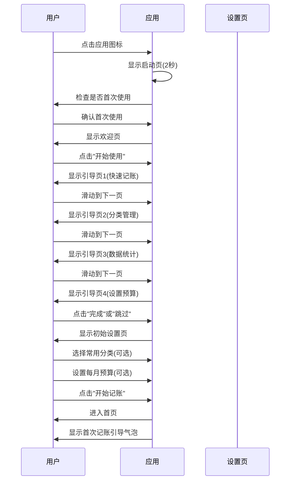
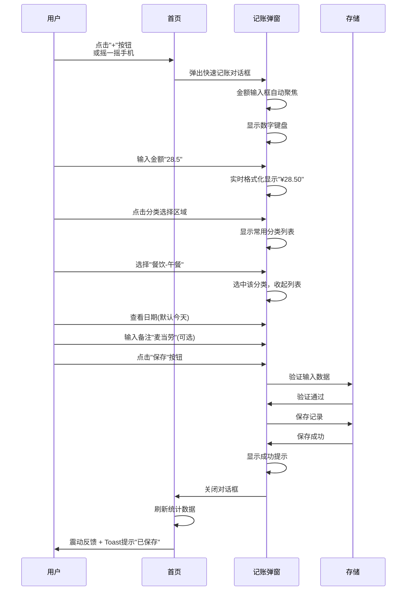
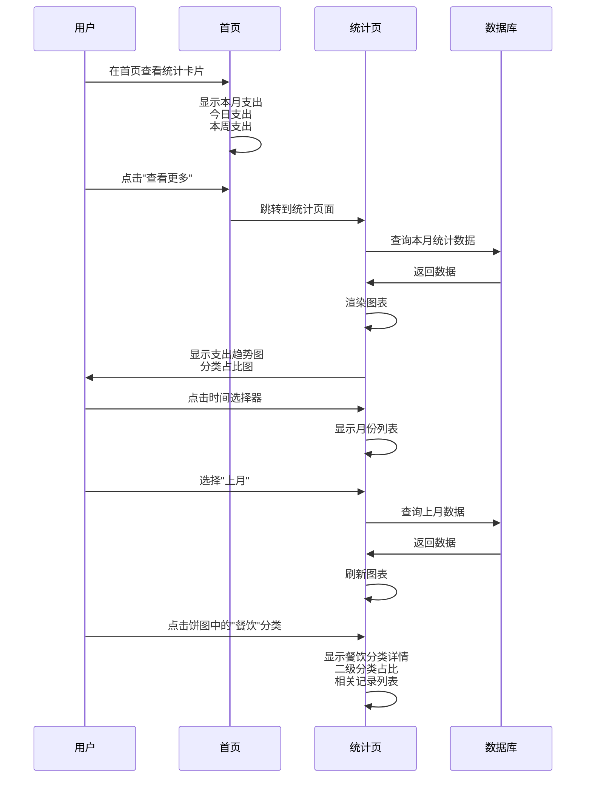
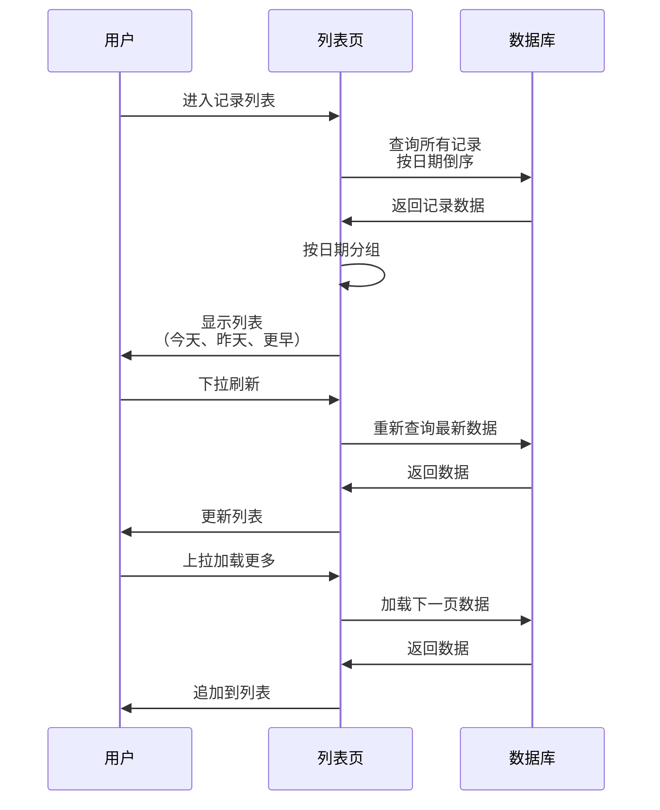
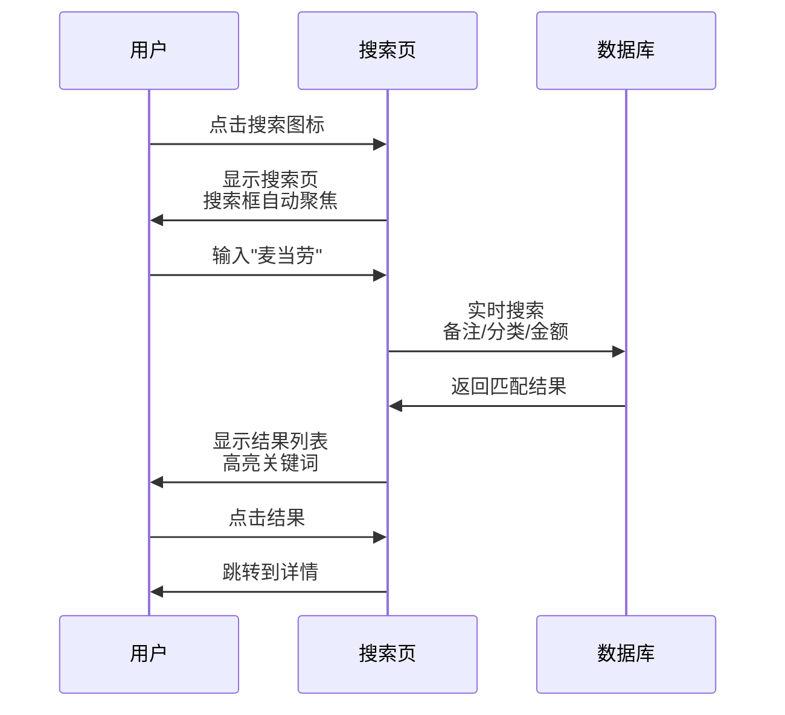

# 用户流程设计

## 1. 用户流程概述

本文档详细描述"账单通"的主要用户场景和完整的交互流程，包括首次使用流程、日常记账流程、数据查看流程等关键场景。

---

## 2. 核心用户流程图

### 2.1 整体用户旅程



---

## 3. 首次使用流程

### 3.1 流程图



### 3.2 流程详细说明

#### 步骤1：启动应用
**触发条件**：用户点击桌面图标

**系统行为**：
1. 显示启动页（Logo + 动画，持续2秒）
2. 检查本地存储，判断是否首次使用
3. 如果首次使用，进入引导流程；否则直接进入首页

**界面元素**：
- 屏幕中央：应用Logo
- 背景：品牌主题色
- 动画：淡入淡出效果

**预期时间**：2秒

---

#### 步骤2：欢迎页
**触发条件**：首次启动应用

**界面元素**：
- 顶部：应用Logo + 名称"账单通"
- 中部：Slogan"记一笔，懂生活"
- 底部：大按钮"开始使用" + 小文字"已有账号？登录"

**用户操作**：点击"开始使用"

**系统反馈**：滑动到引导页1

---

#### 步骤3：功能引导（4页）
**展示内容**：

**第1页 - 快速记账**：
- 标题："3秒完成一笔记录"
- 插图：用户点击"+"按钮输入金额的场景
- 说明："点击右下角+号，输入金额和分类，即可快速记录"
- 页面指示器：●○○○

**第2页 - 分类管理**：
- 标题："智能分类，一目了然"
- 插图：分类列表和图标的展示
- 说明："预设常用分类，也支持自定义，让账目更清晰"
- 页面指示器：○●○○

**第3页 - 数据统计**：
- 标题："洞察消费习惯"
- 插图：饼图和折线图的展示
- 说明："直观的图表展示，让你看懂每一分钱的去向"
- 页面指示器：○○●○

**第4页 - 设置预算**（可选）：
- 标题："控制支出，理性消费"
- 插图：预算进度条的展示
- 说明："设置每月预算，超额提醒，助你养成好习惯"
- 页面指示器：○○○●
- 底部按钮："开始使用"

**用户操作**：
- 左右滑动查看各页
- 点击"跳过"直接进入初始设置
- 最后一页点击"开始使用"

---

#### 步骤4：初始设置
**触发条件**：完成引导或点击"跳过"

**界面元素**：
- 标题："快速开始"
- 副标题："选择你常用的分类（可多选）"
- 分类列表：显示预设分类（复选框样式）
- 预算输入框："设置每月预算（可选）"
- 按钮："完成设置"

**用户操作**：
1. 勾选3-5个常用分类（可选）
2. 输入预算金额（可选，如"5000"）
3. 点击"完成设置"

**系统行为**：
1. 保存用户选择的常用分类
2. 保存预算设置
3. 跳转到首页

---

#### 步骤5：首次记账引导
**触发条件**：进入首页后

**界面元素**：
- 首页正常显示
- 右下角"+"按钮上方显示气泡提示："点击这里记一笔"

**用户操作**：点击气泡或"+"按钮

**系统行为**：
1. 气泡消失
2. 弹出快速记账对话框
3. 金额输入框自动聚焦

---

### 3.3 异常流程处理

| 异常情况 | 处理方式 |
|----------|----------|
| 用户中途退出应用 | 下次启动时继续引导流程 |
| 引导页卡住或崩溃 | 重启应用后重新开始引导 |
| 初始设置失败 | 提供默认设置，允许后续修改 |

---

## 4. 日常记账流程

### 4.1 快速记账流程



### 4.2 详细步骤说明

#### 步骤1：打开记账界面
**触发方式**：
- 点击首页右下角悬浮"+"按钮
- 摇一摇手机（需在设置中开启）
- 首页下拉快捷操作（可选）

**界面状态**：
- 弹出对话框（从底部向上滑入）
- 背景模糊化
- 金额输入框自动聚焦
- 弹出数字键盘

**响应时间**：< 200ms

---

#### 步骤2：输入金额
**界面元素**：
- 金额显示区：大字体、居中、初始显示"¥0.00"
- 数字键盘：0-9、小数点、删除键

**用户操作**：
1. 点击数字键输入金额
2. 支持小数点（自动添加）
3. 点击删除键修改

**系统行为**：
- 实时格式化显示（千分位分隔符）
- 限制小数点后最多2位
- 最大金额：999,999.99

**输入示例**：
- 输入"285" → 显示"¥2.85"
- 输入"2850" → 显示"¥28.50"
- 输入"28500" → 显示"¥285.00"

---

#### 步骤3：选择分类
**界面元素**：
- 分类选择区：金额下方
- 常用分类：横向滚动图标列表（显示5个）
- "更多"按钮：查看所有分类

**用户操作**：
1. 点击分类区域
2. 显示常用分类列表（如果设置了常用分类）
3. 或显示所有分类列表（按使用频率排序）
4. 点击选择分类
5. 支持搜索分类（顶部搜索框）

**系统行为**：
- 高亮显示已选分类
- 自动收起分类列表
- 记住分类选择频率，下次优先显示

**分类列表设计**：
- 网格布局：每行4个
- 每项：图标 + 分类名
- 支持二级分类展示

---

#### 步骤4：确认日期和添加备注
**日期选择**：
- 默认值：当前日期和时间
- 显示格式："今天 12:30"
- 点击可修改：
  - 日期选择器
  - 时间选择器
  - "今天"、"昨天"快捷选项

**备注输入**：
- 输入框：单行文本
- 占位符："添加备注（可选）"
- 最多50字
- 显示剩余字数

**支付方式**（可选）：
- 默认值：上次使用的支付方式
- 选项：微信支付、支付宝、现金、信用卡、其他
- 显示位置：备注下方，小图标

---

#### 步骤5：保存记录
**触发条件**：点击"保存"按钮

**系统验证**：
1. 金额必填且 > 0
2. 分类必选
3. 日期有效

**验证失败**：
- 金额为空：震动 + 红色提示"请输入金额"
- 未选分类：震动 + 红色提示"请选择分类"

**验证通过**：
1. 保存到本地数据库
2. 记录创建时间和修改时间
3. 关联分类、支付方式

**保存成功**：
- 对话框关闭（向下退出动画）
- 震动反馈（100ms）
- Toast提示："已保存 ¥28.50"
- 首页统计数据自动更新

**响应时间**：< 300ms

---

### 4.3 异常流程处理

| 异常情况 | 处理方式 |
|----------|----------|
| 输入非法字符 | 自动过滤，只接受数字和小数点 |
| 金额超出限制 | 提示"金额不能超过999,999.99" |
| 保存失败 | 提示"保存失败，请重试"，保留输入内容 |
| 分类数据加载失败 | 显示基础分类列表，提示"部分分类未加载" |

---

## 5. 查看统计流程

### 5.1 统计概览流程



### 5.2 详细步骤说明

#### 步骤1：首页概览
**界面元素**：
- **本月支出卡片**：
  - 大数字："¥3,245.80"
  - 对比标签："↓ 12% 较上月"（绿色表示减少）
  - 预算进度：如果设置了预算

- **今日支出卡片**：
  - 数字："¥128.00"
  - 对比："+¥35 vs 昨日"（红色表示增加）

- **本周支出卡片**：
  - 数字："¥856.50"
  - 对比："+¥45 vs 上周"

- **分类排行**：
  - 第1名：餐饮 ¥1,200 (37%)
  - 第2名：交通 ¥500 (15%)
  - 第3名：购物 ¥450 (14%)

**用户操作**：
- 左右滑动切换月份
- 点击卡片查看详情
- 点击"查看更多"进入统计页

---

#### 步骤2：进入统计页
**触发条件**：点击首页"查看更多"或底部导航"统计"

**页面结构**：
```
┌─────────────────────────────┐
│  统计                        │
├─────────────────────────────┤
│  [本月 ▼]                   │ ← 时间选择器
├─────────────────────────────┤
│  本月支出                    │
│  ¥3,245.80                  │
│  ↓ 12% vs 上月              │
├─────────────────────────────┤
│  ┌─────────────────────┐   │
│  │   支出趋势（折线图）  │   │
│  │                     │   │
│  └─────────────────────┘   │
├─────────────────────────────┤
│  ┌─────┐ ┌─────┐ ┌─────┐   │
│  │ 饼图 │ │柱状图│ │列表  │   │ ← Tab切换
│  └─────┘ └─────┘ └─────┘   │
│  ┌─────────────────────┐   │
│  │   分类占比（环形图）  │   │
│  └─────────────────────┘   │
│  餐饮  37%  ¥1,200         │
│  交通  15%  ¥500          │
│  ...                       │
└─────────────────────────────┘
```

**用户操作**：
1. 点击时间选择器切换月份
2. 点击Tab切换图表类型
3. 点击图表元素查看详情

---

#### 步骤3：查看趋势图
**图表类型**：
- **日视图**：近30天每日支出（折线图）
- **周视图**：近12周每周支出（柱状图）
- **月视图**：近12月每月支出（柱状图）

**交互功能**：
- 点击数据点：显示当天/周/月的详细信息
- 双指缩放：放大/缩小查看
- 左右拖动：查看更多历史数据
- 长按：高亮显示该点数据

**信息展示**：
- 标题："支出趋势"
- 副标题："近30天"
- Y轴：金额（0 - 最大值）
- X轴：日期/周/月
- 数据点：圆点，带数值标注

---

#### 步骤4：查看分类占比
**饼图/环形图展示**：
- 中心文字：总支出金额
- 环形区块：各分类占比
- 颜色：每个分类使用不同颜色
- 图例：右侧或底部显示

**交互功能**：
1. 点击饼图区块：
   - 高亮该区块
   - 显示详情卡片
   - 详情包含：
     * 分类名称
     * 金额和占比
     * 记录数量
     * 平均每笔金额

2. 点击详情卡片：
   - 钻取到二级分类
   - 或显示该分类的所有记录

**列表视图**：
- 按金额降序排列
- 每项显示：
  * 图标 + 分类名
  * 金额和占比
  * 进度条（可视化占比）
- 点击查看该分类的记录列表

---

### 5.3 异常流程处理

| 异常情况 | 处理方式 |
|----------|----------|
| 某月无数据 | 显示"该月暂无记录"，提示记录第一笔 |
| 图表渲染失败 | 显示错误提示，提供刷新按钮 |
| 数据加载慢 | 显示Loading动画 |
| 分类过多 | 合并小分类为"其他"，或提供分页 |

---

## 6. 记录管理流程

### 6.1 查看记录列表



### 6.2 列表页面设计

**界面结构**：
```
┌─────────────────────────────┐
│  < 记录          [搜索图标]  │
├─────────────────────────────┤
│  [今天] 5笔  ¥128.00       │ ← 日期分组标题
│  ┌─────────────────────┐   │
│  │ [餐饮图标] 麦当劳    │   │
│  │          ¥28.50 12:30│   │
│  └─────────────────────┘   │
│  ┌─────────────────────┐   │
│  │ [交通图标] 地铁       │   │
│  │          ¥5.00 08:20 │   │
│  └─────────────────────┘   │
│  ...                       │
├─────────────────────────────┤
│  [昨天] 8笔  ¥256.00       │
│  ┌─────────────────────┐   │
│  │ [购物图标] 优衣库    │   │
│  │          ¥199.00    │   │
│  └─────────────────────┘   │
│  ...                       │
└─────────────────────────────┘
```

**列表项元素**：
- 左侧：分类图标（40x40px）
- 中间：
  * 分类名称（第一行，左对齐）
  * 备注或时间（第二行，灰色小字）
- 右侧：
  * 金额（红色，大字）
  * 时间（如果是当天显示时间，否则不显示）

**用户操作**：
1. 点击列表项：查看详情
2. 长按列表项：进入编辑/删除菜单
3. 左滑列表项：快捷删除（需确认）
4. 下拉刷新：更新数据
5. 上拉加载：加载更多

---

### 6.3 编辑记录流程

**触发方式**：
- 点击列表项进入详情，再点击"编辑"
- 长按列表项选择"编辑"

**界面设计**：
- 复用快速记账对话框
- 标题改为"编辑记录"
- 预填充现有数据
- 底部按钮：左"取消"，右"保存"

**用户操作**：
1. 修改金额、分类、日期、备注等
2. 点击"保存"
3. 或点击"取消"放弃修改

**系统行为**：
- 验证输入数据
- 更新数据库
- 记录修改时间
- 刷新列表
- 提示"修改成功"

---

### 6.4 删除记录流程

**触发方式**：
- 方式1：长按列表项 → 选择"删除"
- 方式2：进入详情 → 点击"删除"
- 方式3：左滑列表项 → 点击"删除"

**确认对话框**：
```
┌─────────────────────────┐
│  确认删除                │
├─────────────────────────┤
│  确定要删除这条记录吗？   │
│                         │
│  餐饮 - 麦当劳           │
│  ¥28.50                 │
│  2025-01-16             │
│                         │
│  [取消]    [删除]       │
└─────────────────────────┘
```

**删除确认**：
- 点击"删除"按钮
- 震动反馈
- 执行删除操作
- 列表自动刷新
- 提示"已删除"

---

### 6.5 批量操作流程

**触发方式**：长按任意列表项

**界面变化**：
- 顶部显示："已选择 0 项"
- 列表项左侧出现复选框
- 底部出现操作栏：全选、删除

**用户操作**：
1. 点击复选框选择/取消
2. 点击"全选"选择所有
3. 点击"删除"批量删除

**批量删除确认**：
```
┌─────────────────────────┐
│  确认删除                │
├─────────────────────────┤
│  确定要删除 5 条记录吗？  │
│                         │
│  删除后无法恢复          │
│                         │
│  [取消]    [删除]       │
└─────────────────────────┘
```

---

## 7. 搜索流程

### 7.1 搜索交互流程



### 7.2 搜索页面设计

**界面结构**：
```
┌─────────────────────────────┐
│  < 记录                     │
│  ┌─────────────────────┐   │
│  │ 🔍 搜索备注、分类... │   │ ← 搜索框
│  └─────────────────────┘   │
├─────────────────────────────┤
│  搜索历史                   │
│  [麦当劳] [肯德基] [咖啡]   │
│  [清除历史]                 │
├─────────────────────────────┤
│  热门搜索                   │
│  [外卖] [超市] [打车]       │
└─────────────────────────────┘
```

**搜索结果页**：
```
┌─────────────────────────────┐
│  < 记录          [×]        │
│  ┌─────────────────────┐   │
│  │ 🔍 麦当劳            │   │
│  └─────────────────────┘   │
├─────────────────────────────┤
│  找到 3 条相关记录          │
│  ┌─────────────────────┐   │
│  │ [餐饮] <麦当劳>套餐  │   │ ← 高亮关键词
│  │          ¥28.50     │   │
│  │          今天       │   │
│  └─────────────────────┘   │
│  ┌─────────────────────┐   │
│  │ [餐饮] <麦当劳>早餐  │   │
│  │          ¥15.00     │   │
│  │          昨天       │   │
│  └─────────────────────┘   │
│  ...                       │
└─────────────────────────────┘
```

**搜索范围**：
- 备注内容（模糊匹配）
- 分类名称（精确匹配）
- 金额（精确匹配）

**搜索历史**：
- 记录最近10次搜索
- 点击历史快速搜索
- 支持清除历史

**无结果提示**：
- 显示"未找到相关记录"
- 提示"尝试其他关键词"
- 提供清除搜索按钮

---

## 8. 设置流程

### 8.1 设置页面结构

```
┌─────────────────────────────┐
│  < 设置                     │
├─────────────────────────────┤
│  [基本设置]                 │
│    - 货币         CNY >     │
│    - 小数位数      2位 >     │
│    - 每月起始日    1日 >     │
│    - 主题         浅色 >     │
│    - 语言         简体中文 > │
├─────────────────────────────┤
│  [预算管理]                 │
│    - 总预算        ¥5000    │
│    - 分类预算               │
├─────────────────────────────┤
│  [数据管理]                 │
│    - 导出数据               │
│    - 备份数据               │
│    - 恢复数据               │
├─────────────────────────────┤
│  [关于]                     │
│    - 版本         1.0.0     │
│    - 帮助与反馈             │
│    - 隐私政策               │
└─────────────────────────────┘
```

### 8.2 预算设置流程

**总预算设置**：
1. 点击"总预算"
2. 弹出输入框
3. 输入金额（如"5000"）
4. 点击"保存"

**分类预算设置**：
1. 点击"分类预算"
2. 显示所有一级分类列表
3. 每个分类右侧显示预算输入框
4. 输入各分类预算
5. 点击"保存"

**预算提醒设置**：
- 当使用率达到80%：通知警告
- 当使用率超过100%：通知超支
- 支持关闭提醒

---

## 9. 主要用户场景总结

| 场景 | 频率 | 关键步骤 | 预期时间 |
|------|------|----------|----------|
| 首次使用 | 一次 | 下载→引导→初始设置 | 2分钟 |
| 日常记账 | 每天3-5次 | 打开→输入→保存 | 3秒 |
| 查看统计 | 每周2-3次 | 打开→浏览→分析 | 1分钟 |
| 搜索记录 | 每周1次 | 打开搜索→输入→查看 | 30秒 |
| 编辑记录 | 每周2-3次 | 找到记录→编辑→保存 | 30秒 |
| 修改设置 | 每月1次 | 打开设置→修改→保存 | 1分钟 |

---

*文档版本：v1.0*
*创建日期：2025-01-16*
*最后更新：2025-01-16*
