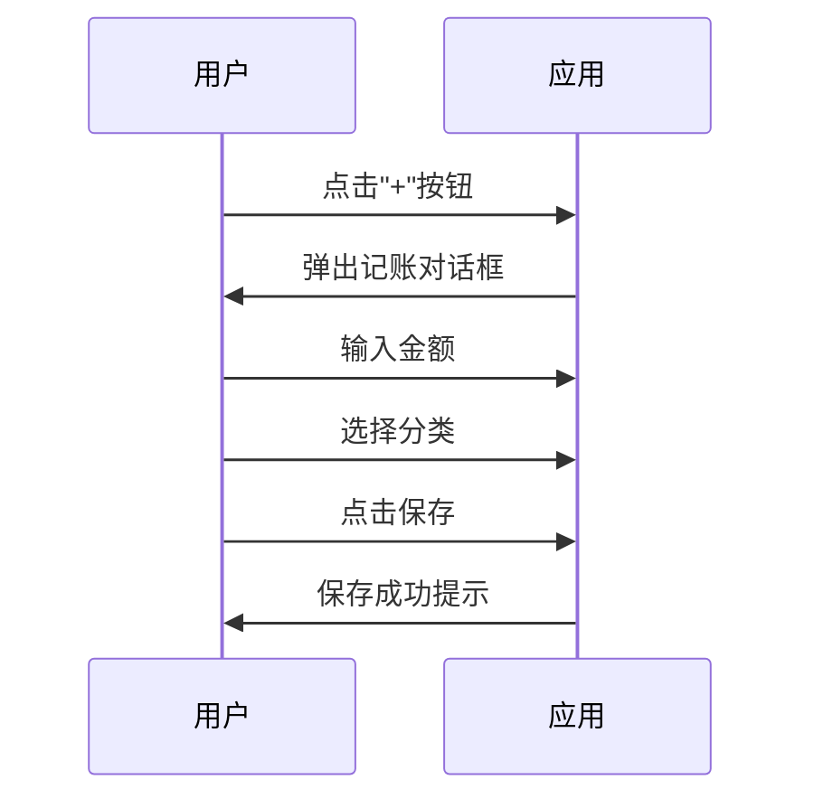

# 账单通产品设计总结

## 项目完成情况

已成功完成"账单通"个人日常消费记录产品的完整产品设计，涵盖产品定义、功能规划、技术架构、测试策略和开发路线图。

---

## 交付文档清单

### 产品与需求文档（7份）

1. **01-product-overview.md** (7.1 KB)
   - 产品定义、价值主张、用户画像
   - 产品愿景和竞争分析
   - 成功指标和风险分析

2. **02-functional-requirements.md** (23 KB)
   - 核心功能详细需求（消费记录、分类管理、数据统计）
   - 数据模型设计（Entity、DAO、Use Case）
   - 非功能需求（性能、安全、兼容性）
   - 功能优先级矩阵

3. **03-user-flow-design.md** (24 KB)
   - 完整用户流程设计（首次使用、日常记账、查看统计）
   - Mermaid时序图
   - 异常流程处理

4. **04-information-architecture.md** (31 KB)
   - 页面层级结构（10个主要页面）
   - 导航架构设计
   - 详细页面布局和内容元素

5. **05-technical-requirements.md** (22 KB)
   - 技术栈选型（Kotlin + Room + MVVM）
   - 系统架构设计
   - 完整的代码示例和数据模型

6. **06-testing-strategy.md** (25 KB)
   - 测试金字塔和200+测试用例
   - 单元测试、集成测试、UI测试、E2E测试
   - 性能测试、兼容性测试、安全测试

7. **07-development-roadmap.md** (14 KB)
   - 12周开发计划
   - 6个里程碑
   - 详细任务分解和工时预估

### UX/UI设计文档（7份，已存在）

8. **00-design-overview.md** - 设计概述
9. **01-color-system.md** - 色彩系统
10. **02-visual-style.md** - 视觉风格
11. **03-page-layouts.md** - 页面布局
12. **04-interaction-design.md** - 交互设计
13. **05-component-library.md** - 组件库
14. **06-psychology-application.md** - 心理学应用

### 总览文档

15. **README.md** (8.6 KB)
    - 项目概述和文档导航
    - 快速开始指南
    - 核心特性和成功指标

---

## 核心亮点

### 1. 产品定位清晰

- **产品名称**：账单通 (BillTrack)
- **价值主张**：3秒完成记录，让记账成为无意识习惯
- **目标用户**：职场新人、家庭主妇、大学生

### 2. 功能规划合理

**1.0 MVP版本**包含：
- ✅ 快速记账（核心功能，3秒完成）
- ✅ 分类管理（8大类，40+子类）
- ✅ 数据统计（饼图、折线图、柱状图）
- ✅ 预算管理（总预算+分类预算）
- ✅ 数据导出（CSV/Excel）

**功能优先级明确**：
- P0（核心功能）：7个，必须实现
- P1（重要功能）：6个，尽快实现
- P2（后续版本）：2个，留待未来

### 3. 技术架构完整

**技术栈**：
- Kotlin + Room + MVVM + Clean Architecture
- Jetpack Compose（推荐）
- Hilt（依赖注入）
- Coroutines + Flow（异步处理）
- MPAndroidChart（图表）

**架构分层**：
```
Presentation Layer (UI)
    ↓
Domain Layer (Business Logic)
    ↓
Data Layer (Repository + Database)
    ↓
Local Storage (Room Database)
```

### 4. 测试策略全面

- **测试分布**：单元测试50% + 集成测试25% + UI测试15% + E2E测试10%
- **测试用例**：200+详细测试用例
- **覆盖率目标**：80%以上
- **性能目标**：启动<2秒，保存<200ms

### 5. 开发计划可行

**12周开发计划**：
- 阶段1（2周）：需求和技术准备
- 阶段2（6周）：MVP开发
- 阶段3（2周）：测试和优化
- 阶段4（1周）：发布准备
- 阶段5（1周）：发布和监控

**6个里程碑**：
- M1: 需求冻结（2025-01-23）
- M2: 技术架构完成（2025-01-30）
- M3: Alpha版本（2025-02-21）
- M4: Beta版本（2025-03-13）
- M5: RC版本（2025-03-27）
- M6: 1.0正式发布（2025-04-10）

---

## 数据模型设计

### 核心实体

1. **Expense（消费记录）**
   - 字段：id, amount, category_id, date, note, payment_method
   - 索引：category_id, date, amount

2. **Category（分类）**
   - 字段：id, name, parent_id, icon, color, is_custom, sort_order
   - 支持二级分类

3. **Budget（预算）**
   - 字段：id, category_id, amount, month
   - 支持总预算和分类预算

4. **UserSettings（用户设置）**
   - 字段：currency, decimal_places, month_start_day, theme, language

### 数据关系

```
UserSettings (1:1)
    ├── Expense (1:N) ──> Category (N:1)
    ├── Budget (1:N) ──> Category (N:1)
    └── Category (1:N) ──> Category.parent (N:1)
```

---

## 性能目标

| 指标 | 目标值 |
|------|--------|
| 应用启动时间 | < 2秒 |
| 页面切换时间 | < 300ms |
| 记录保存时间 | < 200ms |
| 列表加载时间 | < 500ms |
| 图表渲染时间 | < 1秒 |
| 内存占用 | < 100MB |
| APK包体积 | < 20MB |

---

## 成功指标

### 1.0版本目标

| 指标 | 目标值 |
|------|--------|
| 下载量 | 1,000+ |
| 活跃用户 | 500+ |
| 7日留存率 | 40%+ |
| 应用评分 | 4.0+ |
| 崩溃率 | <1% |

---

## 资源需求

### 人力资源

- 技术负责人 x1：50%时间
- Android开发工程师 x2：100%时间
- UI/UX设计师 x1：30%时间
- QA工程师 x1：50%时间

**总计**：约3.5全职等效人员

### 工具和资源

- 开发工具：Android Studio（免费）
- 版本控制：GitHub（免费）
- 设计工具：Figma（免费版）
- 发布成本：$25（Google Play一次性费用）

**总成本**：约$25 + 测试设备成本

---

## 关键用户流程

### 1. 快速记账流程（3秒）



### 2. 首次使用流程（2分钟）

1. 启动应用
2. 查看引导页（4页）
3. 选择常用分类
4. 设置每月预算（可选）
5. 完成引导，进入首页
6. 显示首次记账引导

### 3. 查看统计流程（1分钟）

1. 打开统计页
2. 查看本月支出概览
3. 浏览分类占比饼图
4. 查看支出趋势折线图
5. 点击分类查看详情

---

## 竞争优势

### 与现有产品对比

| 产品 | 优势 | 劣势 |
|------|------|------|
| 随手记 | 功能全面 | 功能复杂，学习成本高 |
| 挖财 | 理财产品丰富 | 广告多，体验不够纯粹 |
| 鲨鱼记账 | 界面简洁 | 功能相对基础 |
| **账单通** | **3秒快速记账**<br>**数据本地存储**<br>**无广告干扰**<br>**专注日常消费** | **新品牌**<br>**功能待完善** |

---

## 风险和应对

### 主要风险

1. **用户习惯难培养**
   - 应对：极致简化操作（3秒完成）
   - 应对：正向反馈机制（成功动画）
   - 应对：提醒功能（后续版本）

2. **市场竞争激烈**
   - 应对：差异化定位（轻量、快速、隐私）
   - 应对：口碑传播（优秀体验）
   - 应对：社区建设（后续版本）

3. **留存困难**
   - 应对：数据价值（清晰洞察）
   - 应对：习惯养成（21天打卡）
   - 应对：社交功能（后续版本）

---

## 下一步行动

### 立即行动（本周）

1. ✅ 产品需求评审
2. ✅ 技术架构评审
3. ⏳ UI/UX设计确认
4. ⏳ 创建项目骨架

### 近期行动（2周内）

1. ⏳ 完成详细UI设计稿
2. ⏳ 搭建开发环境
3. ⏳ 实现数据层（Room Database）
4. ⏳ 实现领域层（Use Cases）

### 中期行动（6周内）

1. ⏳ 完成MVP开发
2. ⏳ 进行Alpha测试
3. ⏳ 优化性能和体验
4. ⏳ 准备Beta发布

---

## 文档使用建议

### 产品经理
1. 从 `01-product-overview.md` 开始
2. 重点关注 `02-functional-requirements.md`
3. 参考 `03-user-flow-design.md` 理解用户流程

### 设计师
1. 从 `04-information-architecture.md` 开始
2. 参考 `03-user-flow-design.md` 设计交互
3. 查看现有的UX/UI设计文档

### 开发工程师
1. 从 `05-technical-requirements.md` 开始
2. 重点关注数据模型和架构设计
3. 参考 `07-development-roadmap.md` 制定计划

### 测试工程师
1. 从 `06-testing-strategy.md` 开始
2. 执行功能测试用例
3. 进行性能和兼容性测试

---

## 总结

本次产品设计完整覆盖了从产品定义到开发实施的全过程，包括：

✅ **7份产品文档**（共146 KB）
✅ **完整的用户流程设计**（Mermaid时序图）
✅ **详细的技术架构**（含代码示例）
✅ **200+测试用例**
✅ **12周开发计划**
✅ **6个里程碑**
✅ **明确的成功指标**

产品设计已经完成，可以进入下一阶段：
- **产品评审**
- **技术评审**
- **UI/UX设计确认**
- **项目初始化**

---

**文档版本**：v1.0
**创建日期**：2025-01-16
**最后更新**：2025-01-16
**状态**：已完成，待评审
