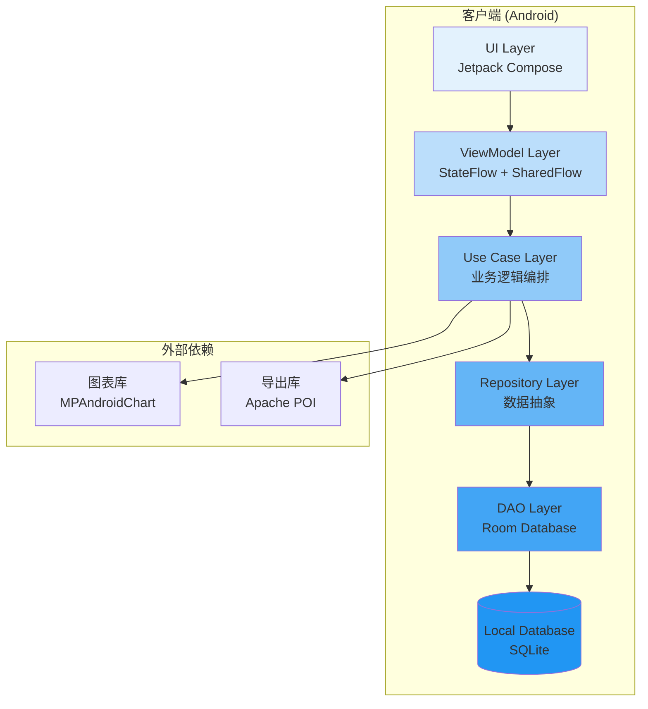
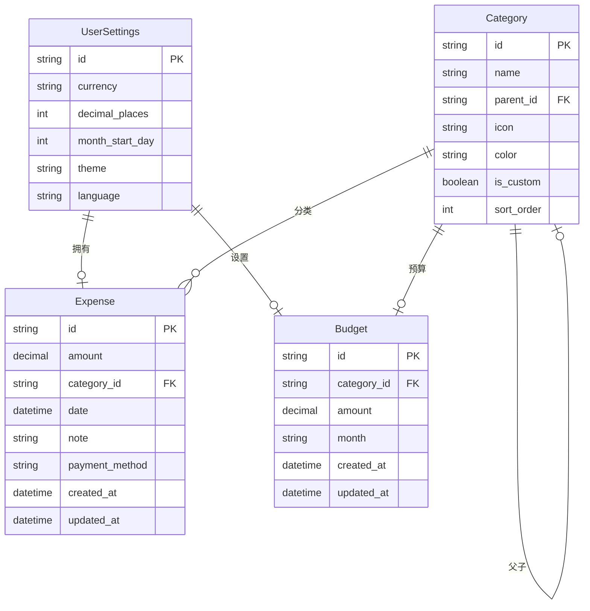
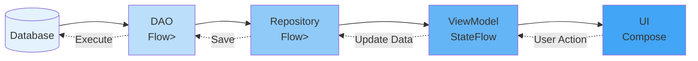

# 账单通 (BillTrack) 技术架构概述

## 1. 架构设计原则

基于产品需求分析和UX设计规范,账单通的技术架构遵循以下核心原则:

### 1.1 核心架构原则

| 原则 | 说明 | 应用体现 |
|------|------|----------|
| **简单优先** | MVP版本聚焦核心功能,避免过度设计 | 本地优先架构,最小化外部依赖 |
| **渐进增强** | 架构支持从简单到复杂的演进 | 预留云同步、多设备扩展接口 |
| **用户体验至上** | 架构服务于用户体验目标 | <3秒记账,<1秒页面加载 |
| **数据隐私** | 用户数据完全掌控 | 本地存储为主,加密备份 |
| **快速迭代** | 支持快速开发和部署 | 模块化设计,自动化测试 |

### 1.2 质量属性优先级

基于产品定位"记一笔,懂生活",质量属性优先级如下:

**P0 - 核心质量**:
- **性能**: 快速响应(记账<3秒,启动<2秒)
- **可用性**: 核心功能99.9%可用性
- **隐私安全**: 数据加密存储,不上传云端

**P1 - 重要质量**:
- **可维护性**: 代码模块化,文档完整
- **可测试性**: 80%以上测试覆盖率
- **兼容性**: Android 7.0+支持

**P2 - 优化质量**:
- **可扩展性**: 预留云同步接口
- **国际化**: 预留多语言支持

---

## 2. 技术栈选型

### 2.1 整体技术栈

```
┌─────────────────────────────────────────────────────────┐
│                     客户端架构                           │
├─────────────────────────────────────────────────────────┤
│  Android原生 (Kotlin)                                    │
│  - UI: Jetpack Compose                                    │
│  - 架构: MVVM + Clean Architecture                       │
│  - 异步: Coroutines + Flow                                │
│  - DI: Hilt                                               │
├─────────────────────────────────────────────────────────┤
│  数据层                                                   │
├─────────────────────────────────────────────────────────┤
│  - 本地数据库: Room Database (SQLite)                     │
│  - 数据格式: JSON (备份) / CSV/Excel (导出)              │
│  - 图表库: MPAndroidChart / Compose Charts               │
├─────────────────────────────────────────────────────────┤
│  测试 & 工具                                              │
├─────────────────────────────────────────────────────────┤
│  - 单元测试: JUnit 5 + MockK                              │
│  - UI测试: Compose Testing                                │
│  - CI/CD: GitHub Actions                                  │
│  - 监控: Firebase Crashlytics + Analytics                 │
└─────────────────────────────────────────────────────────┘
```

### 2.2 技术选型理由

#### Kotlin + Jetpack Compose

**选择理由**:
1. **现代化UI框架**: Compose提供声明式UI,开发效率高,性能优异
2. **类型安全**: Kotlin空安全特性减少运行时崩溃
3. **协程支持**: 原生协程支持简化异步编程
4. **生态成熟**: Google官方推荐,社区活跃,文档完善

**替代方案对比**:

| 方案 | 优势 | 劣势 | 选择 |
|------|------|------|------|
| Kotlin + Compose | 现代、高效、类型安全 | 学习曲线 | ✅ 选择 |
| Kotlin + XML | 熟悉、稳定 | 冗长代码、维护成本 | ❌ |
| Flutter | 跨平台 | Dart生态小、包体积大 | ❌ MVP阶段 |
| React Native | 跨平台 | 性能略差、依赖JS桥接 | ❌ MVP阶段 |

#### Room Database

**选择理由**:
1. **SQLite封装**: Google官方ORM,稳定可靠
2. **编译时验证**: SQL语法检查,类型安全
3. **Flow支持**: 响应式查询,UI自动更新
4. **迁移支持**: 数据库版本管理自动化

**数据存储架构**:

```
┌─────────────────────────────────────────┐
│         Room Database (SQLite)           │
├─────────────────────────────────────────┤
│  @Entity                                 │
│  ├── Expense (消费记录)                  │
│  ├── Category (分类)                     │
│  ├── Budget (预算)                       │
│  └── UserSettings (用户设置)             │
├─────────────────────────────────────────┤
│  @Dao                                    │
│  ├── ExpenseDao                          │
│  ├── CategoryDao                         │
│  ├── BudgetDao                           │
│  └── UserSettingsDao                     │
├─────────────────────────────────────────┤
│  Repository (数据仓库层)                  │
│  ├── ExpenseRepository                   │
│  ├── CategoryRepository                  │
│  ├── BudgetRepository                    │
│  └── UserSettingsRepository              │
└─────────────────────────────────────────┘
```

#### MVVM + Clean Architecture

**架构层次**:

```
┌─────────────────────────────────────────────────────────┐
│                   Presentation Layer                     │
│  ┌──────────┐  ┌──────────┐  ┌──────────┐              │
│  │ Activity │  │ Fragment │  │ Compose │              │
│  └──────────┘  └──────────┘  └──────────┘              │
│         ↓                                                   │
│  ┌──────────────────────────────────────────┐            │
│  │           ViewModel (StateFlow)          │            │
│  └──────────────────────────────────────────┘            │
└─────────────────────────────────────────────────────────┘
                        ↓
┌─────────────────────────────────────────────────────────┐
│                    Domain Layer                          │
│  ┌──────────┐  ┌──────────┐  ┌──────────┐              │
│  │ Use Case │  │  Model   │  │Repository│              │
│  └──────────┘  └──────────┘  └──────────┘              │
└─────────────────────────────────────────────────────────┘
                        ↓
┌─────────────────────────────────────────────────────────┐
│                     Data Layer                           │
│  ┌──────────┐  ┌──────────┐  ┌──────────┐              │
│  │Repository│  │   DAO    │  │ Database │              │
│  └──────────┘  └──────────┘  └──────────┘              │
└─────────────────────────────────────────────────────────┘
```

**分层职责**:

| 层级 | 职责 | 技术 | 依赖 |
|------|------|------|------|
| **Presentation** | UI展示、用户交互 | Compose, ViewModel | Domain |
| **Domain** | 业务逻辑、用例编排 | Kotlin, Coroutines | 无 |
| **Data** | 数据持久化、缓存 | Room, Flow | Domain(接口) |

---

## 3. 系统架构设计

### 3.1 整体架构图



### 3.2 架构模式: Clean Architecture + MVVM

**设计理念**:
- **依赖倒置**: 内层不依赖外层,通过接口定义依赖
- **关注点分离**: 每层专注自己的职责
- **可测试性**: 层间解耦,便于单元测试

**数据流向**:

```
用户操作
  ↓
UI Component (Compose)
  ↓
ViewModel (接收用户意图)
  ↓
Use Case (执行业务逻辑)
  ↓
Repository (请求数据)
  ↓
DAO (查询数据库)
  ↓
Database (返回数据)
  ↓
Repository (转换为领域模型)
  ↓
Use Case (返回结果)
  ↓
ViewModel (更新UI状态)
  ↓
UI Component (重新渲染)
```

### 3.3 核心组件职责

#### Presentation Layer (表现层)

**职责**: UI渲染、用户交互、状态展示

**核心组件**:
- **Compose UI**: 声明式UI组件
- **ViewModel**: 管理UI状态,处理用户交互
- **StateFlow**: 响应式状态流,UI自动更新

**示例**:
```kotlin
@Composable
fun HomeScreen(
    viewModel: HomeViewModel = hiltViewModel()
) {
    val uiState by viewModel.uiState.collectAsState()

    when (val state = uiState) {
        is HomeUiState.Loading -> LoadingView()
        is HomeUiState.Success -> ContentView(state.statistics)
        is HomeUiState.Error -> ErrorView(state.message)
    }
}
```

#### Domain Layer (领域层)

**职责**: 核心业务逻辑、用例编排

**核心组件**:
- **Use Case**: 单个业务用例(如AddExpenseUseCase)
- **Domain Model**: 领域模型(纯Kotlin数据类)
- **Repository Interface**: 仓库接口(定义数据契约)

**示例**:
```kotlin
class AddExpenseUseCase(
    private val expenseRepository: ExpenseRepository,
    private val categoryRepository: CategoryRepository
) {
    suspend operator fun invoke(
        amount: BigDecimal,
        categoryId: String,
        date: LocalDateTime,
        note: String?
    ): Result<Expense> {
        // 1. 验证输入
        if (amount <= BigDecimal.ZERO) {
            return Result.failure(ValidationException("金额必须大于0"))
        }

        // 2. 验证分类存在
        val category = categoryRepository.getCategoryById(categoryId)
            ?: return Result.failure(NotFoundException("分类不存在"))

        // 3. 创建并保存记录
        val expense = Expense(amount, categoryId, date, note)
        return expenseRepository.insertExpense(expense)
    }
}
```

#### Data Layer (数据层)

**职责**: 数据持久化、缓存、数据转换

**核心组件**:
- **Repository Implementation**: 实现Repository接口
- **DAO**: 数据访问对象
- **Room Database**: 数据库配置

**示例**:
```kotlin
@HiltAndroidApp
class AppDatabase : RoomDatabase() {
    abstract fun expenseDao(): ExpenseDao
    abstract fun categoryDao(): CategoryDao
}

@Dao
interface ExpenseDao {
    @Query("SELECT * FROM expenses ORDER BY date DESC")
    fun getAllExpenses(): Flow<List<Expense>>

    @Insert(onConflict = OnConflictStrategy.REPLACE)
    suspend fun insertExpense(expense: Expense)
}
```

---

## 4. 数据架构设计

### 4.1 数据模型设计

#### 核心实体关系图



### 4.2 数据库设计

#### Room Database Schema

```kotlin
@Database(
    entities = [
        Expense::class,
        Category::class,
        Budget::class,
        UserSettings::class
    ],
    version = 1,
    exportSchema = true
)
abstract class AppDatabase : RoomDatabase() {
    abstract fun expenseDao(): ExpenseDao
    abstract fun categoryDao(): CategoryDao
    abstract fun budgetDao(): BudgetDao
    abstract fun userSettingsDao(): UserSettingsDao

    companion object {
        const val DATABASE_NAME = "billtrack_db"
    }
}
```

#### 索引策略

**Expense表索引**:
- `date`: 日期范围查询优化
- `category_id`: 分类查询优化
- `amount`: 金额排序优化
- `created_at`: 时间排序优化

**查询性能优化**:
```kotlin
@Entity(
    tableName = "expenses",
    indices = [
        Index(value = ["date"]),
        Index(value = ["category_id"]),
        Index(value = ["amount"]),
        Index(value = ["created_at"])
    ]
)
data class Expense(...)
```

### 4.3 数据流设计

#### 响应式数据流



**数据流特点**:
1. **单向数据流**: 数据从Database流向UI
2. **响应式更新**: 使用Flow,数据库变化自动触发UI更新
3. **状态管理**: ViewModel使用StateFlow管理UI状态
4. **用户操作**: UI事件通过ViewModel传递到Use Case

---

## 5. 安全架构设计

### 5.1 数据安全策略

#### 本地数据加密

**敏感数据加密**:
```kotlin
// 使用AndroidKeyStore保护加密密钥
class SecurityManager {
    private val masterKey: SecretKey = MasterKey.Builder(context)
        .setKeyScheme(MasterKey.KeyScheme.AES256_GCM)
        .build()

    fun encryptData(data: String): String {
        return EncryptedSharedPreferences.create(
            context,
            "secret_shared_prefs",
            masterKey,
            EncryptedSharedPreferences.PrefKeyEncryptionScheme.AES256_SIV,
            EncryptedSharedPreferences.PrefValueEncryptionScheme.AES256_GCM
        )
    }
}
```

#### 备份文件加密

```kotlin
class BackupManager {
    fun createBackup(): File {
        val data = exportAllData()
        val encryptedData = AESUtil.encrypt(data, userPassword)
        return File(context.filesDir, "backup_${timestamp}.json.enc")
    }
}
```

### 5.2 权限管理

#### 最小权限原则

| 权限 | 用途 | 必需性 | 说明 |
|------|------|--------|------|
| 无 | 核心功能 | ❌ | 本地存储无需任何权限 |
| READ_EXTERNAL_STORAGE | 导出文件 | ⚠️ | 仅在导出时申请 |
| WRITE_EXTERNAL_STORAGE | 保存备份 | ⚠️ | 仅在备份时申请 |

#### 权限申请流程

```kotlin
class PermissionManager {
    fun requestStoragePermission(activity: Activity, callback: (Boolean) -> Unit) {
        if (ContextCompat.checkSelfPermission(activity, Manifest.permission.WRITE_EXTERNAL_STORAGE)
            == PackageManager.PERMISSION_GRANTED) {
            callback(true)
        } else {
            ActivityCompat.requestPermissions(
                activity,
                arrayOf(Manifest.permission.WRITE_EXTERNAL_STORAGE),
                STORAGE_PERMISSION_CODE
            )
        }
    }
}
```

---

## 6. 性能架构设计

### 6.1 性能目标

| 指标 | 目标值 | 优化策略 |
|------|--------|----------|
| 应用启动 | < 2秒 | 懒加载、异步初始化 |
| 快速记账 | < 3秒 | 乐观UI更新、后台保存 |
| 统计页面 | < 1秒 | 数据预加载、分页渲染 |
| 列表滚动 | > 55fps | 虚拟滚动、DiffUtil |
| 内存占用 | < 100MB | 对象池、弱引用 |
| APK体积 | < 20MB | ProGuard、资源压缩 |

### 6.2 性能优化策略

#### 启动优化

```kotlin
class App : Application() {
    override fun onCreate() {
        super.onCreate()

        // 异步初始化非关键组件
        CoroutineScope(Dispatchers.IO).launch {
            // 初始化图表库
            // 初始化数据库(如果需要迁移)
            // 预加载常用分类
        }
    }
}
```

#### UI性能优化

```kotlin
// 1. 使用Compose的稳定性优化
@Immutable
data class ExpenseUiState(
    val expenses: List<Expense>,
    val totalAmount: BigDecimal
)

// 2. 虚拟滚动优化长列表
@Composable
fun ExpenseList(expenses: List<Expense>) {
    LazyColumn {
        items(expenses, key = { it.id }) { expense ->
            ExpenseItem(expense)
        }
    }
}
```

---

## 7. 可扩展性设计

### 7.1 预留扩展接口

#### 云同步接口(预留)

```kotlin
interface SyncRepository {
    suspend fun syncExpenses(): Result<Unit>
    suspend fun pullExpenses(lastSyncTime: Long): Result<List<Expense>>
    suspend fun pushExpenses(expenses: List<Expense>): Result<Unit>
}

// 1.0版本使用本地实现
class LocalSyncRepository : SyncRepository {
    override suspend fun syncExpenses() = Result.success(Unit)
}

// 2.0版本替换为云端实现
class CloudSyncRepository(
    private val apiService: ApiService
) : SyncRepository {
    override suspend fun syncExpenses() {
        // 实现云端同步逻辑
    }
}
```

#### 多设备接口(预留)

```kotlin
interface DeviceManager {
    fun getCurrentDeviceId(): String
    fun getRegisteredDevices(): Flow<List<Device>>
    fun syncDevice(device: Device): Result<Unit>
}
```

### 7.2 模块化架构

```
app/
├── core/              # 核心模块(所有模块依赖)
│   ├── domain/        # 领域层接口
│   ├── data/          # 数据层接口
│   └── common/        # 通用工具
├── feature/           # 功能模块
│   ├── home/          # 首页功能
│   ├── statistics/    # 统计功能
│   ├── expense/       # 记账功能
│   └── settings/      # 设置功能
└── data/              # 数据实现
    ├── local/         # 本地数据
    └── remote/        # 远程数据(预留)
```

---

## 8. 技术债务管理

### 8.1 已知限制

| 限制 | 影响 | 计划解决版本 |
|------|------|-------------|
| 单设备支持 | 用户换设备需手动迁移数据 | 2.0版本 |
| 无云备份 | 数据丢失风险 | 2.0版本 |
| 仅Android | iOS用户无法使用 | 2.0版本(Flutter) |
| 无自动分类 | 需手动选择分类 | 1.2版本 |

### 8.2 技术选型妥协

| 方面 | 当前选择 | 原因 | 未来考虑 |
|------|----------|------|----------|
| UI框架 | Compose | 现代化、高效 | - |
| 状态管理 | StateFlow | 官方推荐 | 考虑Kotlin Parcelize |
| 图表库 | MPAndroidChart | 成熟稳定 | 考虑Compose Charts |
| 依赖注入 | Hilt | 官方方案 | - |

---

## 9. 架构演进路线

### 9.1 1.0版本架构(当前)

```
本地优先架构
├── Android原生 (Kotlin)
├── Jetpack Compose UI
├── Room Database
└── 无后端依赖
```

### 9.2 2.0版本架构(计划)

```
混合架构
├── 跨平台框架 (Flutter)
├── 云同步服务
├── 多设备支持
└── AI智能分类
```

### 9.3 3.0版本架构(远期)

```
微服务架构
├── 移动端(iOS + Android)
├── Web端
├── 云后端服务
├── 大数据分析
└── AI推荐引擎
```

---

## 10. 架构文档索引

1. **技术选型文档** - `01-technology-stack.md`
2. **系统架构设计** - `02-system-architecture.md`
3. **数据模型设计** - `03-data-model.md`
4. **API接口设计** - `04-api-design.md`
5. **部署架构** - `05-deployment-architecture.md`

---

*文档版本: v1.0*
*创建日期: 2025-01-16*
*架构师: Claude (Software Architecture Agent)*
