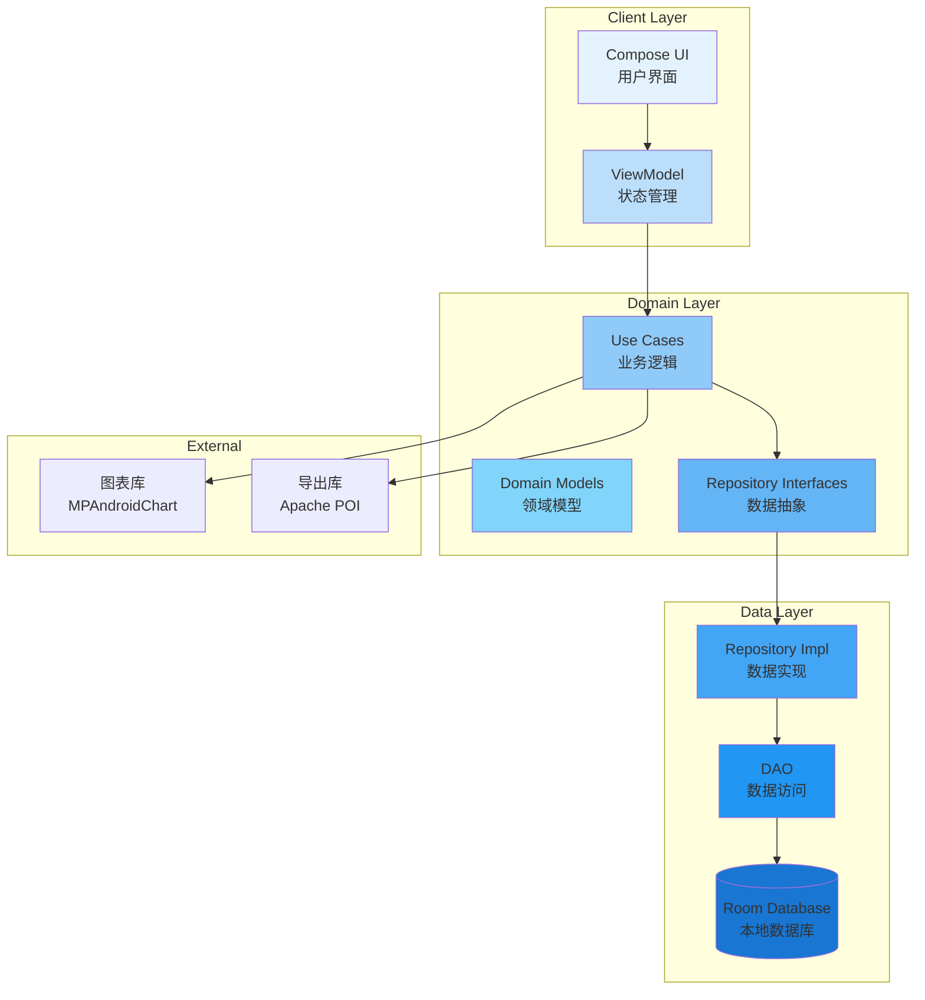

# 系统架构设计

## 1. 架构设计总览

### 1.1 架构目标

基于产品需求分析,系统架构设计实现以下目标:

| 目标 | 指标 | 设计策略 |
|------|------|----------|
| **性能** | 记账<3秒,启动<2秒 | 异步处理、数据预加载、乐观UI |
| **可用性** | 99.9%核心功能可用 | 本地优先、离线工作、错误恢复 |
| **可维护性** | 代码模块化、文档完整 | Clean Architecture、分层解耦 |
| **可测试性** | 80%+测试覆盖 | 依赖注入、接口抽象、单元测试 |
| **可扩展性** | 预留云同步、多设备接口 | 抽象层、策略模式、插件化 |

### 1.2 架构原则

**SOLID原则应用**:

| 原则 | 说明 | 应用示例 |
|------|------|----------|
| **单一职责** | 每个类只有一个改变的理由 | UseCase只处理一个业务逻辑 |
| **开闭原则** | 对扩展开放,对修改关闭 | 新增UseCase无需修改现有代码 |
| **里氏替换** | 子类可替换父类 | Repository接口可被不同实现替换 |
| **接口隔离** | 细粒度接口 | ExpenseRepository只定义消费相关方法 |
| **依赖倒置** | 依赖抽象不依赖具体 | ViewModel依赖UseCase接口 |

---

## 2. 分层架构设计

### 2.1 三层架构

```
┌─────────────────────────────────────────────────────────┐
│                    Presentation Layer                   │
│  (表现层 - UI与用户交互)                                  │
├─────────────────────────────────────────────────────────┤
│  ┌──────────────┐  ┌──────────────┐  ┌──────────────┐ │
│  │   Compose    │  │  ViewModel   │  │  UI State    │ │
│  │     UI       │  │              │  │   (Flow)     │ │
│  └──────────────┘  └──────────────┘  └──────────────┘ │
└─────────────────────────────────────────────────────────┘
                        ↓ 依赖
┌─────────────────────────────────────────────────────────┐
│                     Domain Layer                        │
│  (领域层 - 业务逻辑)                                       │
├─────────────────────────────────────────────────────────┤
│  ┌──────────────┐  ┌──────────────┐  ┌──────────────┐ │
│  │   Use Case   │  │ Domain Model │  │ Repository   │ │
│  │              │  │              │  │  Interface   │ │
│  └──────────────┘  └──────────────┘  └──────────────┘ │
└─────────────────────────────────────────────────────────┘
                        ↓ 依赖
┌─────────────────────────────────────────────────────────┐
│                      Data Layer                         │
│  (数据层 - 数据持久化)                                     │
├─────────────────────────────────────────────────────────┤
│  ┌──────────────┐  ┌──────────────┐  ┌──────────────┐ │
│  │ Repository   │  │     DAO      │  │   Database   │ │
│  │  Impl        │  │              │  │   (Room)     │ │
│  └──────────────┘  └──────────────┘  └──────────────┘ │
└─────────────────────────────────────────────────────────┘
```

### 2.2 层级职责定义

#### Presentation Layer (表现层)

**职责**:
- UI渲染与布局
- 用户交互处理
- UI状态管理
- 导航控制

**核心组件**:
```kotlin
// 1. Compose UI组件
@Composable
fun HomeScreen(
    viewModel: HomeViewModel = hiltViewModel()
) {
    val uiState by viewModel.uiState.collectAsState()
    HomeContent(uiState, viewModel::onEvent)
}

// 2. ViewModel (状态管理)
@HiltViewModel
class HomeViewModel @Inject constructor(
    private val getStatisticsUseCase: GetStatisticsUseCase
) : ViewModel() {
    private val _uiState = MutableStateFlow<HomeUiState>(HomeUiState.Loading)
    val uiState: StateFlow<HomeUiState> = _uiState.asStateFlow()

    fun onEvent(event: HomeEvent) {
        when (event) {
            is HomeEvent.Refresh -> loadStatistics()
        }
    }
}

// 3. UI状态模型
sealed class HomeUiState {
    object Loading : HomeUiState()
    data class Success(val statistics: Statistics) : HomeUiState()
    data class Error(val message: String) : HomeUiState()
}
```

**关键设计点**:
1. **单向数据流**: UI事件 → ViewModel → Use Case → 数据流更新
2. **状态密封类**: 使用sealed class表示UI状态
3. **事件处理**: 通过事件函数处理用户操作
4. **生命周期感知**: 使用viewModelScope,自动取消

#### Domain Layer (领域层)

**职责**:
- 核心业务逻辑
- 用例编排
- 业务规则验证
- 领域模型定义

**核心组件**:
```kotlin
// 1. Use Case (单个业务用例)
class AddExpenseUseCase(
    private val expenseRepository: ExpenseRepository,
    private val categoryRepository: CategoryRepository
) {
    suspend operator fun invoke(
        amount: BigDecimal,
        categoryId: String,
        date: LocalDateTime,
        note: String?
    ): Result<Expense> {
        // 业务逻辑
        if (amount <= BigDecimal.ZERO) {
            return Result.failure(ValidationException("金额必须大于0"))
        }

        val category = categoryRepository.getCategoryById(categoryId)
            ?: return Result.failure(NotFoundException("分类不存在"))

        val expense = Expense(
            id = UUID.randomUUID().toString(),
            amount = amount,
            categoryId = categoryId,
            date = date,
            note = note,
            createdAt = LocalDateTime.now()
        )

        return expenseRepository.insertExpense(expense)
    }
}

// 2. Domain Model (领域模型)
data class Expense(
    val id: String,
    val amount: BigDecimal,
    val categoryId: String,
    val category: Category?,  // 关联查询
    val date: LocalDateTime,
    val note: String?,
    val createdAt: LocalDateTime
)

// 3. Repository Interface (仓库接口)
interface ExpenseRepository {
    suspend fun insertExpense(expense: Expense): Result<Expense>
    suspend fun updateExpense(expense: Expense): Result<Expense>
    suspend fun deleteExpense(id: String): Result<Unit>
    fun getAllExpenses(): Flow<List<Expense>>
    fun getExpensesByDateRange(start: LocalDateTime, end: LocalDateTime): Flow<List<Expense>>
}
```

**关键设计点**:
1. **Use Case隔离**: 每个Use Case只处理一个业务场景
2. **领域模型纯粹**: 不依赖Android框架
3. **接口抽象**: Repository接口在Domain层定义
4. **业务规则**: 验证逻辑、计算逻辑在Use Case中

#### Data Layer (数据层)

**职责**:
- 数据持久化
- 数据缓存
- 数据转换(Entity ↔ Domain Model)
- 数据源抽象

**核心组件**:
```kotlin
// 1. Repository Implementation
@Singleton
class ExpenseRepositoryImpl @Inject constructor(
    private val expenseDao: ExpenseDao,
    private val categoryDao: CategoryDao
) : ExpenseRepository {

    override suspend fun insertExpense(expense: Expense): Result<Expense> {
        return try {
            val entity = expense.toEntity()
            expenseDao.insertExpense(entity)
            Result.success(expense)
        } catch (e: Exception) {
            Result.failure(e)
        }
    }

    override fun getAllExpenses(): Flow<List<Expense>> {
        return expenseDao.getAllExpenses()
            .map { entities -> entities.map { it.toDomainModel() } }
    }
}

// 2. DAO (数据访问对象)
@Dao
interface ExpenseDao {
    @Query("SELECT * FROM expenses ORDER BY date DESC")
    fun getAllExpenses(): Flow<List<ExpenseEntity>>

    @Query("SELECT * FROM expenses WHERE id = :id")
    suspend fun getExpenseById(id: String): ExpenseEntity?

    @Insert(onConflict = OnConflictStrategy.REPLACE)
    suspend fun insertExpense(expense: ExpenseEntity)

    @Update
    suspend fun updateExpense(expense: ExpenseEntity)

    @Delete
    suspend fun deleteExpense(expense: ExpenseEntity)
}

// 3. Room Database
@Database(
    entities = [ExpenseEntity::class, CategoryEntity::class],
    version = 1,
    exportSchema = true
)
abstract class AppDatabase : RoomDatabase() {
    abstract fun expenseDao(): ExpenseDao
    abstract fun categoryDao(): CategoryDao
}
```

**关键设计点**:
1. **Entity隔离**: Entity与Domain Model分离
2. **数据转换**: Mapper函数转换Entity ↔ Model
3. **Flow响应式**: 使用Flow实现响应式数据流
4. **错误处理**: 使用Result包装返回值

---

## 3. 核心模块设计

### 3.1 消费记录模块

**模块职责**:
- 消费记录的CRUD操作
- 记录列表展示与分页
- 记录搜索与筛选

**架构图**:

```
┌─────────────────────────────────────────┐
│  ExpenseFeature (功能模块)               │
├─────────────────────────────────────────┤
│  Presentation                            │
│  ├── ExpenseListScreen                  │
│  ├── ExpenseDetailScreen                │
│  ├── AddExpenseDialog                   │
│  └── ExpenseViewModel                   │
├─────────────────────────────────────────┤
│  Domain                                 │
│  ├── AddExpenseUseCase                  │
│  ├── GetExpensesUseCase                 │
│  ├── UpdateExpenseUseCase               │
│  ├── DeleteExpenseUseCase               │
│  ├── SearchExpensesUseCase              │
│  └── Expense (Domain Model)             │
├─────────────────────────────────────────┤
│  Data                                   │
│  ├── ExpenseRepository                  │
│  ├── ExpenseDao                         │
│  └── ExpenseEntity                      │
└─────────────────────────────────────────┘
```

**关键类设计**:

```kotlin
// ViewModel
@HiltViewModel
class ExpenseViewModel @Inject constructor(
    private val addExpenseUseCase: AddExpenseUseCase,
    private val getExpensesUseCase: GetExpensesUseCase,
    private val deleteExpenseUseCase: DeleteExpenseUseCase
) : ViewModel() {

    private val _uiState = MutableStateFlow<ExpenseUiState>(ExpenseUiState.Loading)
    val uiState: StateFlow<ExpenseUiState> = _uiState.asStateFlow()

    init {
        loadExpenses()
    }

    private fun loadExpenses() {
        viewModelScope.launch {
            getExpensesUseCase()
                .collect { expenses ->
                    _uiState.value = ExpenseUiState.Success(expenses)
                }
        }
    }

    fun addExpense(amount: BigDecimal, categoryId: String, note: String?) {
        viewModelScope.launch {
            val result = addExpenseUseCase(amount, categoryId, LocalDateTime.now(), note)
            result.onSuccess {
                // 显示成功提示
            }.onFailure { error ->
                // 显示错误
            }
        }
    }
}

// Use Case
class GetExpensesUseCase(
    private val expenseRepository: ExpenseRepository
) {
    operator fun invoke(): Flow<List<Expense>> {
        return expenseRepository.getAllExpenses()
    }
}
```

### 3.2 统计分析模块

**模块职责**:
- 统计数据计算
- 趋势分析与可视化
- 分类占比计算

**架构图**:

```
┌─────────────────────────────────────────┐
│  StatisticsFeature (功能模块)            │
├─────────────────────────────────────────┤
│  Presentation                            │
│  ├── StatisticsScreen                   │
│  ├── TrendChartView                     │
│  ├── CategoryPieChartView               │
│  └── StatisticsViewModel                │
├─────────────────────────────────────────┤
│  Domain                                 │
│  ├── GetStatisticsUseCase               │
│  ├── GetTrendUseCase                    │
│  ├── GetCategoryBreakdownUseCase        │
│  ├── CalculateStatistics                │
│  └── Statistics (Domain Model)          │
├─────────────────────────────────────────┤
│  Data                                   │
│  ├── StatisticsRepository               │
│  ├── ExpenseDao (统计查询)              │
│  └── BudgetDao                          │
└─────────────────────────────────────────┘
```

**关键类设计**:

```kotlin
// Domain Model
data class Statistics(
    val totalExpense: BigDecimal,
    val expenseByCategory: List<CategoryExpense>,
    val dailyTrend: List<DailyExpense>,
    val budgetUsage: BudgetUsage?
)

data class CategoryExpense(
    val category: Category,
    val amount: BigDecimal,
    val percentage: Float,
    val count: Int
)

// Use Case
class GetStatisticsUseCase(
    private val expenseRepository: ExpenseRepository,
    private val budgetRepository: BudgetRepository
) {
    suspend operator fun invoke(
        startDate: LocalDateTime,
        endDate: LocalDateTime
    ): Statistics {
        // 1. 获取总支出
        val totalExpense = expenseRepository.getTotalExpense(startDate, endDate)

        // 2. 获取分类统计
        val expenses = expenseRepository.getExpensesByDateRange(startDate, endDate)
        val categoryExpenses = calculateCategoryBreakdown(expenses, totalExpense)

        // 3. 获取趋势数据
        val dailyTrend = expenseRepository.getDailyTrend(startDate, endDate)

        // 4. 获取预算使用
        val budgetUsage = budgetRepository.getBudgetUsage(startDate.toYearMonth())

        return Statistics(
            totalExpense = totalExpense,
            expenseByCategory = categoryExpenses,
            dailyTrend = dailyTrend,
            budgetUsage = budgetUsage
        )
    }
}
```

### 3.3 分类管理模块

**模块职责**:
- 预设分类初始化
- 自定义分类管理
- 分类排序与编辑

**架构图**:

```
┌─────────────────────────────────────────┐
│  CategoryFeature (功能模块)              │
├─────────────────────────────────────────┤
│  Presentation                            │
│  ├── CategoryListScreen                 │
│  ├── AddCategoryDialog                  │
│  ├── CategoryViewModel                  │
│  └── CategorySelector                   │
├─────────────────────────────────────────┤
│  Domain                                 │
│  ├── GetCategoriesUseCase               │
│  ├── AddCategoryUseCase                 │
│  ├── UpdateCategoryUseCase              │
│  ├── DeleteCategoryUseCase              │
│  └── Category (Domain Model)            │
├─────────────────────────────────────────┤
│  Data                                   │
│  ├── CategoryRepository                 │
│  ├── CategoryDao                        │
│  └── CategoryEntity                     │
└─────────────────────────────────────────┘
```

### 3.4 预算管理模块

**模块职责**:
- 预算设置
- 预算使用计算
- 超支提醒

**架构图**:

```
┌─────────────────────────────────────────┐
│  BudgetFeature (功能模块)                │
├─────────────────────────────────────────┤
│  Presentation                            │
│  ├── BudgetScreen                       │
│  ├── BudgetSetupDialog                  │
│  └── BudgetViewModel                    │
├─────────────────────────────────────────┤
│  Domain                                 │
│  ├── GetBudgetUseCase                   │
│  ├── SetBudgetUseCase                   │
│  ├── CalculateBudgetUsage               │
│  └── Budget (Domain Model)              │
├─────────────────────────────────────────┤
│  Data                                   │
│  ├── BudgetRepository                   │
│  ├── BudgetDao                          │
│  └── BudgetEntity                       │
└─────────────────────────────────────────┘
```

---

## 4. 数据流设计

### 4.1 响应式数据流

**Flow数据流**:

```
┌──────────────┐
│   Database   │ (Room)
└──────┬───────┘
       │ Flow<List<Entity>>
       ↓
┌──────────────┐
│  Repository  │ (转换为Domain Model)
└──────┬───────┘
       │ Flow<List<Model>>
       ↓
┌──────────────┐
│   Use Case   │ (业务逻辑处理)
└──────┬───────┘
       │ Flow<List<Model>>
       ↓
┌──────────────┐
│  ViewModel   │ (StateFlow)
└──────┬───────┘
       │ StateFlow<UiState>
       ↓
┌──────────────┐
│     UI       │ (Compose自动重组)
└──────────────┘
```

**代码示例**:

```kotlin
// 1. Database层 (Room)
@Dao
interface ExpenseDao {
    @Query("SELECT * FROM expenses ORDER BY date DESC")
    fun getAllExpenses(): Flow<List<ExpenseEntity>>
}

// 2. Repository层
class ExpenseRepositoryImpl(
    private val expenseDao: ExpenseDao
) : ExpenseRepository {
    override fun getAllExpenses(): Flow<List<Expense>> {
        return expenseDao.getAllExpenses()
            .map { entities -> entities.map { it.toDomainModel() } }
    }
}

// 3. ViewModel层
@HiltViewModel
class HomeViewModel @Inject constructor(
    private val getExpensesUseCase: GetExpensesUseCase
) : ViewModel() {
    private val _uiState = MutableStateFlow<HomeUiState>(HomeUiState.Loading)
    val uiState: StateFlow<HomeUiState> = _uiState.asStateFlow()

    init {
        getExpensesUseCase()
            .onEach { expenses ->
                _uiState.value = HomeUiState.Success(expenses)
            }
            .launchIn(viewModelScope)
    }
}

// 4. UI层 (Compose)
@Composable
fun HomeScreen(viewModel: HomeViewModel = hiltViewModel()) {
    val uiState by viewModel.uiState.collectAsState()

    when (val state = uiState) {
        is HomeUiState.Success -> ExpenseList(state.expenses)
        is HomeUiState.Loading -> LoadingView()
        is HomeUiState.Error -> ErrorView(state.message)
    }
}
```

### 4.2 用户操作流

**添加消费记录流程**:

```
用户点击"+"按钮
  ↓
UI触发事件: viewModel.onEvent(HomeEvent.AddExpense)
  ↓
ViewModel调用Use Case: addExpenseUseCase(...)
  ↓
Use Case验证业务规则
  ↓
Use Case调用Repository: expenseRepository.insertExpense(...)
  ↓
Repository调用DAO: expenseDao.insertExpense(...)
  ↓
DAO执行SQL: INSERT INTO expenses ...
  ↓
Flow自动推送更新: Flow<List<Expense>>
  ↓
ViewModel更新StateFlow: _uiState.value = Success(...)
  ↓
Compose自动重组: UI显示新数据
```

**代码示例**:

```kotlin
// 1. UI事件
sealed class HomeEvent {
    data class AddExpense(val amount: BigDecimal, val categoryId: String) : HomeEvent()
}

// 2. ViewModel处理
@HiltViewModel
class HomeViewModel(
    private val addExpenseUseCase: AddExpenseUseCase
) : ViewModel() {
    fun onEvent(event: HomeEvent) {
        when (event) {
            is HomeEvent.AddExpense -> {
                viewModelScope.launch {
                    addExpenseUseCase(
                        amount = event.amount,
                        categoryId = event.categoryId,
                        date = LocalDateTime.now(),
                        note = null
                    ).onSuccess {
                        // 显示成功提示
                    }.onFailure { error ->
                        // 显示错误
                    }
                }
            }
        }
    }
}

// 3. Use Case执行
class AddExpenseUseCase(
    private val expenseRepository: ExpenseRepository
) {
    suspend operator fun invoke(...): Result<Expense> {
        return expenseRepository.insertExpense(expense)
    }
}
```

---

## 5. 状态管理设计

### 5.1 UI状态模型

**状态密封类设计**:

```kotlin
// 首页UI状态
sealed class HomeUiState {
    object Loading : HomeUiState()
    data class Success(
        val statistics: Statistics,
        val recentExpenses: List<Expense>
    ) : HomeUiState()
    data class Error(val message: String) : HomeUiState()
}

// 记账UI状态
sealed class AddExpenseUiState {
    object Idle : AddExpenseUiState()
    object Saving : AddExpenseUiState()
    data class Success(val expense: Expense) : AddExpenseUiState()
    data class Error(val message: String) : AddExpenseUiState()
}

// 统计页UI状态
sealed class StatisticsUiState {
    object Loading : StatisticsUiState()
    data class Success(
        val statistics: Statistics,
        val trendData: List<DailyExpense>,
        val categoryData: List<CategoryExpense>
    ) : StatisticsUiState()
    data class Error(val message: String) : StatisticsUiState()
}
```

### 5.2 StateFlow vs SharedFlow

**使用场景**:

| 类型 | 用途 | 特点 |
|------|------|------|
| **StateFlow** | UI状态 | 有初始值、新订阅者获取最新值 |
| **SharedFlow** | 一次性事件 | 无初始值、新订阅者不获取历史值 |

**代码示例**:

```kotlin
@HiltViewModel
class HomeViewModel : ViewModel() {

    // StateFlow: UI状态(有初始值)
    private val _uiState = MutableStateFlow<HomeUiState>(HomeUiState.Loading)
    val uiState: StateFlow<HomeUiState> = _uiState.asStateFlow()

    // SharedFlow: 一次性事件(Toast、导航)
    private val _events = MutableSharedFlow<HomeEvent>()
    val events: SharedFlow<HomeEvent> = _events.asSharedFlow()

    fun addExpense(...) {
        viewModelScope.launch {
            _uiState.value = AddExpenseUiState.Saving
            val result = addExpenseUseCase(...)
            result.onSuccess { expense ->
                _uiState.value = AddExpenseUiState.Success(expense)
                _events.emit(HomeEvent.ShowToast("添加成功"))
                _events.emit(HomeEvent.NavigateBack)
            }
        }
    }
}
```

---

## 6. 错误处理设计

### 6.1 Result模式

**使用Result包装返回值**:

```kotlin
// Use Case返回Result
class AddExpenseUseCase(...) {
    suspend operator fun invoke(...): Result<Expense> {
        return try {
            // 验证
            if (amount <= BigDecimal.ZERO) {
                return Result.failure(ValidationException("金额必须大于0"))
            }

            // 执行
            val expense = expenseRepository.insertExpense(expense)
            Result.success(expense)
        } catch (e: Exception) {
            Result.failure(e)
        }
    }
}

// ViewModel处理Result
@HiltViewModel
class ExpenseViewModel : ViewModel() {
    fun addExpense(...) {
        viewModelScope.launch {
            addExpenseUseCase(...)
                .onSuccess { expense ->
                    _events.emit(ShowToast("添加成功"))
                }
                .onFailure { error ->
                    when (error) {
                        is ValidationException -> _events.emit(ShowError(error.message))
                        is NotFoundException -> _events.emit(ShowError("分类不存在"))
                        else -> _events.emit(ShowError("添加失败"))
                    }
                }
        }
    }
}
```

### 6.2 异常分类

**自定义异常**:

```kotlin
// 业务异常
sealed class BusinessException(message: String) : Exception(message)

class ValidationException(message: String) : BusinessException(message)
class NotFoundException(message: String) : BusinessException(message)
class DuplicateException(message: String) : BusinessException(message)

// 使用
if (amount <= BigDecimal.ZERO) {
    throw ValidationException("金额必须大于0")
}
```

---

## 7. 性能优化设计

### 7.1 数据库优化

**索引策略**:

```kotlin
@Entity(
    tableName = "expenses",
    indices = [
        Index(value = ["date"]),           // 日期查询优化
        Index(value = ["category_id"]),    // 分类查询优化
        Index(value = ["created_at"])      // 时间排序优化
    ]
)
data class ExpenseEntity(...)
```

**查询优化**:

```kotlin
@Dao
interface ExpenseDao {
    // 分页查询
    @Query("SELECT * FROM expenses ORDER BY date DESC LIMIT :limit OFFSET :offset")
    suspend fun getExpensesPaged(limit: Int, offset: Int): List<ExpenseEntity>

    // 统计查询(使用索引)
    @Query("SELECT SUM(amount) FROM expenses WHERE date >= :startDate AND date < :endDate")
    suspend fun getTotalExpense(startDate: LocalDateTime, endDate: LocalDateTime): BigDecimal?

    // 批量插入
    @Insert(onConflict = OnConflictStrategy.REPLACE)
    suspend fun insertExpenses(expenses: List<ExpenseEntity>)
}
```

### 7.2 UI性能优化

**Compose性能优化**:

```kotlin
// 1. 使用@Immutable注解
@Immutable
data class ExpenseUiState(
    val expenses: List<Expense>,
    val totalAmount: BigDecimal
)

// 2. 使用key优化LazyColumn
@Composable
fun ExpenseList(expenses: List<Expense>) {
    LazyColumn {
        items(
            items = expenses,
            key = { it.id }  // 使用唯一ID作为key
        ) { expense ->
            ExpenseItem(expense)
        }
    }
}

// 3. 细粒度重组
@Composable
fun ExpenseItem(expense: Expense) {
    // 将复杂组件拆分,避免不必要的重组
    Column {
        ExpenseHeader(expense.category, expense.date)
        ExpenseAmount(expense.amount)
        ExpenseNote(expense.note)
    }
}
```

---

## 8. 测试架构

### 8.1 测试金字塔

```
                /\
               /E2E\         ← 端到端测试 (10%)
              /------\
             /  UI   \       ← UI测试 (20%)
            /----------\
           /Integration \   ← 集成测试 (30%)
          /--------------\
         /    Unit Test   \ ← 单元测试 (40%)
        /------------------\
```

### 8.2 单元测试设计

**Use Case测试**:

```kotlin
class AddExpenseUseCaseTest {
    private lateinit var useCase: AddExpenseUseCase
    private lateinit var mockRepo: ExpenseRepository
    private lateinit var mockCategoryRepo: CategoryRepository

    @Before
    fun setup() {
        mockRepo = mockk()
        mockCategoryRepo = mockk()
        useCase = AddExpenseUseCase(mockRepo, mockCategoryRepo)
    }

    @Test
    fun `should add expense successfully`() = runTest {
        // Given
        val expense = Expense(amount = BigDecimal("28.50"), categoryId = "cat1")
        coEvery { mockCategoryRepo.getCategoryById("cat1") } returns Category(id = "cat1")
        coEvery { mockRepo.insertExpense(any()) } returns expense

        // When
        val result = useCase(expense.amount, expense.categoryId, LocalDateTime.now())

        // Then
        assertTrue(result.isSuccess)
        assertEquals(expense, result.getOrNull())
    }
}
```

**Repository测试**:

```kotlin
@HiltAndroidTest
class ExpenseRepositoryTest {
    @get:Rule
    val hiltRule = HiltAndroidRule(this)

    @Inject
    lateinit var repository: ExpenseRepository

    @Before
    fun setup() {
        hiltRule.inject()
    }

    @Test
    fun `should insert and retrieve expense`() = runTest {
        // Given
        val expense = Expense(
            id = "exp1",
            amount = BigDecimal("28.50"),
            categoryId = "cat1",
            date = LocalDateTime.now()
        )

        // When
        repository.insertExpense(expense)

        // Then
        val result = repository.getExpenseById("exp1")
        assertNotNull(result)
        assertEquals(expense.id, result?.id)
    }
}
```

---

## 9. 架构图总结

### 9.1 系统架构全景图



---

*文档版本: v1.0*
*创建日期: 2025-01-16*
*架构师: Claude (Software Architecture Agent)*
