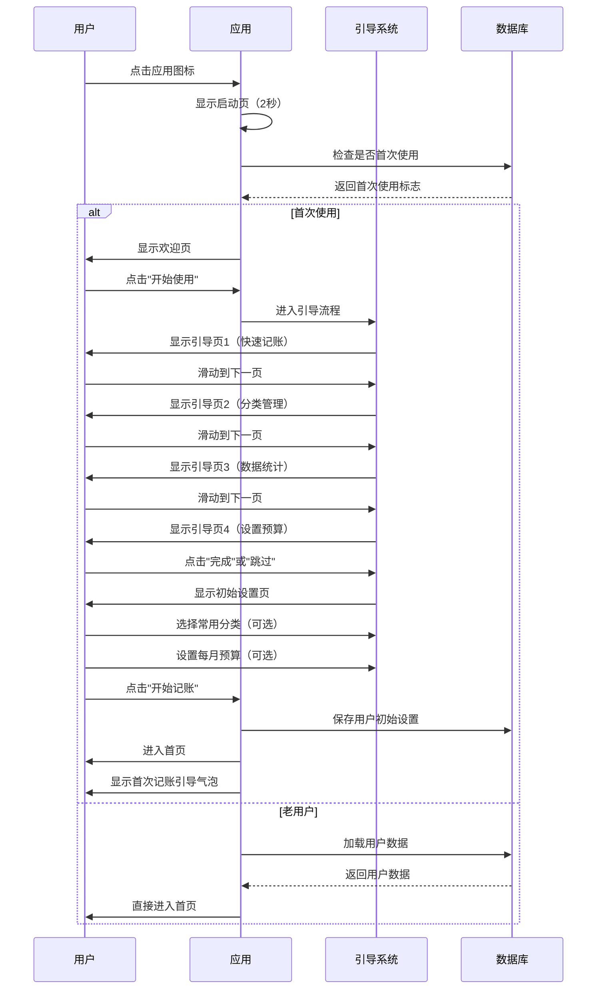
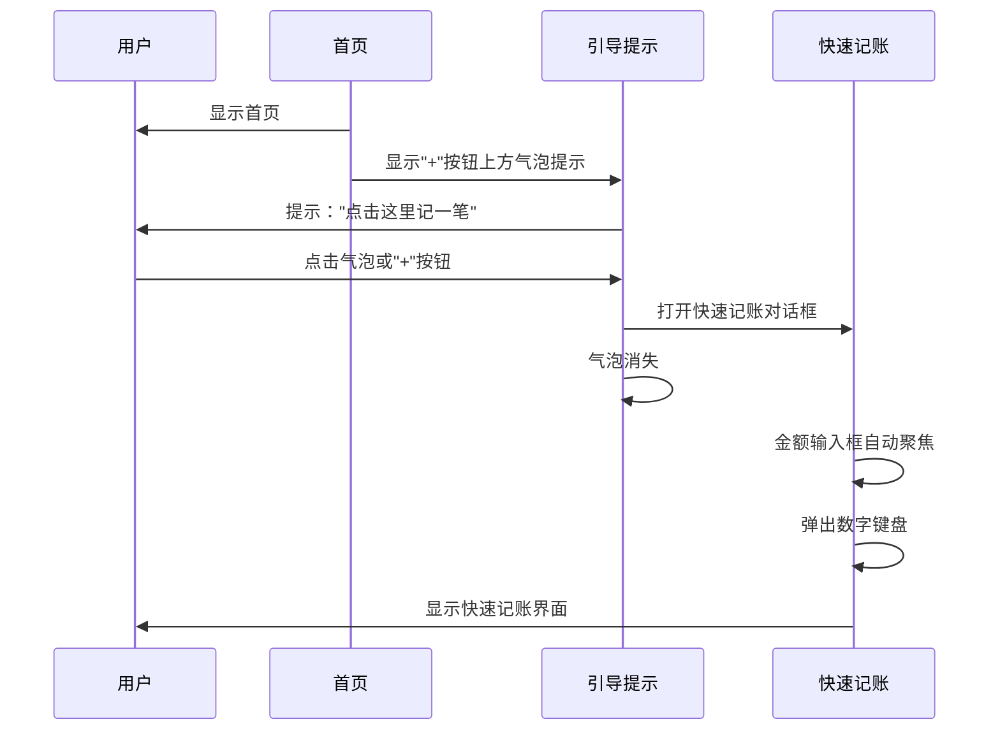
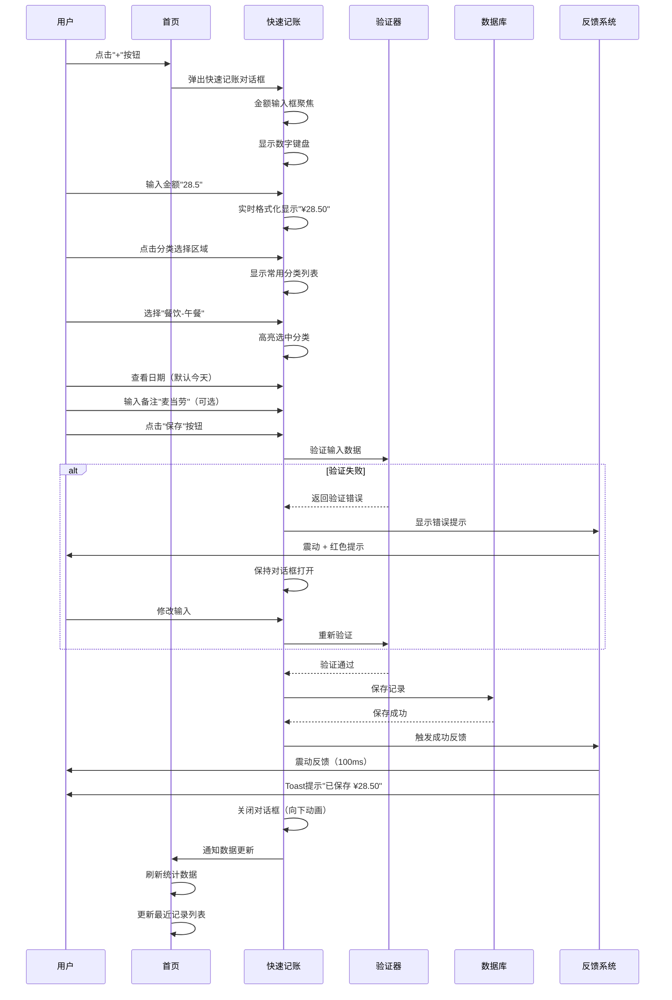
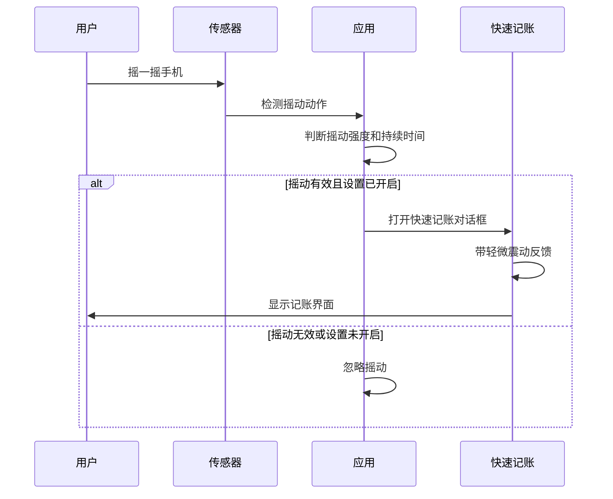
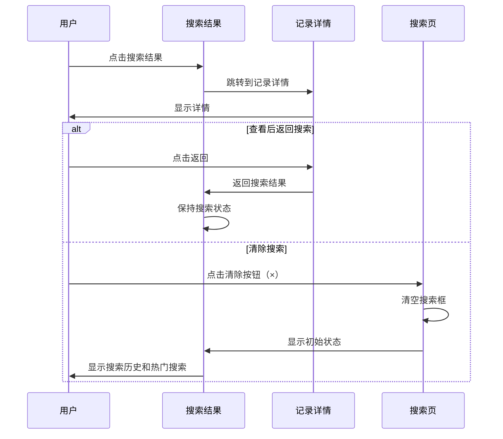

# 账单通 (BillTrack) 交互流程设计

## 1. 交互流程概述

本文档详细定义账单通的完整用户交互流程，使用UML序列图和流程图展示每个关键场景的交互细节。

---

## 2. 首次使用流程

### 2.1 完整引导流程



### 2.2 首次记账引导流程



---

## 3. 日常记账流程

### 3.1 快速记账完整流程



### 3.2 摇一摇记账流程



---

## 4. 记录管理流程

### 4.1 查看记录详情

```mermaid
sequenceDiagram
    participant U as 用户
    participant L as 记录列表
    participant D as 记录详情
    participant DB as 数据库

    U->>L: 点击记录项
    L->>DB: 获取完整记录信息
    DB-->>L: 返回记录详情
    L->>D: 跳转到记录详情页
    D->>U: 显示详细信息

    Note over D,U:
    显示内容：
    - 分类图标和名称
    - 金额（大字体）
    - 日期、时间
    - 备注
    - 支付方式
    - 创建/修改时间
    ```

### 4.2 编辑记录流程

```mermaid
sequenceDiagram
    participant U as 用户
    participant D as 记录详情
    participant E as 编辑界面
    participant V as 验证器
    participant DB as 数据库

    U->>D: 点击"编辑"按钮
    D->>E: 打开编辑界面
    E->>E: 预填充现有数据
    E->>U: 显示编辑表单

    U->>E: 修改金额/分类/备注等
    E->>E: 实时验证输入

    U->>E: 点击"保存"
    E->>V: 验证修改数据
    alt 验证失败
        V-->>E: 返回错误
        E->>U: 显示错误提示
    else 验证成功
        E->>DB: 更新记录
        DB-->>E: 更新成功
        E->>E: 记录修改时间
        E->>U: 显示成功提示
        E->>D: 返回详情页
        D->>D: 刷新显示数据
    end

    alt 用户取消
        U->>E: 点击"取消"或返回
        E->>E: 丢弃修改
        E->>D: 返回详情页
    end
```

### 4.3 删除记录流程

```mermaid
sequenceDiagram
    participant U as 用户
    participant D as 记录详情
    participant C as 确认对话框
    participant DB as 数据库
    participant L as 记录列表

    U->>D: 点击"删除"按钮
    D->>C: 显示确认对话框
    C->>U: 展示删除信息：
        - 分类和金额
        - 日期
        - 警告文案

    alt 用户确认删除
        U->>C: 点击"删除"按钮
        C->>C: 震动反馈
        C->>DB: 执行删除
        DB-->>C: 删除成功
        C->>U: 显示删除成功提示
        C->>L: 返回列表页
        L->>L: 刷新列表
        L->>L: 列表项退出动画
    else 用户取消
        U->>C: 点击"取消"或外部区域
        C->>D: 关闭对话框
        D->>U: 返回详情页
    end
```

### 4.4 批量删除流程

```mermaid
sequenceDiagram
    participant U as 用户
    participant L as 记录列表
    participant S as 选择模式
    participant DB as 数据库

    U->>L: 长按任意记录项
    L->>S: 进入选择模式
    S->>U: 显示选择界面：
        - 顶部"已选择 0 项"
        - 列表项左侧显示复选框
        - 底部操作栏（全选、删除）

    U->>S: 点击复选框选择记录
    S->>S: 更新选择计数
    S->>U: 高亮选中项

    U->>S: 点击"删除"按钮
    S->>U: 显示批量删除确认：
        - 删除数量
        - 总金额
        - 警告文案

    alt 用户确认
        U->>S: 点击"确认删除"
        S->>DB: 批量删除记录
        DB-->>S: 删除成功
        S->>U: 显示删除进度
        S->>L: 退出选择模式
        L->>L: 刷新列表
    else 用户取消
        U->>S: 点击"取消"
        S->>L: 退出选择模式
    end
```

---

## 5. 统计查看流程

### 5.1 统计概览查看

```mermaid
sequenceDiagram
    participant U as 用户
    participant H as 首页
    participant S as 统计页
    participant DB as 数据库
    participant C as 图表组件

    U->>H: 点击"查看更多"或底部导航"统计"
    H->>S: 跳转到统计页
    S->>DB: 请求本月统计数据
    DB-->>S: 返回统计数据

    S->>C: 渲染本月支出卡片
    C->>U: 显示：
        - 总金额
        - 与上月对比
        - 预算使用率

    S->>C: 渲染支出趋势图
    C->>U: 显示折线图/柱状图

    S->>C: 渲染分类占比图
    C->>U: 显示饼图/环形图

    U->>C: 点击图表元素
    C->>S: 触发详情查看
    S->>U: 显示分类详情或时间详情
```

### 5.2 时间范围切换

```mermaid
sequenceDiagram
    participant U as 用户
    participant S as 统计页
    participant DB as 数据库
    participant C as 图表组件

    U->>S: 点击时间选择器
    S->>U: 显示时间选项列表：
        - 本月
        - 上月
        - 近3月
        - 近6月
        - 今年
        - 自定义

    U->>S: 选择"上月"
    S->>DB: 请求上月数据
    DB-->>S: 返回上月统计

    S->>C: 更新所有图表
    C->>C: 执行过渡动画
    C->>U: 显示上月数据

    U->>S: 点击"切换"按钮（上一个周期）
    S->>DB: 请求更早月份数据
    DB-->>S: 返回数据
    S->>C: 更新图表
    C->>U: 显示历史数据
```

### 5.3 分类详情钻取

```mermaid
sequenceDiagram
    participant U as 用户
    participant S as 统计页
    participant D as 分类详情
    participant DB as 数据库
    participant C as 图表组件

    U->>S: 点击饼图中的"餐饮"区块
    S->>D: 钻取到餐饮分类详情
    D->>DB: 请求餐饮分类详细数据
    DB-->>D: 返回：
        - 一级分类统计
        - 二级分类列表
        - 相关记录

    D->>U: 显示详情页：
        - 餐饮总额和占比
        - 二级分类环形图
        - 二级分类列表
        - 最近记录

    U->>D: 点击"午餐"二级分类
    D->>DB: 请求午餐记录列表
    DB-->>D: 返回记录列表
    D->>U: 显示记录列表
```

---

## 6. 搜索流程

### 6.1 基本搜索流程

```mermaid
sequenceDiagram
    participant U as 用户
    participant L as 记录列表
    participant S as 搜索页
    participant DB as 数据库
    participant R as 结果列表

    U->>L: 点击搜索图标
    L->>S: 跳转到搜索页
    S->>S: 搜索框自动聚焦
    S->>S: 弹出键盘
    S->>U: 显示：
        - 搜索历史
        - 热门搜索

    U->>S: 输入"麦当劳"
    S->>S: 实时搜索（防抖300ms）
    S->>DB: 执行搜索查询
    DB->>DB: 搜索范围：
        - 备注内容（模糊匹配）
        - 分类名称（精确匹配）
        - 金额（精确匹配）
    DB-->>S: 返回匹配结果

    S->>R: 显示搜索结果
    R->>U: 展示：
        - 结果数量
        - 匹配记录列表
        - 关键词高亮
```

### 6.2 搜索结果操作



---

## 7. 设置流程

### 7.1 基本设置修改

```mermaid
sequenceDiagram
    participant U as 用户
    participant S as 设置页
    participant P as 偏好设置
    participant DB as 数据库
    participant A as 应用

    U->>S: 点击"货币"设置项
    S->>P: 显示货币选择对话框
    P->>U: 展示选项：
        - CNY（人民币）
        - USD（美元）
        - EUR（欧元）

    U->>P: 选择"USD"
    P->>DB: 保存设置
    DB-->>P: 保存成功
    P->>A: 通知设置变更
    A->>A: 更新所有货币符号
    A->>U: 显示确认提示

    Note over A,U:
    实时生效：
    - 首页统计卡片
    - 记录列表
    - 快速记账
    - 统计页面
```

### 7.2 预算设置流程

```mermaid
sequenceDiagram
    participant U as 用户
    participant S as 设置页
    participant B as 预算设置
    participant V as 验证器
    participant DB as 数据库

    U->>S: 点击"总预算"设置项
    S->>B: 显示预算输入对话框
    B->>U: 显示：
        - 当前预算（如果有）
        - 输入框
        - 本月已用金额

    U->>B: 输入"5000"
    B->>V: 验证输入
    V->>V: 检查：
        - 是否为有效数字
        - 是否大于0
        - 是否合理范围

    alt 验证失败
        V-->>B: 返回错误
        B->>U: 显示错误提示
    else 验证成功
        U->>B: 点击"保存"
        B->>DB: 保存预算
        DB-->>B: 保存成功
        B->>U: 显示成功提示
        B->>S: 返回设置页
        S->>S: 更新预算显示
    end
```

### 7.3 数据导出流程

```mermaid
sequenceDiagram
    participant U as 用户
    participant S as 设置页
    participant E as 导出系统
    participant DB as 数据库
    participant F as 文件系统

    U->>S: 点击"导出数据"
    S->>E: 显示导出选项对话框
    E->>U: 显示选项：
        - 时间范围（全部/自定义）
        - 文件格式（CSV/Excel）
        - 包含内容选项

    U->>E: 选择导出选项
    U->>E: 点击"导出"

    E->>DB: 请求数据
    DB-->>E: 返回数据

    E->>E: 生成文件
    E->>F: 保存到文件系统
    F-->>E: 保存成功

    E->>U: 显示成功对话框：
        - 文件路径
        - 文件大小
        - 操作选项（打开/分享）

    alt 用户选择分享
        U->>E: 点击"分享"
        E->>E: 调用系统分享
        E->>U: 显示分享面板
    else 用户选择打开
        U->>E: 点击"打开"
        E->>F: 打开文件
    end
```

---

## 8. 分类管理流程

### 8.1 添加自定义分类

```mermaid
sequenceDiagram
    participant U as 用户
    participant C as 分类管理
    participant A as 添加分类
    participant V as 验证器
    participant DB as 数据库

    U->>C: 点击"+"添加按钮
    C->>A: 显示添加分类对话框
    A->>U: 显示表单：
        - 分类名称输入框
        - 父级分类选择（可选）
        - 图标选择器
        - 颜色选择器

    U->>A: 输入分类名称"咖啡"
    U->>A: 选择父级分类"餐饮"（可选）
    U->>A: 选择图标☕
    U->>A: 选择颜色

    U->>A: 点击"保存"
    A->>V: 验证输入
    V->>V: 检查：
        - 名称不为空
        - 名称长度1-10字
        - 名称不重复
        - 图标已选择
        - 颜色已选择

    alt 验证失败
        V-->>A: 返回错误
        A->>U: 显示错误提示
        A->>A: 保持对话框打开
    else 验证成功
        A->>DB: 保存分类
        DB-->>A: 保存成功
        A->>U: 显示成功提示
        A->>C: 返回分类管理
        C->>C: 刷新分类列表
        C->>U: 新分类高亮显示
    end
```

### 8.2 删除分类流程

```mermaid
sequenceDiagram
    participant U as 用户
    participant C as 分类管理
    participant D as 删除确认
    participant DB as 数据库

    U->>C: 点击自定义分类的"删除"按钮
    C->>D: 显示删除确认对话框
    D->>U: 显示：
        - 分类名称和图标
        - 该分类下的记录数量
        - 询问是否转移到"其他"分类

    alt 分类有记录
        U->>D: 选择转移到"其他"
        D->>DB: 执行转移并删除
        DB-->>D: 操作成功
        D->>U: 显示成功提示
    else 分类无记录
        U->>D: 直接删除
        D->>DB: 执行删除
        DB-->>D: 删除成功
        D->>U: 显示成功提示
    end

    D->>C: 返回分类管理
    C->>C: 刷新列表
    C->>C: 更新分类统计
```

---

## 9. 异常流程处理

### 9.1 网络异常处理

```mermaid
sequenceDiagram
    participant U as 用户
    participant A as 应用
    participant N as 网络层
    participant L as 本地存储

    U->>A: 执行操作（如同步数据）
    A->>N: 发起网络请求
    N-->>A: 网络错误

    A->>A: 检测到网络异常
    A->>U: 显示错误提示：
        - "网络连接失败"
        - "数据已保存到本地"
        - "将在网络恢复后自动同步"

    A->>L: 保存到本地队列
    A->>A: 设置待同步标志

    Note over A: 等待网络恢复

    alt 网络恢复
        N->>A: 网络可用通知
        A->>N: 检查待同步数据
        A->>N: 执行同步
        N-->>A: 同步成功
        A->>U: 显示"同步成功"提示
    end
```

### 9.2 数据加载失败

```mermaid
sequenceDiagram
    participant U as 用户
    participant P as 页面
    participant DB as 数据库
    participant E as 错误处理

    U->>P: 进入页面
    P->>DB: 请求数据
    DB-->>P: 返回错误

    P->>E: 触发错误处理
    E->>U: 显示错误状态：
        - 错误插图
        - 友好的错误描述
        - 重试按钮

    alt 用户重试
        U->>E: 点击"重试"
        E->>DB: 重新请求数据
        alt 成功
            DB-->>E: 返回数据
            E->>P: 更新页面
            P->>U: 显示数据
        else 失败
            DB-->>E: 返回错误
            E->>U: 保持错误状态
        end
    end
```

### 9.3 存储空间不足

```mermaid
sequenceDiagram
    participant U as 用户
    participant A as 应用
    participant S as 存储系统
    participant D as 对话框

    U->>A: 保存数据或导出文件
    A->>S: 写入存储
    S-->>A: 存储空间不足错误

    A->>D: 显示警告对话框
    D->>U: 显示：
        - "存储空间不足"
        - "需要释放XX MB空间"
        - 操作建议：
            * 清理应用缓存
            * 删除旧记录
            * 导出后清除数据

    alt 用户选择清理缓存
        U->>D: 点击"清理缓存"
        D->>S: 清理缓存
        S-->>D: 清理完成
        D->>U: 显示释放空间
        D->>A: 重试操作
        A->>S: 重新写入
        S-->>A: 成功
    else 用户取消
        U->>D: 点击"取消"
        D->>A: 取消操作
        A->>U: 返回之前状态
    end
```

---

## 10. 手势交互规范

### 10.1 下拉刷新

```mermaid
sequenceDiagram
    participant U as 用户
    participant L as 列表页
    participant DB as 数据库
    participant A as 动画系统

    U->>L: 在列表顶部下拉
    L->>A: 显示下拉指示器
    A->>U: 显示下拉动画

    alt 下拉达到阈值
        U->>L: 继续下拉超过阈值
        L->>A: 显示释放提示
        A->>U: 显示"释放即可刷新"

        U->>L: 释放手指
        L->>A: 显示加载动画
        A->>U: 显示Loading指示器

        L->>DB: 请求最新数据
        DB-->>L: 返回数据
        L->>L: 更新列表
        L->>A: 隐藏加载动画
        A->>U: 显示"刷新成功"提示
    else 未达到阈值
        U->>L: 释放手指（未达阈值）
        L->>A: 隐藏下拉指示器
        A->>U: 回弹动画
    end
```

### 10.2 侧滑删除

```mermaid
sequenceDiagram
    participant U as 用户
    participant I as 列表项
    participant C as 确认对话框
    participant DB as 数据库

    U->>I: 向左滑动列表项
    I->>I: 跟随手指移动
    I->>I: 显示红色背景

    alt 滑动超过阈值
        U->>I: 继续滑动超过删除阈值
        I->>I: 显示"删除"按钮
        I->>U: 保持展开状态

        alt 用户确认删除
            U->>I: 点击"删除"按钮
            I->>C: 显示确认对话框
            C->>U: 确认删除

            U->>C: 点击"确认"
            C->>DB: 执行删除
            DB-->>C: 删除成功
            C->>I: 移除列表项
            I->>I: 执行退出动画
        else 用户取消
            U->>I: 点击其他区域
            I->>I: 执行回弹动画
            I->>U: 恢复原状
        end
    else 未达阈值
        U->>I: 释放手指
        I->>I: 执行回弹动画
        I->>U: 恢复原状
    end
```

---

## 11. 交互状态机

### 11.1 快速记账状态机

```mermaid
stateDiagram-v2
    [*] --> Closed: 初始状态
    Closed --> Opening: 点击"+"按钮
    Opening --> Opened: 动画完成
    Opened --> Inputting: 用户输入
    Inputting --> Validating: 点击保存
    Validating --> Saving: 验证通过
    Validating --> Inputting: 验证失败
    Saving --> Closing: 保存成功
    Closing --> Closed: 动画完成
    Opened --> Closing: 点击取消/外部区域
    Closing --> Closed: 动画完成

    note right of Inputting
        用户可以：
        - 输入金额
        - 选择分类
        - 修改日期
        - 添加备注
    end note

    note right of Validating
        验证项目：
        - 金额 > 0
        - 分类已选
        - 日期有效
    end note
```

### 11.2 记录列表状态机

```mermaid
stateDiagram-v2
    [*] --> Loading: 初始加载
    Loading --> WithData: 加载成功
    Loading --> Empty: 无数据
    Loading --> Error: 加载失败

    WithData --> Refreshing: 下拉刷新
    Refreshing --> WithData: 刷新成功
    Refreshing --> Error: 刷新失败

    WithData --> LoadingMore: 上拉加载更多
    LoadingMore --> WithData: 加载完成
    LoadingMore --> NoMoreData: 没有更多数据

    WithData --> SelectionMode: 长按列表项
    SelectionMode --> WithData: 取消选择
    SelectionMode --> Deleting: 点击删除

    Empty --> WithData: 添加第一条记录
    Error --> Loading: 点击重试

    note right of WithData
        显示：
        - 记录列表
        - 分组标题
        - 统计信息
    end note

    note right of Empty
        显示：
        - 空状态插图
        - 引导文案
        - 记一笔按钮
    end note
```

---

*文档版本：v1.0*
*创建日期：2025-01-16*
*设计团队：UX Design Team*
