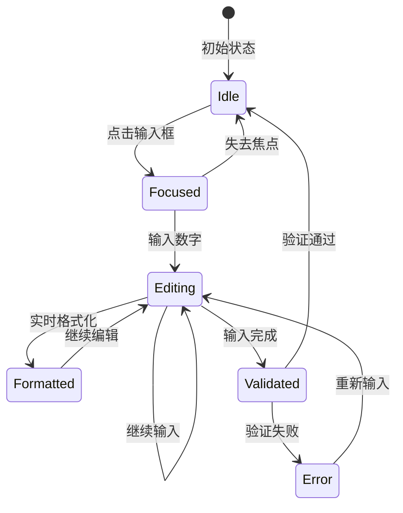
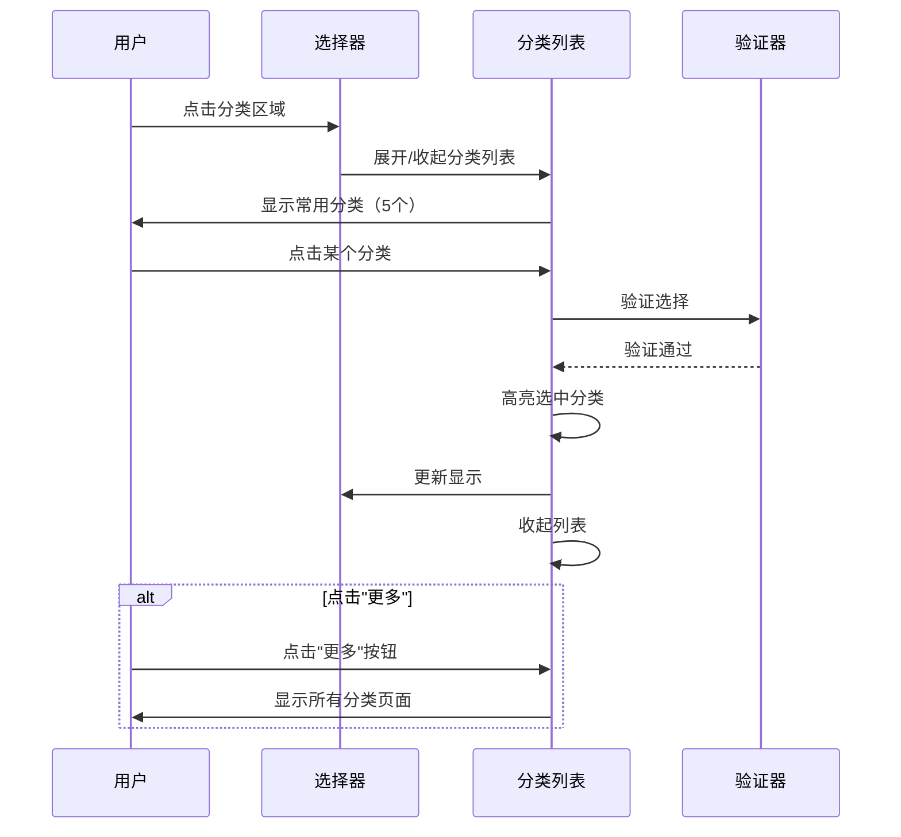
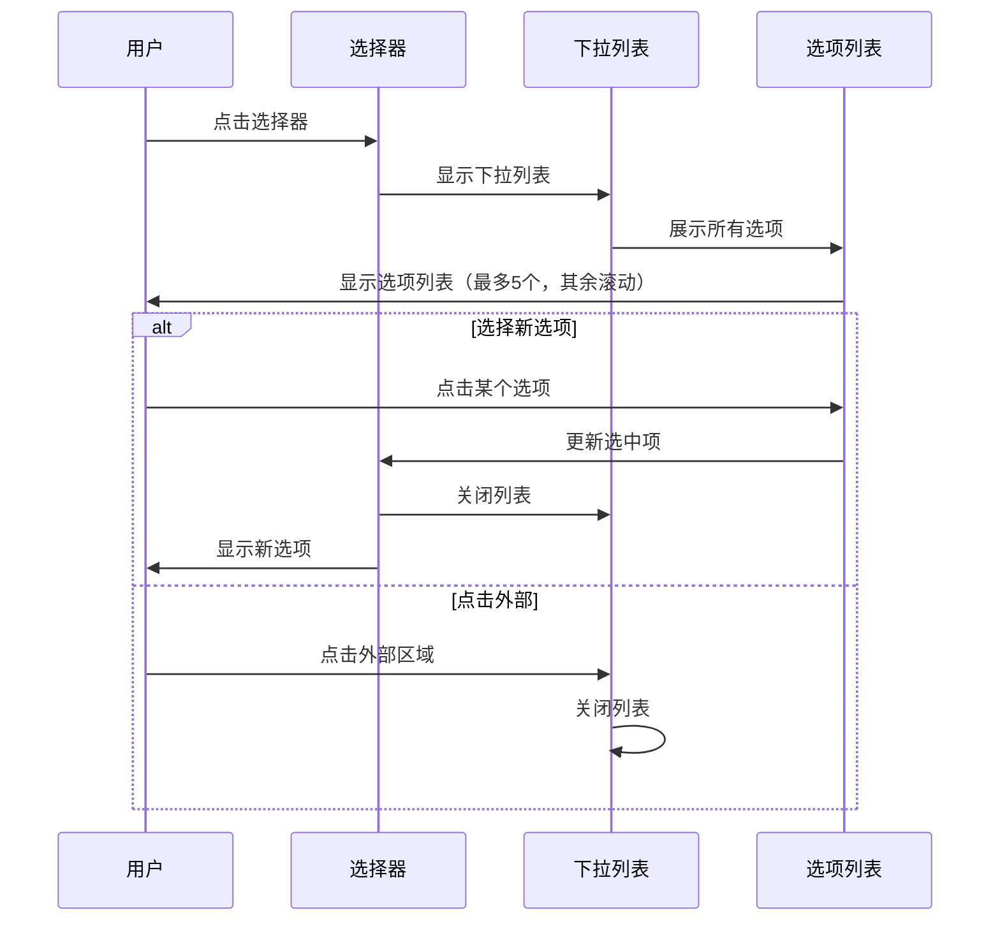

# 账单通 (BillTrack) 组件交互规范

## 1. 组件概述

本文档定义账单通所有UI组件的交互行为、状态变化和视觉规范，确保整个产品的一致性和可用性。

---

## 2. 表单输入组件

### 2.1 金额输入框 (Amount Input)

**组件描述**：
用于快速记账时的金额输入，支持实时格式化和智能输入。

**视觉规范**：
- 尺寸：全宽显示，高度80dp
- 字体：48sp，粗体
- 颜色：主题色 #2196F3
- 对齐：居中对齐
- 货币符号：左侧显示，24sp

**交互行为**：


**状态说明**：

| 状态 | 视觉表现 | 交互反馈 |
|------|---------|---------|
| Idle（空闲） | 显示"¥ 0.00"，灰色 | 点击聚焦 |
| Focused（聚焦） | 显示"¥ 0.00"，主题色，光标闪烁 | 弹出数字键盘 |
| Editing（编辑中） | 实时显示输入值，主题色 | 自动添加小数点 |
| Validated（已验证） | 显示格式化金额，绿色 | 震动反馈 |
| Error（错误） | 红色边框，抖动动画 | 震动 + 错误提示 |

**输入规则**：
- 自动添加小数点：输入"285" → "¥2.85"
- 限制小数位：最多2位
- 最大金额：999,999.99
- 实时格式化：千分位分隔符

**键盘配置**：
- 类型：数字键盘
- 布局：0-9数字键 + 小数点 + 删除键
- 回车键：显示"完成"
- 自动弹出：输入框聚焦时

### 2.2 分类选择器 (Category Selector)

**组件描述**：
用于选择消费分类的横向滚动列表。

**视觉规范**：
- 布局：横向滚动，每行5个
- 图标尺寸：40x40dp
- 图标背景：圆形，48dp
- 文字大小：12sp
- 间距：8dp
- 高度：72dp

**交互行为**：


**状态说明**：

| 状态 | 视觉表现 | 交互反馈 |
|------|---------|---------|
| Normal（正常） | 灰色图标 + 文字 | 可点击 |
| Selected（选中） | 主题色背景 + 白色图标 | 缩放动画 |
| Pressed（按下） | 轻微缩小（0.95倍） | 触觉反馈 |
| Disabled（禁用） | 半透明，不可点击 | 无反馈 |

**排序逻辑**：
- 优先显示常用分类
- 按使用频率排序
- 未使用的分类排在后面

### 2.3 日期选择器 (Date Picker)

**组件描述**：
用于选择消费日期和时间的组合选择器。

**视觉规范**：
- 显示格式："今天 12:30" 或 "01-16 周四 12:30"
- 字体大小：14sp
- 颜色：次要文本色
- 图标：右侧箭头，16dp

**交互行为**：
```mermaid
sequenceDiagram
    participant U as 用户
    participant D as 日期显示
    participant P as 选择器面板
    participant S as 系统

    U->>D: 点击日期区域
    D->>P: 显示日期时间选择器
    P->>U: 显示：
        - 日期选择（日历）
        - 时间选择（滚轮）
        - 快捷选项（今天、昨天）

    alt 选择快捷选项
        U->>P: 点击"今天"
        P->>P: 设置为今天当前时间
        P->>D: 更新显示
    else 自定义选择
        U->>P: 选择日期和时间
        P->>P: 验证选择的合理性
        P->>D: 更新显示
    end

    U->>P: 点击"确定"
    P->>D: 保存选择
    P->>P: 关闭面板
    D->>U: 显示新日期时间
```

**快捷选项**：
- "今天"：设置为今天当前时间
- "昨天"：设置为昨天同一时间
- "本周一"：设置为本周一
- "本月1号"：设置为本月1号

### 2.4 备注输入框 (Note Input)

**组件描述**：
用于添加消费备注的单行文本输入框。

**视觉规范**：
- 高度：44dp
- 字体大小：14sp
- 占位符："添加备注（可选）"
- 限制：50字符
- 显示：实时显示剩余字符数

**交互行为**：

| 用户操作 | 系统响应 |
|---------|---------|
| 点击输入框 | 聚焦，弹出系统键盘 |
| 输入字符 | 实时显示，更新剩余字符数 |
| 接近限制（40字） | 显示警告色（橙色） |
| 达到限制（50字） | 禁止输入，震动反馈 |
| 点击外部 | 失去焦点，收起键盘 |

---

## 3. 按钮组件

### 3.1 主按钮 (Primary Button)

**用途**：主要操作，如"保存"、"确认"。

**视觉规范**：
- 高度：48dp
- 圆角：8dp
- 背景色：主题色 #2196F3
- 文字颜色：白色
- 字体大小：16sp，粗体
- 最小宽度：120dp
- 内边距：水平16dp

**交互行为**：

| 状态 | 背景色 | 文字色 | 其他效果 |
|------|-------|-------|---------|
| Normal | #2196F3 | #FFFFFF | 无 |
| Pressed | #1976D2 | #FFFFFF | 轻微缩小 |
| Disabled | #BDBDBD | #FFFFFF | 不可点击 |
| Loading | #2196F3 | #FFFFFF | 加载动画 |

**动画时长**：100ms

### 3.2 次按钮 (Secondary Button)

**用途**：次要操作，如"取消"、"返回"。

**视觉规范**：
- 高度：48dp
- 圆角：8dp
- 背景色：透明
- 边框：1dp，主题色
- 文字颜色：主题色
- 字体大小：16sp

**交互行为**：

| 状态 | 背景色 | 文字色 | 边框色 |
|------|-------|-------|-------|
| Normal | 透明 | #2196F3 | #2196F3 |
| Pressed | #E3F2FD | #1976D2 | #1976D2 |
| Disabled | 透明 | #BDBDBD | #E0E0E0 |

### 3.3 文字按钮 (Text Button)

**用途**：不强调的操作，如"跳过"、"查看更多"。

**视觉规范**：
- 高度：36dp
- 最小宽度：64dp
- 背景色：透明
- 文字颜色：主题色
- 字体大小：14sp

**交互行为**：

| 状态 | 文字色 | 背景 |
|------|-------|------|
| Normal | #2196F3 | 透明 |
| Pressed | #1976D2 | #F5F5F5（涟漪效果） |
| Disabled | #BDBDBD | 透明 |

### 3.4 悬浮按钮 (FAB - Floating Action Button)

**用途**：主要操作的快捷入口，如"快速记账"。

**视觉规范**：
- 尺寸：56x56dp
- 圆角：28dp（完全圆形）
- 背景色：主题色 #2196F3
- 图标：白色，24dp
- 阴影：elevation 6dp
- 位置：右下角，距离边缘16dp

**交互行为**：

| 状态 | 尺寸 | 阴影 | 其他效果 |
|------|------|------|---------|
| Normal | 56dp | 6dp | 无 |
| Pressed | 52dp | 12dp | 缩放动画 |
| Disabled | 56dp | 0dp | 半透明 |

**动画**：
- 按下：缩小到52dp，100ms
- 释放：恢复到56dp，100ms
- 阴影过渡：100ms

---

## 4. 选择器组件

### 4.1 下拉选择器 (Dropdown Selector)

**用途**：从多个选项中选择一个，如货币设置。

**视觉规范**：
- 高度：48dp
- 内边距：水平16dp
- 右侧箭头：16dp
- 分隔线：底部1dp

**交互行为**：


**列表样式**：
- 最大高度：240dp
- 每项高度：48dp
- 内边距：水平16dp
- 选中项：左侧显示勾选图标
- 滚动条：右侧显示

### 4.2 单选列表 (Radio List)

**用途**：从多个选项中选择一个，显示所有选项。

**视觉规范**：
- 每项高度：56dp
- 图标：左侧，24dp
- 单选按钮：右侧，20dp
- 分隔线：每项之间

**交互行为**：

| 选中状态 | 单选按钮 | 背景 |
|---------|---------|------|
| 未选中 | 空心圆 | 透明 |
| 选中 | 实心圆 + 主题色 | #E3F2FD |

### 4.3 复选框列表 (Checkbox List)

**用途**：从多个选项中选择多个，如选择常用分类。

**视觉规范**：
- 每项高度：56dp
- 图标：左侧，24dp
- 复选框：右侧，20dp

**交互行为**：

| 选中状态 | 复选框 | 背景 |
|---------|-------|------|
| 未选中 | 空心方框 | 透明 |
| 选中 | 实心勾 + 主题色 | #E3F2FD |
| 部分选中 | 实心横线 + 主题色 | #E3F2FD |

---

## 5. 反馈组件

### 5.1 Toast 提示

**用途**：短暂的操作反馈。

**视觉规范**：
- 高度：48dp
- 圆角：24dp
- 背景色：#323232（90%透明度）
- 文字颜色：白色
- 字体大小：14sp
- 内边距：水平16dp，垂直12dp
- 位置：屏幕底部，距离64dp（避开FAB）

**显示时长**：
- 短提示：2000ms
- 长提示：3500ms

**进场/退场动画**：
- 淡入淡出：300ms
- 位移：从下向上

### 5.2 Snackbar 提示

**用途**：带操作按钮的提示。

**视觉规范**：
- 高度：48dp
- 圆角：4dp
- 背景色：#323232
- 文字颜色：白色
- 操作按钮：右侧，文字按钮样式

**交互行为**：
- 自动消失时长：4000ms
- 可滑动关闭
- 点击操作按钮立即消失

### 5.3 进度指示器 (Progress Indicator)

**圆形进度指示器**：
- 尺寸：36dp
- 线条粗细：3dp
- 颜色：主题色
- 动画：旋转

**线性进度指示器**：
- 高度：4dp
- 颜色：主题色
- 背景：#E0E0E0
- 动画：从左到右填充

### 5.4 骨架屏 (Skeleton Screen)

**用途**：数据加载时占位。

**视觉规范**：
- 背景色：#E0E0E0
- 动画：shimmer效果（从左到右扫过）
- 动画时长：1500ms
- 重复：无限循环

**使用场景**：
- 首页统计卡片
- 记录列表
- 分类列表

---

## 6. 对话框组件

### 6.1 确认对话框 (Alert Dialog)

**用途**：重要操作的二次确认。

**视觉规范**：
- 宽度：最大280dp
- 圆角：8dp
- 内边距：24dp
- 标题：20sp，粗体
- 内容：14sp，次要文本色
- 按钮：底部右对齐

**布局示例**：
```
┌─────────────────────────────┐
│  确认删除                    │ ← 标题
├─────────────────────────────┤
│  确定要删除这条记录吗？       │ ← 内容
│  删除后无法恢复              │
│                             │
│           [取消]  [删除]    │ ← 按钮
└─────────────────────────────┘
```

### 6.2 输入对话框 (Input Dialog)

**用途**：需要用户输入的简单操作。

**视觉规范**：
- 宽度：最大280dp
- 圆角：8dp
- 内边距：24dp
- 输入框：全宽，40dp高度

### 6.3 底部弹出对话框 (Bottom Sheet)

**用途**：展示选项列表或操作菜单。

**视觉规范**：
- 圆角：顶部16dp，其他0dp
- 内边距：16dp
- 最大高度：屏幕高度的70%
- 背景色：白色
- 阴影：elevation 8dp

**交互行为**：
- 从底部滑入：300ms
- 向下滑动关闭
- 点击背景关闭
- 支持拖动调整高度

---

## 7. 列表组件

### 7.1 记录列表项 (Transaction List Item)

**视觉规范**：
- 高度：72dp
- 内边距：水平16dp，垂直8dp
- 图标：左侧，40x40dp
- 金额：右侧，24sp，粗体
- 分隔线：底部1dp

**布局**：
```
┌────────────────────────────────────┐
│ [图标]  分类名称          ¥28.50   │
│         备注/时间         12:30    │
└────────────────────────────────────┘
```

**交互行为**：
- 点击：查看详情
- 长按：进入编辑/删除菜单
- 侧滑：快捷删除

### 7.2 设置列表项 (Settings List Item)

**视觉规范**：
- 高度：56dp
- 内边距：水平16dp
- 图标：左侧，24dp（可选）
- 标题：16sp
- 副标题：14sp（可选）
- 箭头：右侧，16dp

**布局示例**：
```
┌────────────────────────────────────┐
│ [图标] 货币               CNY  >   │
└────────────────────────────────────┘
```

### 7.3 分类列表项 (Category List Item)

**视觉规范**：
- 高度：64dp
- 内边距：水平16dp
- 图标：左侧，40x40dp，圆形背景
- 分类名：16sp
- 统计信息：14sp，次要色
- 操作按钮：右侧

**布局示例**：
```
┌────────────────────────────────────┐
│ [图标] 餐饮           [编辑] [删除]│
│        二级: 5个  使用123次        │
└────────────────────────────────────┘
```

---

## 8. 卡片组件

### 8.1 统计卡片 (Statistics Card)

**用途**：展示核心统计数据。

**视觉规范**：
- 圆角：12dp
- 内边距：16dp
- 背景色：白色
- 阴影：elevation 2dp
- 高度：自适应内容

**主卡片样式**（本月支出）：
```
┌────────────────────────────────────┐
│  本月支出                          │
│  ¥3,245.80                        │ ← 48sp，粗体，主题色
│  ↓ 12% vs 上月                    │ ← 绿色表示减少
│  ████████░░ 65%                   │ ← 进度条
└────────────────────────────────────┘
```

**次要卡片样式**（今日/本周支出）：
```
┌────────────┐  ┌────────────┐
│ 今日支出    │  │ 本周支出    │
│ ¥128       │  │ ¥856       │
└────────────┘  └────────────┘
```

### 8.2 分类排行卡片 (Category Ranking Card)

**视觉规范**：
- 每项高度：56dp
- 图标：32x32dp
- 排名数字：16sp，粗体，圆形背景
- 分类名：14sp
- 金额：14sp，粗体
- 占比：12sp，次要色

**布局示例**：
```
┌────────────────────────────────────┐
│ 1️⃣ 餐饮  ¥1,200  37%              │
│ 2️⃣ 交通  ¥500    15%              │
│ 3️⃣ 购物  ¥450    14%              │
└────────────────────────────────────┘
```

---

## 9. 图表组件

### 9.1 折线图 (Line Chart)

**用途**：展示支出趋势。

**视觉规范**：
- 线条粗细：3dp
- 线条颜色：主题色
- 数据点：6dp圆形
- 填充：线下渐变填充（0-50%透明度）
- 网格线：虚线，1dp，次要色

**交互行为**：
- 点击数据点：显示详情提示框
- 长按：高亮数据点
- 双指缩放：放大/缩小
- 拖动：查看更多数据

### 9.2 柱状图 (Bar Chart)

**视觉规范**：
- 柱子宽度：自适应间距
- 柱子圆角：顶部4dp
- 颜色：主题色
- 间距：柱子宽度的50%
- 最大值：占满图表高度

**交互行为**：
- 点击柱子：显示详情
- 长按：高亮柱子

### 9.3 环形图 (Donut Chart)

**视觉规范**：
- 环形宽度：32dp
- 中心文字：总金额，24sp
- 颜色：每个分类不同颜色
- 图例：右侧或底部显示

**交互行为**：
- 点击扇区：高亮该扇区
- 点击扇区：显示详情列表
- 动画：顺时针展开

### 9.4 进度条 (Progress Bar)

**视觉规范**：
- 高度：8dp
- 圆角：4dp
- 背景色：#E0E0E0
- 填充色：根据进度变化

**颜色方案**：
- < 50%：绿色 #4CAF50
- 50%-80%：橙色 #FF9800
- 80%-100%：红色 #F44336
- > 100%：深红色 #D32F2F

---

## 10. 导航组件

### 10.1 底部导航栏 (Bottom Navigation)

**视觉规范**：
- 高度：56dp
- 背景色：白色
- 阴影：elevation 8dp
- 图标：24dp
- 文字：12sp
- 内边距：上下6dp

**交互状态**：

| 状态 | 图标色 | 文字色 | 效果 |
|------|-------|-------|------|
| Unselected | #9E9E9E | #9E9E9E | 无 |
| Selected | #2196F3 | #2196F3 | 图标上移4dp |

**布局**：
```
┌────────────────────────────────────┐
│  [首页图标]  [统计]  [记录]  [我的]  │
│    首页      统计    记录    我的    │
└────────────────────────────────────┘
```

### 10.2 顶部栏 (App Bar)

**视觉规范**：
- 高度：56dp
- 背景色：白色
- 阴影：elevation 4dp
- 标题：20sp，粗体
- 返回按钮：左侧，24dp
- 操作按钮：右侧，24dp

**布局示例**：
```
┌────────────────────────────────────┐
│ < 记录                    [搜索]   │
└────────────────────────────────────┘
```

---

## 11. 状态组件

### 11.1 空状态 (Empty State)

**用途**：无数据时的友好提示。

**视觉规范**：
- 插图：200x200dp
- 标题：18sp，粗体
- 描述：14sp，次要色
- 按钮：主按钮样式

**布局**：
```
┌────────────────────────────────────┐
│                                    │
│         [插图]                     │
│     还没有记录                     │
│    快去记一笔吧                    │
│                                    │
│        [记一笔]                    │
│                                    │
└────────────────────────────────────┘
```

### 11.2 错误状态 (Error State)

**视觉规范**：
- 错误图标：64x64dp，红色
- 标题：18sp，粗体
- 描述：14sp，次要色
- 重试按钮：次按钮样式

### 11.3 加载状态 (Loading State)

**圆形加载器**：
- 尺寸：36dp
- 颜色：主题色
- 位置：屏幕中央

**骨架屏**：
- 重复shimmer动画
- 模拟实际内容布局

---

## 12. 微交互规范

### 12.1 点击反馈 (Click Feedback)

**视觉反馈**：
- 按下：轻微缩小（0.95倍）
- 释放：恢复正常
- 时长：100ms

**触觉反馈**：
- 轻触：10ms
- 中等：25ms
- 重：50ms

### 12.2 涟漪效果 (Ripple Effect)

**用途**：按钮点击时的水波纹扩散。

**视觉规范**：
- 颜色：主题色，20%透明度
- 从点击位置扩散
- 时长：400ms

### 12.3 过渡动画 (Transition Animation)

**页面切换**：
- 淡入淡出：300ms
- 滑入滑出：300ms
- 缩放：250ms

**列表动画**：
- 新增：从上滑入 + 淡入
- 删除：向右滑出 + 淡出
- 更新：闪烁效果

---

## 13. 响应式规范

### 13.1 布局断点

- 小屏：< 360dp
- 中屏：360dp - 600dp
- 大屏：> 600dp

### 13.2 间距系统

- 4dp：最小间距
- 8dp：小间距
- 16dp：标准间距
- 24dp：大间距
- 32dp：超大间距

### 13.3 字体系统

- 12sp：说明文字
- 14sp：正文
- 16sp：副标题
- 20sp：标题
- 24sp：大标题
- 48sp：超大标题

---

*文档版本：v1.0*
*创建日期：2025-01-16*
*设计团队：UX Design Team*
