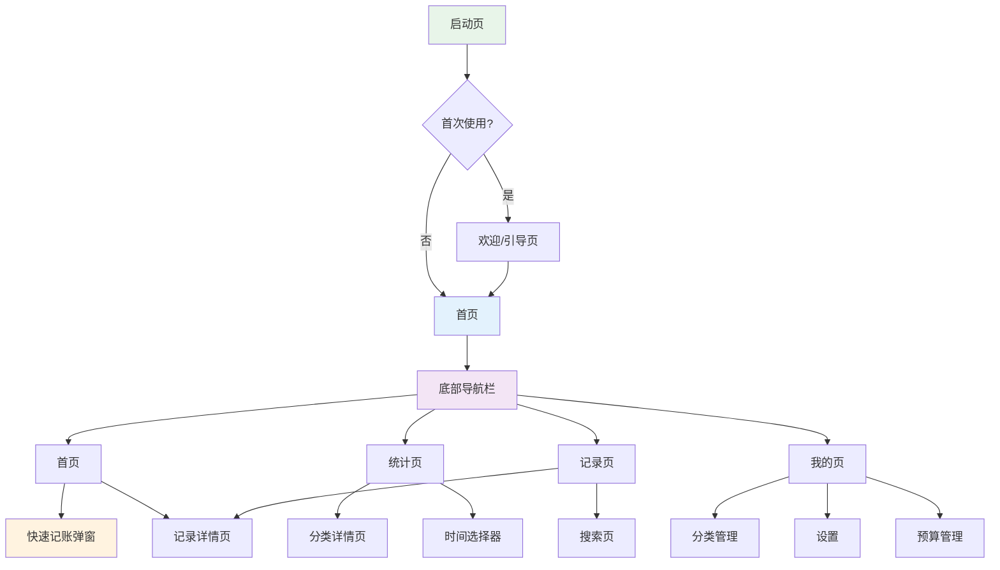

# 导航架构与页面层级设计

## 1. 导航架构总览

### 1.1 导航层级图



### 1.2 导航模式选择

**主导航模式**：底部标签导航（Bottom Tab Navigation）

**选择理由（心理学依据）**：
1. **拇指可达性**：Fitts定律 - 底部导航更易于单手操作
2. **明确当前位置**：始终可见的导航提供清晰的上下文
3. **快速切换**：扁平化结构减少返回操作
4. **认知习惯**：符合主流App（微信、支付宝等）的用户心智模型

---

## 2. 底部导航栏设计

### 2.1 导航项定义

| 导航项 | 图标 | 标签 | 颜色状态 | 主要功能 |
|--------|------|------|----------|----------|
| 首页 | 🏠 | 首页 | 未选中:#9E9E9E / 选中:#4CAF50 | 统计概览、快速记账入口 |
| 统计 | 📊 | 统计 | 未选中:#9E9E9E / 选中:#4CAF50 | 趋势分析、分类占比 |
| 记录 | 📝 | 记录 | 未选中:#9E9E9E / 选中:#4CAF50 | 记录列表、搜索 |
| 我的 | ⚙️ | 我的 | 未选中:#9E9E9E / 选中:#4CAF50 | 设置、分类管理 |

### 2.2 导航栏交互规范

#### 视觉规范
- **高度**：56dp（符合Material Design标准）
- **图标尺寸**：24x24dp
- **图标与文字间距**：4dp
- **背景色**：白色（浅色模式）/ #121212（深色模式）
- **上边框**：1dp分割线，颜色 #E0E0E0

#### 交互状态
| 状态 | 视觉表现 | 触觉反馈 |
|------|---------|---------|
| 未选中 | 灰色图标 + 灰色文字 | 无 |
| 选中 | 主题色图标 + 主题色文字 | 轻微震动 |
| 按下 | 图标缩放到0.9倍 | 即时震动 |
| 切换 | 图标渐变色动画（300ms） | 无 |

#### 心理学设计细节
- **即时反馈**：选中状态立即确认用户意图
- **视觉锚点**：始终可见的导航降低迷失感
- **最小记忆负担**：当前Tab高亮，无需记住位置

---

## 3. 页面层级与导航路径

### 3.1 层级结构定义

**扁平化策略**：最多3层导航深度

```
Level 0: 底部导航（主要入口）
Level 1: 主要页面（首页、统计、记录、我的）
Level 2: 详情页面（记录详情、分类详情等）
```

### 3.2 主要导航路径

#### 路径1：快速记账流程
```
首页
  → 点击悬浮按钮 → 快速记账弹窗（Level 2）
  → 保存 → 返回首页
```

**设计要点**：
- 弹窗模式保持上下文
- 保存后自动关闭，无需手动返回
- 失败时保持在弹窗内，避免重复打开

#### 路径2：查看统计数据
```
首页
  → 点击统计卡片 / 底部导航统计Tab → 统计页（Level 1）
  → 点击图表分类 → 分类详情页（Level 2）
  → 返回 → 统计页
```

**设计要点**：
- 首页统计卡片作为次级入口
- 分类详情使用"钻取"模式
- 保持面包屑上下文

#### 路径3：管理记录
```
记录Tab（Level 1）
  → 点击记录项 → 记录详情页（Level 2）
  → 点击编辑 → 编辑模式（Level 2内状态切换）
  → 保存 → 返回详情页 / 返回列表
```

**设计要点**：
- 列表项直接可点击，减少操作步骤
- 编辑使用原位编辑，避免页面跳转
- 保存后返回列表并刷新

#### 路径4：搜索记录
```
记录Tab（Level 1）
  → 点击搜索图标 → 搜索页（Level 2，全屏模式）
  → 输入关键词 → 显示结果
  → 点击结果 → 记录详情页（Level 2，覆盖搜索页）
  → 返回 → 搜索页（保持搜索状态）
```

**设计要点**：
- 搜索页全屏模式，减少干扰
- 保持搜索历史，支持快速重新搜索
- 搜索结果高亮关键词

---

## 4. 页面间转换设计

### 4.1 转场动画规范

基于Material Design动效原则，结合心理学：

| 转场类型 | 动画效果 | 持续时间 | 心理效果 |
|---------|---------|---------|---------|
| 底部Tab切换 | 淡入淡出 + 轻微位移 | 300ms | 平滑过渡，减少突兀感 |
| 进入详情页 | 从右侧滑入 | 250ms | 建立空间层级关系 |
| 返回列表 | 向右侧滑出 | 250ms | 一致的返回预期 |
| 弹出快速记账 | 从底部滑入 | 200ms | 符合"从下出现"的心智模型 |
| 关闭快速记账 | 向底部滑出 | 200ms | 与打开对称，形成闭环 |

### 4.2 转场心理学细节

#### 1. 首页到统计页的过渡
- **设计**：统计数据从首页卡片位置"放大"到统计页
- **心理效果**：建立视觉连续性，降低认知负荷
- **实现**：共享元素转场（Shared Element Transition）

#### 2. 快速记账弹窗的进入
- **设计**：背景模糊化 + 弹窗从底部滑入
- **心理效果**：创建"专注模式"，减少外界干扰
- **实现**：背景遮罩（Dimming）+ 弹窗动画

#### 3. 列表到详情的钻取
- **设计**：列表项"展开"成为详情页
- **心理效果**：强化"从概览到细节"的信息层级
- **实现**：列表项作为hero element进行转场

---

## 5. 返回逻辑设计

### 5.1 返回按钮行为

**通用规则**：遵循Android返回键语义

| 当前页面 | 返回行为 | 系统返回键 | 导航栏返回按钮 |
|---------|---------|-----------|--------------|
| 首页（Level 1） | 无效（最小化任务） | 最小化应用 | 不显示 |
| 统计页（Level 1） | 无效 | 返回桌面 | 不显示 |
| 记录页（Level 1） | 无效 | 返回桌面 | 不显示 |
| 我的页（Level 1） | 无效 | 返回桌面 | 不显示 |
| 记录详情页（Level 2） | 返回列表 | 返回记录页 | 显示"记录" |
| 分类详情页（Level 2） | 返回统计页 | 返回统计页 | 显示"统计" |
| 快速记账弹窗 | 关闭弹窗 | 关闭弹窗 | 显示"×" |

### 5.2 特殊返回场景

#### 场景1：编辑后返回
```
详情页 → 编辑 → 修改 → 保存 → 详情页（已更新）
```
**处理**：保存成功后返回详情页，自动刷新数据

#### 场景2：搜索结果中返回
```
搜索页 → 点击结果 → 详情页 → 返回 → 搜索页（保持搜索状态）
```
**处理**：保留搜索关键词和结果列表

#### 场景3：从快捷入口进入
```
首页统计卡片 → 统计页 → 分类详情 → 返回 → 统计页
```
**处理**：统计页保持用户之前的状态（如选中的时间范围）

---

## 6. 面包屑导航设计

### 6.1 需要面包屑的场景

**判断标准**：导航深度 > 2层时显示面包屑

| 页面 | 面包屑显示 | 示例 |
|------|----------|------|
| 首页 | 不显示 | - |
| 统计页 | 不显示 | - |
| 分类详情 | 显示 | 统计 > 餐饮分类详情 |
| 记录列表 | 不显示 | - |
| 记录详情 | 可选 | 记录 > 麦当劳套餐详情 |
| 搜索结果 | 显示 | 记录 > 搜索"麦当劳" |

### 6.2 面包屑交互规范

- **样式**：灰色小字，箭头分隔（>）
- **点击**：面包屑可点击返回上级
- **位置**：页面顶部，标题下方
- **省略**：超过3级时，显示"首页 > ... > 当前页"

---

## 7. 深度链接与外部导航

### 7.1 推送通知导航

**场景**：预算超支提醒

**导航路径**：
```
点击通知 → 首页 → 自动显示预算进度卡片
          或直接跳转预算设置页（可选）
```

**设计要点**：
- 保持导航上下文清晰
- 提供返回路径到应用首页

### 7.2 快捷方式导航（桌面Widget）

**未来版本支持**：
```
桌面Widget"快速记账" → 快速记账弹窗
```

**设计要点**：
- 打开弹窗而非完整页面，减少等待
- 保存后返回桌面或留在首页（可选）

---

## 8. 导航状态管理

### 8.1 Tab状态保持

**原则**：每个Tab独立维护滚动位置和状态

| Tab | 状态保持内容 |
|-----|------------|
| 首页 | 滚动位置、统计数据刷新时间 |
| 统计 | 选中的时间范围、图表类型 |
| 记录 | 滚动位置、搜索关键词 |
| 我的 | - |

### 8.2 后台恢复策略

**场景**：用户切换到其他应用后返回

**恢复逻辑**：
- 保持用户离开时的页面和状态
- 如果超过30分钟，刷新数据
- 如果超过2小时，显示数据更新提示

---

## 9. 导航可访问性

### 9.1 屏幕阅读器支持

- 所有导航元素提供语义化标签
- 底部导航使用"Tab栏"角色
- 返回按钮朗读"返回到[页面名称]"

### 9.2 键盘导航

- 支持Tab键在导航项间切换
- 方向键在列表中导航
- Enter键确认选择

---

## 10. 导航性能优化

### 10.1 预加载策略

**Tab预加载**：
- 首页启动时，预加载统计页数据
- 切换到统计Tab时，预加载记录页列表（首屏）
- 记录页使用分页加载，减少初始加载时间

### 10.2 缓存策略

**数据缓存**：
- 首页统计数据缓存5分钟
- 统计页图表数据缓存10分钟
- 记录列表缓存到内存，下拉刷新更新

---

*文档版本：v1.0*
*创建日期：2025-01-16*
*最后更新：2025-01-16*
*设计师：Claude (UX Designer Agent)*
