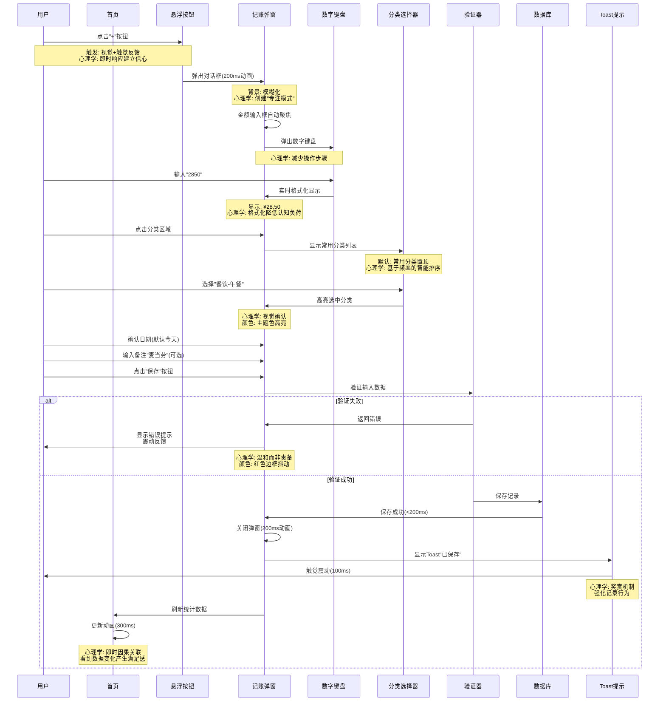
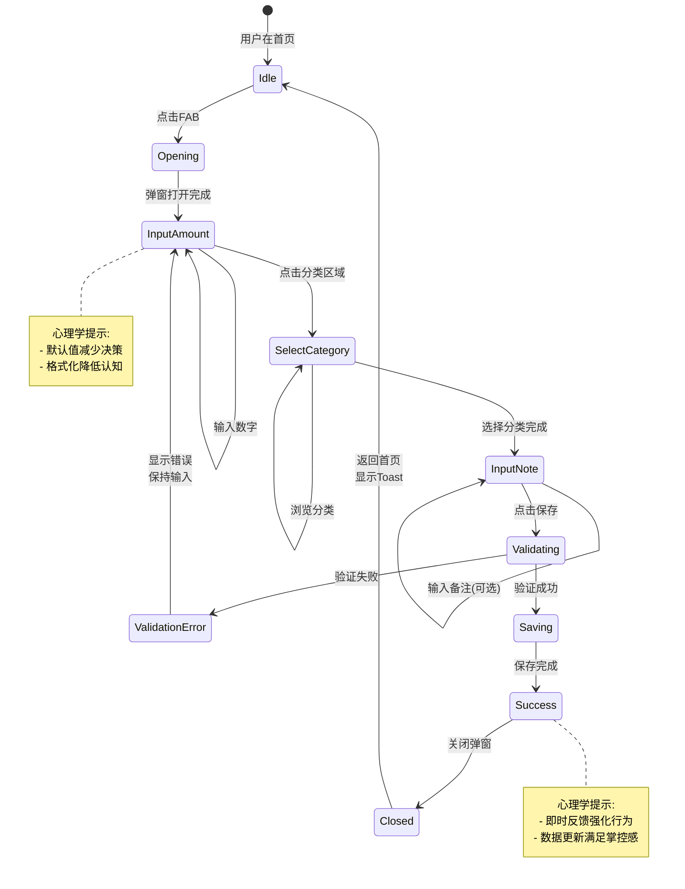
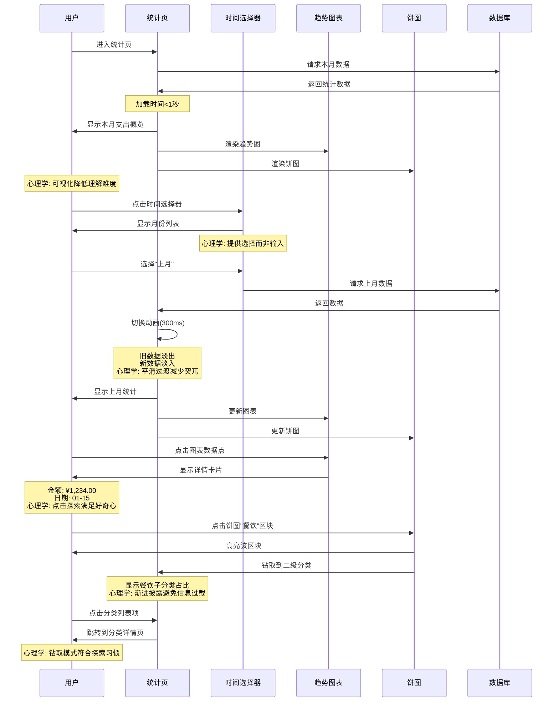
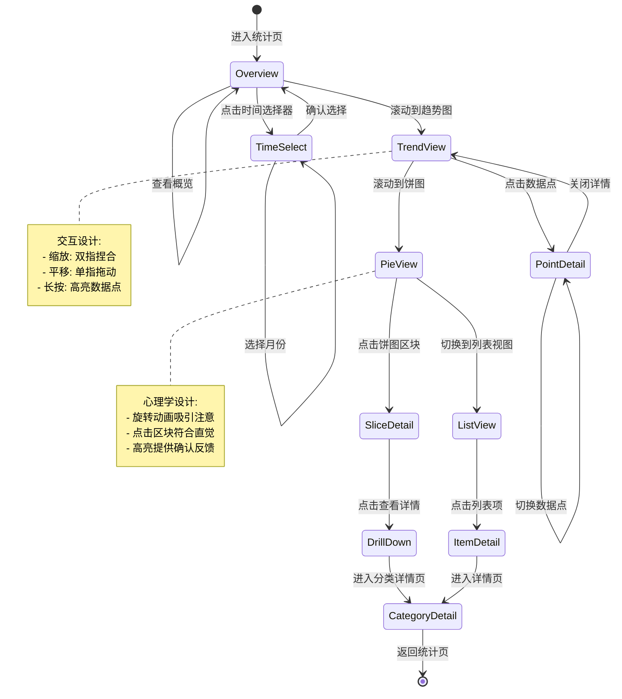
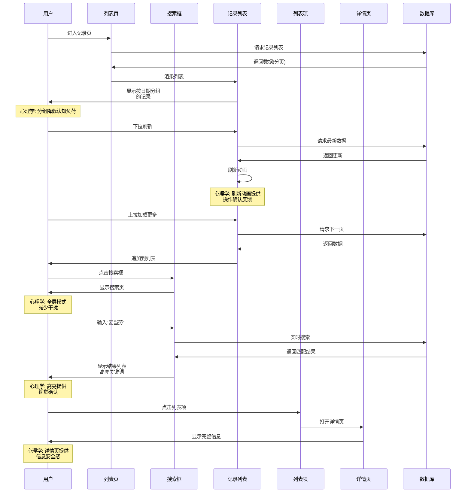
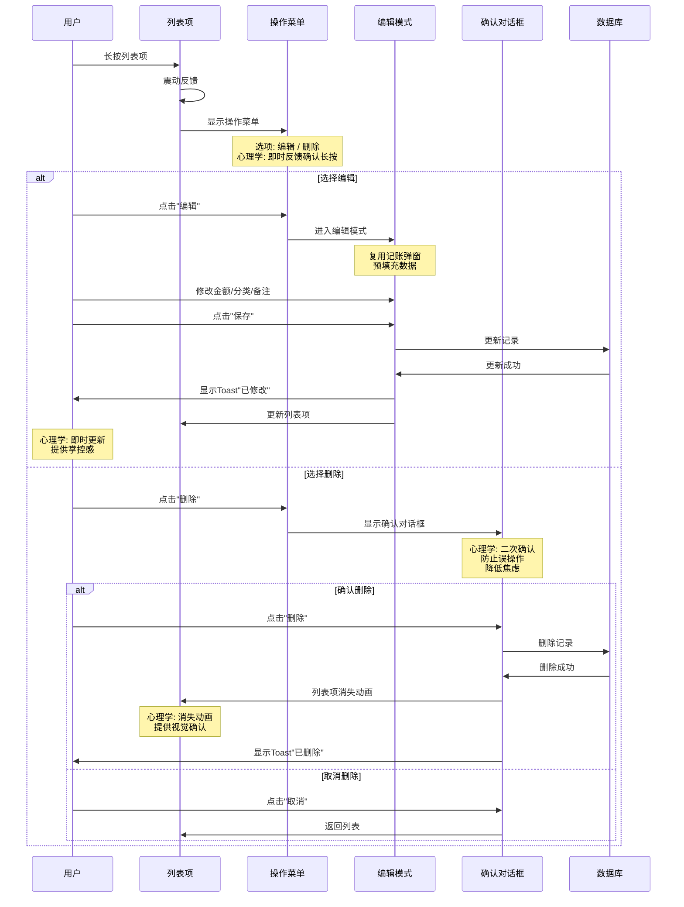
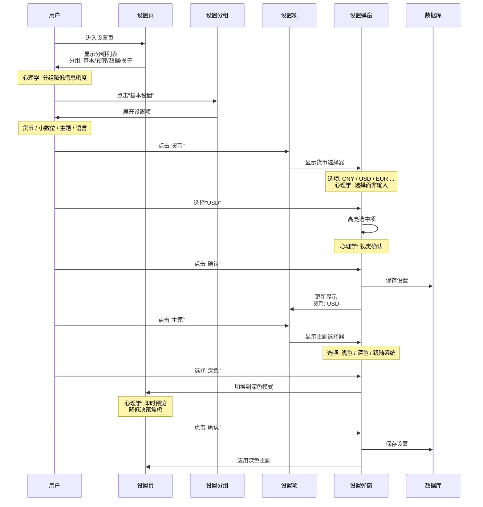
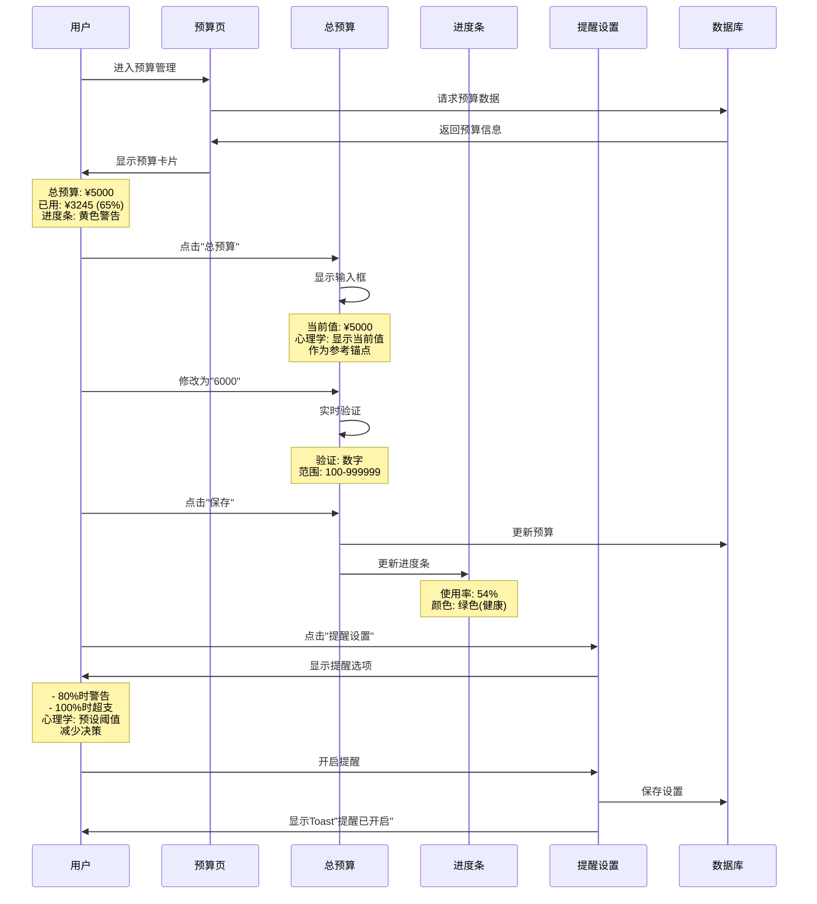
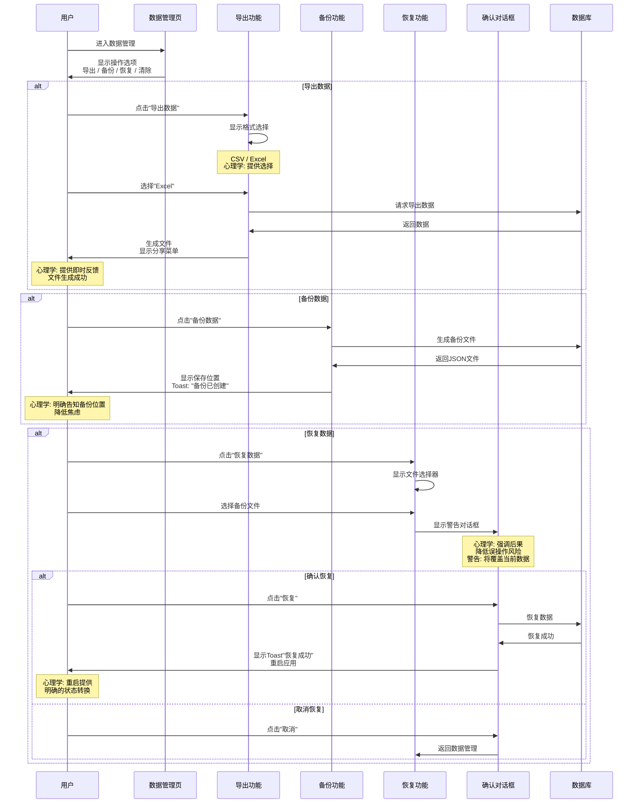

# 页面交互流程设计

## 1. 交互流程概述

本文档使用Mermaid序列图和流程图，详细描述账单通核心页面的交互流程，结合心理学原理设计每个交互节点。

---

## 2. 快速记账交互流程

### 2.1 完整记账序列图

### 2.2 记账流程状态机

### 2.3 快速记账心理学设计要点

#### 触发机制设计
- **视觉触发**：右下角悬浮按钮，主题色（绿色），吸引注意
- **空间触发**：始终可见，无需记忆位置
- **行为触发**：支持摇一摇（可选），增加趣味性

#### 输入优化设计
- **智能格式化**：自动添加小数点，千分位分隔
- **默认值策略**：
  - 日期：默认今天
  - 分类：常用分类置顶
  - 支付方式：记住上次选择
- **键盘优化**：直接弹出数字键盘，减少切换

#### 反馈机制设计
- **视觉反馈**：按钮按下缩放，选中高亮
- **触觉反馈**：保存成功轻微震动
- **信息反馈**：Toast提示 + 数据更新动画

---

## 3. 统计页面交互流程

### 3.1 统计浏览序列图

### 3.2 图表交互状态机

### 3.3 统计页面心理学设计要点

#### 可视化设计原则
- **颜色编码**：每个分类使用固定颜色，建立颜色-分类关联
- **视觉层级**：大数字突出关键指标，小图表展示细节
- **交互反馈**：悬停/点击高亮，提供即时确认

#### 信息层级设计
- **一级信息**：本月总支出（大字体、居中）
- **二级信息**：趋势图、饼图（辅助理解）
- **三级信息**：分类列表（详细数据）

#### 探索式交互设计
- **点击探索**：所有图表元素可点击
- **渐进披露**：从概览到详情，逐步深入
- **自由导航**：支持在图表间自由切换

---

## 4. 记录管理交互流程

### 4.1 记录列表浏览序列图

### 4.2 记录操作序列图

### 4.3 记录管理心理学设计要点

#### 列表设计原则
- **分组显示**：按日期分组（今天、昨天、更早）
- **视觉层次**：图标 + 分类名 + 金额，信息清晰
- **快速扫描**：金额右对齐，便于比较

#### 操作效率设计
- **长按菜单**：减少操作步骤
- **左滑删除**：快捷操作（需确认）
- **批量操作**：长按进入选择模式

#### 错误预防设计
- **删除确认**：防止误删
- **编辑预填充**：减少重复输入
- **自动保存**：避免意外丢失

---

## 5. 设置页面交互流程

### 5.1 设置浏览与修改序列图

### 5.2 预算设置序列图

### 5.3 数据管理序列图

### 5.4 设置页面心理学设计要点

#### 分组设计原则
- **逻辑分组**：基本 / 预算 / 数据 / 关于
- **视觉分隔**：使用分隔线或卡片区分
- **渐进披露**：点击展开详细选项

#### 选择器设计
- **提供选项**：而非自由输入，减少决策负担
- **显示当前值**：作为参考锚点
- **即时预览**：主题切换立即预览效果

#### 安全操作设计
- **明确警告**：破坏性操作前强调后果
- **二次确认**：防止误操作
- **可逆性**：尽可能提供撤销选项

---

## 6. 交互流程总结

### 6.1 通用交互模式

| 交互类型 | 标准流程 | 心理学原理 |
|---------|---------|-----------|
| 打开页面 | 淡入/滑入动画 | 建立空间层级 |
| 返回页面 | 反向滑出动画 | 一致性预期 |
| 保存数据 | 验证 → 保存 → 反馈 | 即时强化 |
| 删除数据 | 确认 → 删除 → 动画 | 降低焦虑 |
| 加载数据 | 骨架屏 → 内容填充 | 减少等待焦虑 |

### 6.2 性能与感知性能

| 操作 | 目标时间 | 感知优化策略 |
|------|---------|-------------|
| 页面切换 | < 300ms | 并行加载数据 |
| 数据保存 | < 200ms | 乐观UI更新 |
| 列表加载 | < 500ms | 分页 + 虚拟滚动 |
| 图表渲染 | < 1s | 渐进式渲染 |

---

*文档版本：v1.0*
*创建日期：2025-01-16*
*最后更新：2025-01-16*
*设计师：Claude (UX Designer Agent)*
