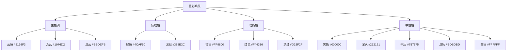
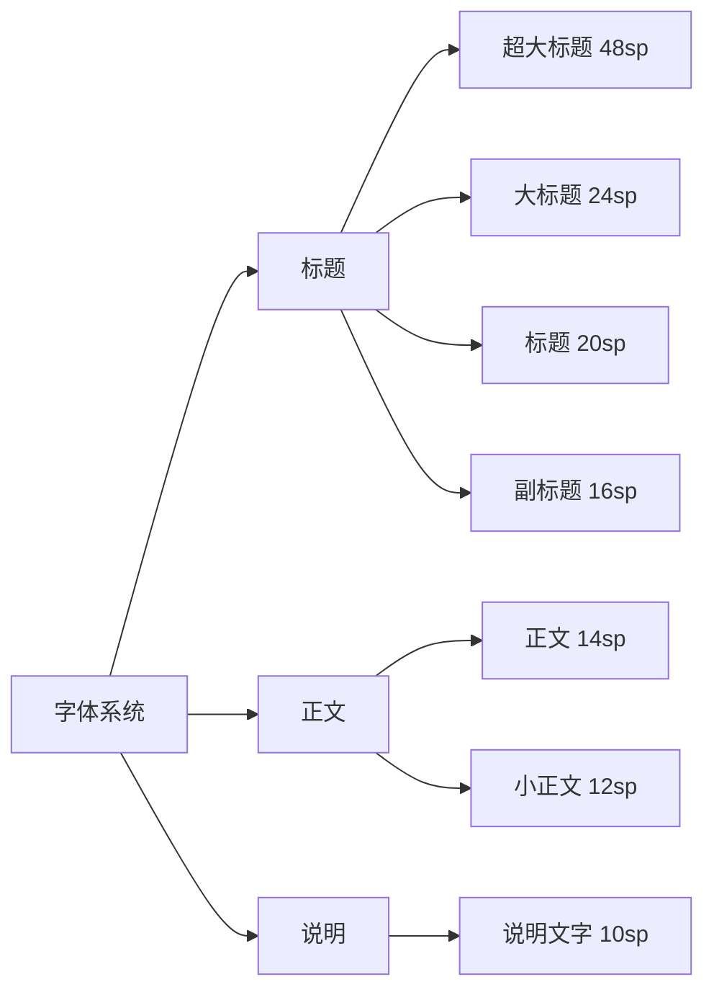

# 账单通 (BillTrack) 视觉设计系统

## 1. 设计系统概述

本文档定义账单通的完整视觉设计系统，包括色彩、字体、图标、间距和布局规范，确保视觉一致性和品牌识别度。

---

## 2. 色彩系统

### 2.1 色彩心理学应用

基于账单通的产品定位和用户画像，我们精心选择了能够传达信任、专业和积极情绪的色彩方案。

#### 主色调：蓝色 (Primary Blue)

**色彩选择**：
- 主色：#2196F3 (Material Blue 500)
- 深色：#1976D2 (Material Blue 700)
- 浅色：#BBDEFB (Material Blue 100)
- 极浅：#E3F2FD (Material Blue 50)

**心理学依据**：
- **信任与专业**：蓝色是最受信任的颜色，传达专业性和可靠性
- **冷静与理性**：帮助用户保持冷静，做出理性的消费决策
- **安全感**：降低财务焦虑，增强使用信心
- **科技感**：符合年轻用户对现代产品的期待

**使用场景**：
- 主要操作按钮（保存、确认）
- 导航栏选中状态
- 重要数据和金额显示
- 链接和可点击元素
- 加载和进度指示

#### 辅助色：绿色 (Success Green)

**色彩选择**：
- 主色：#4CAF50 (Material Green 500)
- 深色：#388E3C (Material Green 700)
- 浅色：#C8E6C9 (Material Green 100)

**心理学依据**：
- **积极与成长**：传达积极的情绪，鼓励用户建立好习惯
- **健康与平衡**：暗示健康的财务状况
- **成功与完成**：给予用户完成记账的成就感

**使用场景**：
- 收入显示
- 预算充足状态
- 成功提示和确认
- 正面数据对比（减少支出）
- 健康的消费习惯提示

#### 警告色：橙红色 (Warning Orange-Red)

**色彩选择**：
- 橙色：#FF9800 (Material Orange 500)
- 红色：#F44336 (Material Red 500)
- 深红：#D32F2F (Material Red 700)

**心理学依据**：
- **注意与警觉**：引起用户注意，但不产生过度焦虑
- **紧急感**：在预算超支时需要用户关注
- **行动提示**：促使用户采取行动

**使用场景**：
- 支出金额显示
- 预算警告（80%使用率）
- 预算超支（100%+使用率）
- 删除操作确认
- 错误提示

#### 中性色系统

**灰色阶梯**：
- 黑色：#000000
- 深灰：#212121
- 中灰：#757575
- 浅灰：#BDBDBD
- 极浅灰：#F5F5F5
- 背景灰：#FAFAFA
- 白色：#FFFFFF

**使用场景**：
- 黑色：主要文字
- 深灰：次要文字
- 中灰：辅助文字和图标
- 浅灰：禁用状态
- 极浅灰：分隔线
- 背景灰：页面背景
- 白色：卡片和弹窗背景

### 2.2 语义化色彩



### 2.3 色彩对比度标准

遵循WCAG 2.1 AA标准：

| 文字大小 | 最小对比度 | 实际应用 |
|---------|-----------|---------|
| 小于18sp | 4.5:1 | 正文文字 |
| 18sp及以上 | 3:1 | 标题文字 |
| 图标 | 3:1 | 功能图标 |

**对比度检查**：
- 黑色文字 (#000000) on 白色背景 (#FFFFFF)：21:1 ✓
- 深灰文字 (#212121) on 白色背景 (#FFFFFF)：12.6:1 ✓
- 中灰文字 (#757575) on 白色背景 (#FFFFFF)：4.6:1 ✓
- 主题色文字 (#2196F3) on 白色背景 (#FFFFFF)：3.2:1 ✓
- 白色文字 (#FFFFFF) on 主题色背景 (#2196F3)：3.2:1 ✓

---

## 3. 字体系统

### 3.1 字体选择

**中文字体**：
- 系统默认：-apple-system, BlinkMacSystemFont, "Segoe UI", Roboto
- Android：Roboto
- iOS：SF Pro Text
- 优先使用系统字体，确保最佳性能和可读性

**字体特点**：
- 无衬线字体（Sans-serif）
- 清晰易读
- 支持多种字重
- 优秀的数字显示

### 3.2 字体层级



**详细规范**：

| 类型 | 字号 | 字重 | 行高 | 使用场景 |
|------|------|------|------|---------|
| 超大标题 | 48sp | Bold (700) | 56sp | 金额显示 |
| 大标题 | 24sp | Bold (700) | 32sp | 页面标题 |
| 标题 | 20sp | Medium (500) | 28sp | 卡片标题 |
| 副标题 | 16sp | Medium (500) | 24sp | 列表标题 |
| 正文 | 14sp | Regular (400) | 20sp | 正文内容 |
| 小正文 | 12sp | Regular (400) | 16sp | 辅助信息 |
| 说明文字 | 10sp | Regular (400) | 14sp | 标签、注释 |

### 3.3 字重系统

- Light (300)：不常用
- Regular (400)：正文
- Medium (500)：标题、按钮
- Bold (700)：强调、重要数据
- Black (900)：不常用

### 3.4 数字字体

**金额显示特殊处理**：
- 使用等宽数字字体（Tabular Figures）
- 确保数字对齐
- 字号：48sp（大额金额）
- 字重：Bold (700)
- 颜色：主题色

**格式化示例**：
- 千分位分隔：¥1,234.56
- 小数点对齐：¥28.50
- 货币符号：左侧显示

---

## 4. 图标系统

### 4.1 图标风格

**设计原则**：
- 线性图标（Outlined）
- 统一的线条粗细：2dp
- 圆角端点
- 清晰的视觉语言
- Material Design Icons

**尺寸规范**：

| 类型 | 尺寸 | 使用场景 |
|------|------|---------|
| 超小图标 | 16dp | 列表辅助图标 |
| 小图标 | 20dp | 按钮、单选框 |
| 标准图标 | 24dp | 导航、列表 |
| 中图标 | 32dp | 分类图标 |
| 大图标 | 40dp | 列表主图标 |
| 超大图标 | 48dp | 空状态插图 |
| 巨大图标 | 64dp | 启动页 |

### 4.2 分类图标集

**餐饮类**：
- 🍔 餐饮（restaurant）
- 🍞 早餐（breakfast）
- 🍱 午餐（lunch）
- 🍲 晚餐（dinner）
- 🍰 零食（snack）

**交通类**：
- 🚇 交通（directions_transit）
- 🚌 公交（directions_bus）
- 🚗 打车（directions_car）
- 🅿️ 停车（local_parking）

**购物类**：
- 🛍️ 购物（shopping_bag）
- 👕 服饰（checkroom）
- 📦 日用品（inventory_2）

**娱乐类**：
- 🎬 娱乐（movie）
- 🎮 游戏（sports_esports）
- ✈️ 旅游（flight）

**居住类**：
- 🏠 居住（home）
- 💡 水电（lightbulb）
- 📱 宽带（phone）

**医疗类**：
- 💊 医疗（medical_services）
- 🏥 门诊（local_hospital）

**教育类**：
- 📚 教育（menu_book）
- ✏️ 课程（edit）

**其他类**：
- 💝 礼品（card_giftcard）
- ❤️ 捐赠（favorite）

### 4.3 功能图标集

**导航图标**：
- 🏠 首页（home）
- 📊 统计（bar_chart）
- 📝 记录（receipt）
- ⚙️ 我的（settings）

**操作图标**：
- ➕ 添加（add）
- ✏️ 编辑（edit）
- 🗑️ 删除（delete）
- 🔍 搜索（search）
- ↕️ 排序（swap_vert）
- ☰ 菜单（menu）
- × 关闭（close）
- ✓ 确认（check）
- ↩️ 返回（arrow_back）

**状态图标**：
- ⚠️ 警告（warning）
- ❌ 错误（error）
- ℹ️ 信息（info）
- ✅ 成功（check_circle）

**支付方式图标**：
- 💳 微信支付
- 💰 支付宝
- 💵 现金
- 💳 信用卡

---

## 5. 间距系统

### 5.1 8dp网格系统

基于Material Design的8dp网格系统：

```
0dp ---- 4dp ---- 8dp ---- 12dp ---- 16dp ---- 24dp ---- 32dp ---- 48dp
```

**使用规则**：
- 所有间距使用4的倍数
- 保持一致性
- 优先使用8dp和16dp

### 5.2 间距规范

| 间距 | 大小 | 使用场景 |
|------|------|---------|
| 微小间距 | 4dp | 图标与文字 |
| 小间距 | 8dp | 相关元素之间 |
| 标准间距 | 12dp | 卡片内元素 |
| 大间距 | 16dp | 页面边距 |
| 超大间距 | 24dp | 分组之间 |
| 巨大间距 | 32dp | 主要区块 |

### 5.3 内边距 (Padding)

**组件内边距**：
- 按钮：12dp（垂直），16dp（水平）
- 卡片：16dp
- 输入框：12dp（垂直），16dp（水平）
- 列表项：16dp（水平），8dp（垂直）

**页面内边距**：
- 标准页面：16dp
- 大屏页面：24dp

---

## 6. 布局系统

### 6.1 栅格系统

基于4列栅格系统：

```
┌─────────────────────────────────────────────────────────┐
│  16dp  │  [1列]  │  8dp  │  [2-3列]  │  8dp  │  [4列]  │  16dp  │
└─────────────────────────────────────────────────────────┘
```

**列宽计算**：
- 屏幕宽度 - 32dp（左右边距） - 16dp（间距）= 可用宽度
- 1列：25%
- 2列：50%
- 3列：75%
- 4列：100%

### 6.2 页面布局模板

**标准页面布局**：
```
┌─────────────────────────────────────┐
│  App Bar (56dp)                     │ ← 固定顶部
├─────────────────────────────────────┤
│                                     │
│  内容区域 (可滚动)                   │ ← 自适应高度
│  - 顶部内边距: 16dp                 │
│  - 卡片间距: 8dp                    │
│  - 底部内边距: 16dp                 │
│                                     │
├─────────────────────────────────────┤
│  Bottom Nav (56dp)                  │ ← 固定底部
│  FAB (56x56dp)                      │ ← 悬浮按钮
└─────────────────────────────────────┘
```

**对话框布局**：
```
┌─────────────────────────────────────┐
│  标题 (24dp)                         │
├─────────────────────────────────────┤
│  内容 (自适应)                       │
│  - 内边距: 24dp                     │
│  - 最小高度: 48dp                   │
├─────────────────────────────────────┤
│  按钮区域 (48dp)                     │
│  - 内边距: 8dp                      │
│  - 按钮间距: 8dp                    │
└─────────────────────────────────────┘
```

---

## 7. 阴影系统

### 7.1 阴影层级

基于Material Design的elevation系统：

| Level | 阴影值 | 使用场景 |
|-------|-------|---------|
| 0 | 无 | 平面元素 |
| 1 | 2dp | 卡片 |
| 2 | 4dp | 悬浮卡片 |
| 3 | 6dp | FAB正常 |
| 4 | 8dp | 底部导航 |
| 5 | 12dp | 对话框 |
| 6 | 16dp | 底部弹出 |

### 7.2 阴影样式

**阴影实现**（CSS示例）：
```css
/* Level 1: 卡片 */
box-shadow: 0 1px 3px rgba(0,0,0,0.12), 0 1px 2px rgba(0,0,0,0.24);

/* Level 3: FAB */
box-shadow: 0 3px 5px -1px rgba(0,0,0,0.2), 0 6px 10px 0 rgba(0,0,0,0.14);

/* Level 5: 对话框 */
box-shadow: 0 19px 38px rgba(0,0,0,0.3), 0 15px 12px rgba(0,0,0,0.22);
```

---

## 8. 圆角系统

### 8.1 圆角规范

| 组件 | 圆角大小 | 说明 |
|------|---------|------|
| 按钮 | 8dp | 标准圆角 |
| 卡片 | 12dp | 较大圆角 |
| 对话框 | 8dp | 标准圆角 |
| 底部弹出 | 16dp | 仅顶部圆角 |
| FAB | 28dp | 完全圆形（56/2） |
| 图标背景 | 50% | 完全圆形 |
| 输入框 | 4dp | 小圆角 |
| 芯片 | 16dp | 完全圆形 |

---

## 9. 动画系统

### 9.1 缓动函数

**标准缓动**：
- 标准：cubic-bezier(0.4, 0.0, 0.2, 1)
- 减速：cubic-bezier(0.0, 0.0, 0.2, 1)
- 加速：cubic-bezier(0.4, 0.0, 1, 1)
- 急速：cubic-bezier(0.4, 0.0, 0.6, 1)

### 9.2 动画时长

| 类型 | 时长 | 使用场景 |
|------|------|---------|
| 极快 | 100ms | 按钮点击 |
| 快 | 200ms | 状态切换 |
| 标准 | 300ms | 页面切换 |
| 慢 | 400ms | 复杂动画 |
| 极慢 | 500ms | 特殊效果 |

### 9.3 常用动画

**淡入淡出**：
- 时长：300ms
- 缓动：标准
- opacity: 0 → 1

**滑入滑出**：
- 时长：300ms
- 缓动：减速
- transform: translateY(100%) → translateY(0)

**缩放**：
- 时长：200ms
- 缓动：标准
- transform: scale(1) → scale(0.95)

**涟漪效果**：
- 时长：400ms
- 缓动：标准
- 从点击位置扩散

---

## 10. 响应式设计

### 10.1 断点系统

| 断点 | 屏幕宽度 | 设备类型 |
|------|---------|---------|
| 小 | < 360dp | 小屏手机 |
| 中 | 360dp - 600dp | 标准手机 |
| 大 | 600dp - 840dp | 大屏手机/小平板 |
| 超大 | > 840dp | 平板 |

### 10.2 适配策略

**小屏适配**（< 360dp）：
- 减少内边距：16dp → 12dp
- 缩小字体：保持可读性
- 隐藏次要信息
- 单列布局

**标准屏**（360dp - 600dp）：
- 标准布局
- 标准字体
- 完整信息

**大屏**（> 600dp）：
- 增加内边距：16dp → 24dp
- 增大字体
- 多列布局（统计页）
- 显示更多信息

---

## 11. 深色模式

### 11.1 深色模式色彩

**背景色**：
- 主背景：#121212
- 卡片背景：#1E1E1E
- 输入框背景：#2C2C2C

**文字色**：
- 主要文字：#FFFFFF（87%透明度）
- 次要文字：#B0B0B0（60%透明度）
- 辅助文字：#6E6E6E（38%透明度）

**主题色调整**：
- 主色：#BBDEFB（浅蓝色）
- 强调色：保持不变

### 11.2 切换机制

**切换选项**：
- 跟随系统（默认）
- 浅色模式
- 深色模式

**切换动画**：
- 时长：300ms
- 淡入淡出
- 平滑过渡

---

## 12. 无障碍设计

### 12.1 颜色无障碍

**对比度要求**：
- 正文：4.5:1
- 大文字：3:1
- 图标：3:1

**色盲友好**：
- 不仅依靠颜色传达信息
- 使用图标+颜色组合
- 提供文字标签

### 12.2 触控目标

**最小尺寸**：
- 按钮：44x44dp
- 链接：44x44dp
- 输入框：48dp高度

**间距**：
- 可点击元素之间至少8dp

### 12.3 字体缩放

**支持范围**：
- 最小：系统设置的85%
- 最大：系统设置的200%
- 布局自适应

---

## 13. 品牌元素

### 13.1 Logo规范

**Logo类型**：
- 图标Logo：账本图标
- 文字Logo：账单通
- 组合Logo：图标 + 文字

**使用规范**：
- 启动页：120x120dp
- 导航栏：24x24dp
- 设置页：48x48dp

### 13.2 应用图标

**设计规范**：
- 尺寸：192x192dp（Android）
- 圆角：40dp
- 背景：渐变蓝色
- 图标：白色账本图标

---

## 14. 设计资源

### 14.1 设计文件

- Figma设计文件：包含所有UI组件和页面
- 图标库：Material Design Icons
- 字体：系统默认字体

### 14.2 开发资源

- 色彩常量：十六进制颜色值
- 尺寸常量：dp/sp值
- 字体样式：CSS/样式定义
- 图标字体：Icon Font

---

*文档版本：v1.0*
*创建日期：2025-01-16*
*设计团队：UX Design Team*
