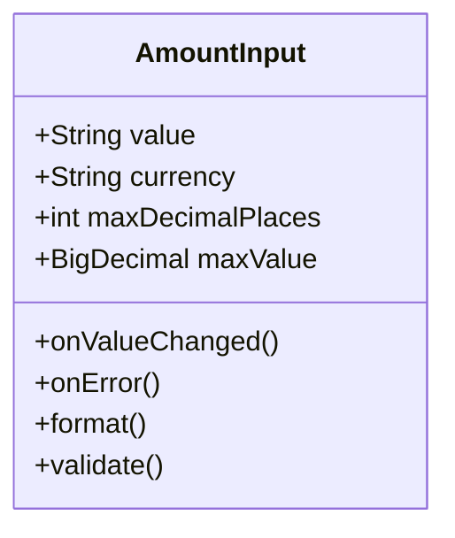
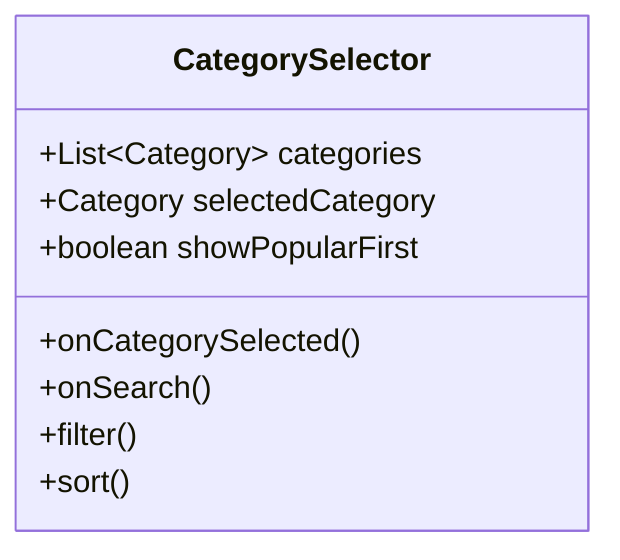
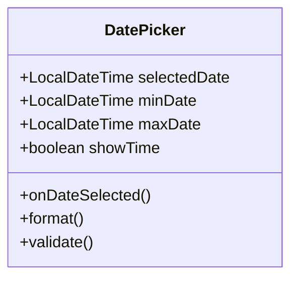

# 组件交互规范

## 1. 组件设计原则

### 1.1 设计哲学

基于原子设计理论（Atomic Design）和心理学原理，将界面元素划分为五个层级：

```
原子 (Atoms) → 分子 (Molecules) → 组织 (Organisms) → 模板 (Templates) → 页面 (Pages)
```

**核心原则**：
- **一致性**：相同组件在不同页面表现一致
- **可复用性**：组件设计考虑多种使用场景
- **可访问性**：所有组件支持无障碍访问
- **心理学导向**：交互设计基于用户心理模型

---

## 2. 表单输入组件

### 2.1 金额输入组件 (AmountInput)

#### 组件规格



#### 视觉规范

```
┌─────────────────────────────┐
│                             │
│           ¥ 0.00           │ ← 48sp, 主题色, 居中
│                             │
│  ┌───┬───┬───┬───┬───┐   │ ← 数字键盘
│  │ 1 │ 2 │ 3 │ × │ ←│   │
│  ├───┼───┼───┼───┼───┤   │
│  │ 4 │ 5 │ 6 │ ÷ │ →│   │
│  ├───┼───┼───┼───┼───┤   │
│  │ 7 │ 8 │ 9 │ + │完 │   │
│  ├───┼───┼───┼───┼───┤   │
│  │ . │ 0 │ ⌫ │ - │成 │   │
│  └───┴───┴───┴───┴───┘   │
└─────────────────────────────┘
```

#### 交互规范

| 状态 | 视觉表现 | 触觉反馈 | 动画效果 |
|------|---------|---------|---------|
| 默认 | 灰色文字, 光标闪烁 | 无 | 光标闪烁动画 |
| 聚焦 | 主题色文字, 光标可见 | 轻微震动 | 无 |
| 输入中 | 实时格式化显示 | 无 | 无 |
| 错误 | 红色文字, 边框抖动 | 震动 | 左右抖动(200ms) |
| 成功 | 主题色文字 | 无 | 缩放确认动画 |

#### 心理学设计要点

**认知负荷优化**：
- **格式化显示**：千分位分隔符，快速识别金额量级
- **货币符号**：始终显示，提供上下文
- **对齐方式**：右对齐数字，符合阅读习惯

**输入效率优化**：
- **智能小数点**：自动添加，只需输入数字
- **快速删除**：长按删除键清空
- **键盘布局**：数字键盘优先，减少切换

**错误预防**：
- **实时验证**：输入时验证格式和范围
- **温和提示**：错误时红色边框 + 抖动，而非弹窗
- **容错设计**：允许撤销操作

#### 代码示例（Kotlin Compose）

```kotlin
@Composable
fun AmountInput(
    value: String,
    onValueChange: (String) -> Unit,
    currency: String = "¥",
    maxDecimalPlaces: Int = 2,
    maxValue: BigDecimal = BigDecimal("999999.99")
) {
    var isError by remember { mutableStateOf(false) }
    var isFocused by remember { mutableStateOf(false) }

    Column(
        horizontalAlignment = Alignment.CenterHorizontally,
        modifier = Modifier
            .fillMaxWidth()
            .padding(vertical = 32.dp)
    ) {
        // 金额显示
        Text(
            text = formatAmount(value, currency),
            fontSize = 48.sp,
            fontWeight = FontWeight.Medium,
            color = if (isError) MaterialTheme.colors.error
                    else MaterialTheme.colors.primary,
            textAlign = TextAlign.Center
        )

        // 数字键盘
        NumericKeypad(
            onKeyPress = { key ->
                when (key) {
                    is NumericKey.Digit -> onValueChange(value + key.digit)
                    is NumericKey.Decimal -> if (!value.contains(".")) {
                        onValueChange(value + ".")
                    }
                    is NumericKey.Delete -> onValueChange(
                        value.dropLast(1).ifEmpty { "0" }
                    )
                }
                // 验证逻辑
                isError = !validateAmount(value, maxValue)
            }
        )
    }
}
```

---

### 2.2 分类选择组件 (CategorySelector)

#### 组件规格



#### 视觉规范

**网格布局**：
```
┌─────────────────────────────┐
│  选择分类            [搜索]  │
├─────────────────────────────┤
│  常用分类                   │
│  ┌─────┬─────┬─────┬─────┐ │
│  │ 🍔  │ 🚇  │ 👕  │ 🎬  │ │ ← 4列网格
│  │餐饮 │交通 │购物 │娱乐 │ │
│  └─────┴─────┴─────┴─────┘ │
│  ┌─────┬─────┬─────┬─────┐ │
│  │ 🏠  │ 💊  │ 📚  │ ➕  │ │
│  │居住 │医疗 │教育 │更多 │ │
│  └─────┴─────┴─────┴─────┘ │
├─────────────────────────────┤
│  所有分类                   │
│  [餐饮] (展开)              │
│    早餐 / 午餐 / 晚餐       │
│  [交通]                     │
│  [购物]                     │
│  ...                        │
└─────────────────────────────┘
```

#### 交互规范

| 操作 | 触发方式 | 反馈 | 心理效果 |
|------|---------|------|---------|
| 选择分类 | 点击图标/名称 | 高亮 + 震动 | 即时确认 |
| 查看二级分类 | 点击分类 | 展开动画 | 渐进披露 |
| 搜索分类 | 点击搜索图标 | 显示搜索框 | 快速定位 |
| 取消选择 | 点击已选项 | 取消高亮 | 容错操作 |

#### 心理学设计要点

**视觉层级**：
- **图标优先**：图标比文字识别速度快
- **颜色编码**：每个分类固定颜色
- **大小对比**：选中项放大10%，提供视觉确认

**智能排序**：
- **常用置顶**：基于使用频率
- **最近使用**：记住最近3次选择
- **时间感知**：早餐分类在上午时段优先

**搜索优化**：
- **实时过滤**：输入时即时过滤
- **模糊匹配**：支持拼音、缩写
- **历史记录**：显示最近搜索

---

### 2.3 日期选择组件 (DatePicker)

#### 组件规格



#### 视觉规范

**紧凑模式**：
```
┌─────────────────────────────┐
│  📅 2025-01-16  今天  12:30 │ ← 默认显示
└─────────────────────────────┘
```

**展开模式**：
```
┌─────────────────────────────┐
│  选择日期和时间             │
├─────────────────────────────┤
│  2025年 1月     [今天][昨天]│ ← 快捷选项
│  ┌───┬───┬───┬───┬───┬───┬───┐│
│  │日 │一 │二 │三 │四 │五 │六 ││
│  ├───┼───┼───┼───┼───┼───┼───┤│
│  │ 29│ 30│ 31│ 1 │ 2 │ 3 │ 4 ││
│  │ 5 │ 6 │ 7 │ 8 │ 9 │ 10│ 11││
│  │ 12│ 13│ 14│ 15│ 16│ 17│ 18││ ← 选中
│  │ 19│ 20│ 21│ 22│ 23│ 24│ 25││
│  │ 26│ 27│ 28│ 29│ 30│ 31│   ││
│  └───┴───┴───┴───┴───┴───┴───┘│
├─────────────────────────────┤
│  时间: 12:30                 │
│  ┌───┬───┬───┬───┬───┬───┐ │
│  │09 │10 │11 │12 │13 │14 │ │ ← 小时
│  ├───┼───┼───┼───┼───┼───┤ │
│  │00 │15 │30 │45 │   │   │ │ ← 分钟
│  └───┴───┴───┴───┴───┴───┘ │
├─────────────────────────────┤
│      [取消]    [确认]       │
└─────────────────────────────┘
```

#### 交互规范

| 操作 | 触发方式 | 反馈 | 心理效果 |
|------|---------|------|---------|
| 打开选择器 | 点击日期 | 展开动画 | 渐进披露 |
| 选择日期 | 点击日历 | 高亮 + 震动 | 即时确认 |
| 选择时间 | 点击时间 | 高亮 | 精确控制 |
| 快捷选择 | 点击今天/昨天 | 自动填充 | 效率优化 |
| 确认选择 | 点击确认 | 关闭 + 更新 | 完成闭环 |

#### 心理学设计要点

**默认值策略**：
- **当前日期**：符合80%使用场景
- **快捷选项**：今天、昨天、上周
- **时间推断**：根据输入时间智能推荐

**视觉引导**：
- **当前日期**：特殊标记
- **选中日期**：主题色圆圈
- **不可选日期**：灰色 + 禁用

**时间感知**：
- **相对时间**："今天"、"昨天"比日期更直观
- **时间范围**：显示可选范围（如：本月）

---

## 3. 按钮组件

### 3.1 主按钮 (PrimaryButton)

#### 视觉规范

```
┌─────────────────────────────┐
│         保存                │ ← 高度: 48dp
└─────────────────────────────┘   圆角: 8dp
    背景: 主题色 (#4CAF50)
    文字: 白色, 16sp/Medium
```

#### 状态规范

| 状态 | 背景色 | 文字色 | 图标 | 触觉反馈 | 动画 |
|------|--------|--------|------|---------|------|
| 正常 | #4CAF50 | #FFFFFF | 正常 | 无 | 无 |
| 按下 | #43A047 | #FFFFFF | 缩小0.9倍 | 震动 | 缩放 |
| 禁用 | #E0E0E0 | #9E9E9E | 灰色 | 无 | 无 |
| 加载 | #4CAF50 | #FFFFFF | 加载动画 | 无 | 旋转 |

#### 心理学设计要点

**视觉突出**：
- **颜色对比**：主题色与背景高对比
- **尺寸优势**：比次要按钮高20%
- **阴影效果**：elevation 2dp，提升层次

**位置策略**：
- **右下角**：符合右手操作习惯
- **固定位置**：减少寻找时间
- **拇指可达**：单手操作友好

**反馈明确**：
- **按下缩放**：提供触觉反馈
- **禁用状态**：明确不可用
- **加载状态**：进度指示

---

### 3.2 悬浮按钮 (FAB - FloatingActionButton)

#### 视觉规范

```
        ┌─────┐
        │  +  │ ← 56x56dp, 圆形
        └─────┘   背景: 主题色
         阴影: elevation 6dp
         图标: 24x24dp, 白色
```

#### 交互规范

| 状态 | 尺寸 | 阴影 | 位置 | 动画 |
|------|------|------|------|------|
| 默认 | 56dp | 6dp | 右下角(16dp边距) | 无 |
| 按下 | 52dp | 12dp | 不变 | 缩放0.9倍 |
| 展开菜单 | 56dp | 6dp | 不变 | 旋转45° |
| 隐藏 | 0dp | 0dp | 屏幕外 | 滑出动画 |

#### 心理学设计要点

**视觉吸引**：
- **颜色突出**：主题色，吸引注意
- **阴影效果**：提升视觉层级
- **圆形设计**：友好、现代

**位置固定**：
- **右下角**：最佳拇指位置
- **始终可见**：无需记忆
- **不遮挡内容**：智能避让

**微交互**：
- **按下缩放**：提供触觉反馈
- **弹出动画**：从底部滑入
- **涟漪效果**：Material Design风格

---

### 3.3 图标按钮 (IconButton)

#### 视觉规范

```
┌─────┐ ┌─────┐ ┌─────┐
│ 🔍  │ │ ⋮   │ │ ×   │ ← 48x48dp
└─────┘ └─────┘ └─────┘   圆角: 50%
  背景: 透明/灰色
  图标: 24x24dp
```

#### 交互规范

| 状态 | 背景 | 图标色 | 触觉反馈 | 动画 |
|------|------|--------|---------|------|
| 正常 | 透明 | #616161 | 无 | 无 |
| 按下 | #E0E0E0 | #616161 | 震动 | 涟漪 |
| 禁用 | 透明 | #BDBDBD | 无 | 无 |

#### 心理学设计要点

**简洁高效**：
- **无文字**：纯图标，节省空间
- **快速识别**：通用图标
- **轻量感**：透明背景

**操作引导**：
- **工具提示**：长按显示文字说明
- **涟漪效果**：提供点击反馈
- **禁用明显**：灰色图标

---

## 4. 选择器组件

### 4.1 下拉选择器 (Dropdown)

#### 视觉规范

**收起状态**：
```
┌─────────────────────────────┐
│  本月              [▼]      │ ← 48dp高
└─────────────────────────────┘   边框: 1dp #E0E0E0
```

**展开状态**：
```
┌─────────────────────────────┐
│  本月              [▲]      │
├─────────────────────────────┤
│  本月         ●             │ ← 选中标记
│  上月                       │
│  近3月                      │
│  近6月                      │
│  今年                       │
│  自定义...                  │ ← 副标题样式
├─────────────────────────────┤
│  ┌─────────────────────┐   │
│  │      取消            │   │ ← 按钮样式
│  └─────────────────────┘   │
└─────────────────────────────┘
```

#### 交互规范

| 操作 | 触发方式 | 反馈 | 心理效果 |
|------|---------|------|---------|
| 打开选择器 | 点击下拉框 | 展开动画 | 渐进披露 |
| 选择选项 | 点击选项 | 高亮 + 震动 | 即时确认 |
| 关闭选择器 | 点击外部/取消 | 收起动画 | 完成闭环 |
| 自定义选项 | 点击"自定义" | 打开自定义页面 | 高级功能 |

#### 心理学设计要点

**认知负荷优化**：
- **常用选项**：预设选项覆盖80%场景
- **清晰分组**：使用分隔线或副标题
- **选中状态**：明确的视觉标记

**决策支持**：
- **描述性文字**：选项名称清晰
- **默认选中**：合理默认值减少决策
- **取消明确**：提供退出路径

---

### 4.2 单选按钮组 (RadioGroup)

#### 视觉规范

```
┌─────────────────────────────┐
│  选择主题                   │
├─────────────────────────────┤
│  ○ 浅色                     │ ← 未选中
│  ● 深色                     │ ← 选中
│  ○ 跟随系统                 │
└─────────────────────────────┘
```

#### 交互规范

| 状态 | 视觉表现 | 触觉反馈 | 动画 |
|------|---------|---------|------|
| 未选中 | ○ 灰色圆圈 | 无 | 无 |
| 选中 | ● 主题色圆点 | 震动 | 缩放动画 |
| 禁用 | ○ 灰色虚线 | 无 | 无 |

#### 心理学设计要点

**互斥明确**：
- **单选逻辑**：视觉上暗示互斥
- **选中标记**：明显的视觉变化
- **分组清晰**：使用容器或分隔线

**操作友好**：
- **点击区域**：整行可点击，不限于圆圈
- **即时反馈**：选中立即生效
- **描述辅助**：文字说明提供上下文

---

## 5. 反馈组件

### 5.1 Toast提示 (Toast)

#### 视觉规范

```
┌─────────────────────────────┐
│         ✓ 已保存           │ ← 圆角: 4dp
└─────────────────────────────┘   高度: 48dp
    背景: #323232 (90%透明)
    文字: 白色, 14sp
    位置: 底部(距底80dp)
```

#### 交互规范

| 类型 | 图标 | 颜色 | 持续时间 | 位置 |
|------|------|------|---------|------|
| 成功 | ✓ | #4CAF50 | 2s | 底部 |
| 错误 | ✗ | #F44336 | 3s | 底部 |
| 警告 | ! | #FFC107 | 2.5s | 底部 |
| 信息 | i | #2196F3 | 2s | 底部 |

#### 心理学设计要点

**非侵入式**：
- **自动消失**：无需用户操作
- **位置不遮挡**：底部显示，避开操作区
- **短暂显示**：2-3秒，提供阅读时间

**信息明确**：
- **图标辅助**：快速识别类型
- **文字简洁**：一行文字，<20字
- **颜色编码**：成功绿、错误红

**可操作**：
- **可点击**：点击后立即消失
- **排队显示**：多个Toast依次显示
- **防止重复**：相同消息不重复显示

---

### 5.2 对话框 (Dialog)

#### 视觉规范

**确认对话框**：
```
┌─────────────────────────────┐
│  确认删除           [×]     │ ← 标题栏
├─────────────────────────────┤
│                             │
│  确定要删除这条记录吗？      │ ← 提示文字
│                             │
│  ┌─────────────────────┐   │
│  │  餐饮 - 麦当劳       │   │ ← 内容卡片
│  │  ¥28.50             │   │
│  │  2025-01-16         │   │
│  └─────────────────────┘   │
│                             │
│  删除后无法恢复              │ ← 警告文字(红色)
│                             │
├─────────────────────────────┤
│      [取消]    [删除]       │ ← 按钮组
└─────────────────────────────┘
```

#### 交互规范

| 操作 | 触发方式 | 反馈 | 心理效果 |
|------|---------|------|---------|
| 打开对话框 | 触发操作 | 淡入动画 | 聚焦注意力 |
| 确认操作 | 点击确认按钮 | 关闭 + 执行 | 明确后果 |
| 取消操作 | 点击取消/外部 | 关闭 | 安全退出 |

#### 心理学设计要点

**降低焦虑**：
- **后果明确**：清晰说明操作结果
- **二次确认**：重要操作需要确认
- **退出路径**：提供明确的取消选项

**视觉聚焦**：
- **背景遮罩**：半透明黑色，聚焦对话框
- **圆角设计**：友好的视觉风格
- **阴影效果**：提升层级

**操作引导**：
- **主次按钮**：确认按钮更突出
- **默认焦点**：取消按钮默认聚焦
- **键盘支持**：ESC键取消，Enter键确认

---

### 5.3 底部菜单 (BottomSheet)

#### 视觉规范

```
┌─────────────────────────────┐
│                             │ ← 上方内容(变暗)
│                             │
├─────────────────────────────┤ ← 顶部把手
│  ║                         │ ← 圆角顶部
├─────────────────────────────┤
│  选择操作                   │ ← 标题
│                             │
│  ┌─────────────────────┐   │
│  │  ✏️  编辑           │   │ ← 选项1
│  └─────────────────────┘   │
│  ┌─────────────────────┐   │
│  │  🗑️  删除           │   │ ← 选项2(红色)
│  └─────────────────────┘   │
│  ┌─────────────────────┐   │
│  │  📋  复制           │   │ ← 选项3
│  └─────────────────────┘   │
│                             │
│         [取消]              │ ← 底部按钮
└─────────────────────────────┘
```

#### 交互规范

| 操作 | 触发方式 | 反馈 | 心理效果 |
|------|---------|------|---------|
| 打开菜单 | 长按/点击 | 从底部滑入 | 原位操作 |
| 选择选项 | 点击选项 | 关闭 + 执行 | 快速高效 |
| 关闭菜单 | 下拉/点击取消/外部 | 滑出动画 | 自然交互 |

#### 心理学设计要点

**拇指友好**：
- **底部位置**：易于单手操作
- **大目标**：每个选项高度48dp
- **滑动手势**：下拉关闭符合直觉

**视觉层次**：
- **图标辅助**：图标 + 文字
- **危险警告**：删除操作使用红色
- **分组明确**：使用分隔线

**上下文保持**：
- **不遮挡**：保持部分原内容可见
- **原位操作**：无需页面跳转
- **快速返回**：一次操作即可返回

---

## 6. 列表组件

### 6.1 记录列表项 (ExpenseListItem)

#### 视觉规范

```
┌─────────────────────────────┐
│  [🍔] 餐饮           ¥28.50│ ← 主信息
│       麦当劳套餐       12:30│ ← 次信息
└─────────────────────────────┘
    ↑        ↑           ↑
   40dp     16sp        16sp/Bold
   图标    分类名       金额(红色)
```

#### 交互规范

| 操作 | 触发方式 | 反馈 | 心理效果 |
|------|---------|------|---------|
| 查看详情 | 点击列表项 | 滑入详情页 | 导航清晰 |
| 快捷操作 | 左滑 | 显示操作按钮 | 效率优化 |
| 长按菜单 | 长按列表项 | 震动 + 菜单 | 高级功能 |

#### 心理学设计要点

**信息层次**：
- **图标识别**：颜色 + 图标快速识别分类
- **金额突出**：右侧对齐，红色字体
- **时间辅助**：次要信息，灰色小字

**操作引导**：
- **点击区域**：整行可点击
- **左滑提示**：首次使用气泡提示
- **长按反馈**：震动确认长按操作

**视觉反馈**：
- **按下效果**：轻微背景色变化
- **涟漪效果**：Material Design风格
- **过渡动画**：列表项进入/退出动画

---

### 6.2 分组列表 (GroupedList)

#### 视觉规范

```
┌─────────────────────────────┐
│  [今天]  5笔  ¥128.00      │ ← 分组标题
├─────────────────────────────┤
│  [🍔] 餐饮           ¥28.50│
│      麦当劳套餐       12:30│
│  ─────────────────────────  │ ← 分隔线
│  [🚇] 交通            ¥5.00│
│      地铁             08:20│
│  ...                        │
├─────────────────────────────┤
│  [昨天]  8笔  ¥256.00      │ ← 分组标题
├─────────────────────────────┤
│  [👕] 购物          ¥199.00│
│      优衣库T恤             │
│  ...                        │
└─────────────────────────────┘
```

#### 心理学设计要点

**分组优势**：
- **时间感知**：今天、昨天更直观
- **统计汇总**：每组显示笔数和总额
- **视觉分隔**：分组标题使用不同背景色

**滚动优化**：
- **粘性标题**：分组标题滚动时吸附顶部
- **索引提示**：长按快速滚动，显示索引
- **加载更多**：底部加载指示器

---

## 7. 卡片组件

### 7.1 统计卡片 (StatCard)

#### 视觉规范

**主卡片**：
```
┌─────────────────────────────┐
│  本月支出                   │ ← 标题
│  ¥3,245.80                 │ ← 金额(32sp)
│  ↓ 12% vs 上月              │ ← 对比(绿色)
│  ████████░░ 65%            │ ← 进度条
└─────────────────────────────┘
```

**次要卡片**：
```
┌───────────┬───────────┐
│  今日支出  │  本周支出  │ ← 并排卡片
│  ¥128     │  ¥856     │
│  +¥35     │  +¥45     │
└───────────┴───────────┘
```

#### 交互规范

| 操作 | 触发方式 | 反馈 | 心理效果 |
|------|---------|------|---------|
| 查看详情 | 点击卡片 | 跳转详情页 | 探索引导 |
| 刷新数据 | 下拉 | 刷新动画 | 数据更新 |

#### 心理学设计要点

**视觉层次**：
- **主次分明**：主卡片更大，使用主题色
- **数字突出**：金额使用大字体
- **对比明确**：增长绿、减少红

**数据可视化**：
- **进度条**：预算使用率直观
- **趋势箭头**：↑ ↓ 表示变化
- **颜色编码**：健康绿、警告黄、超支红

**交互引导**：
- **点击提示**：首次使用提示可点击
- **涟漪效果**：提供点击反馈
- **悬停效果**：Web版本支持

---

## 8. 组件使用规范总结

### 8.1 组件选择指南

| 场景 | 推荐组件 | 替代组件 | 理由 |
|------|---------|---------|------|
| 主要操作 | 主按钮 | FAB | 视觉突出 |
| 次要操作 | 图标按钮 | 文字按钮 | 节省空间 |
| 选择操作 | 下拉选择器 | 单选按钮组 | 节省空间 |
| 确认操作 | 对话框 | 底部菜单 | 强调重要性 |
| 快捷操作 | 底部菜单 | 滑动操作 | 拇指友好 |
| 信息展示 | 卡片 | 列表项 | 视觉吸引 |

### 8.2 组件组合规范

**快速记账弹窗**：
```
金额输入组件
    +
分类选择组件
    +
日期选择组件
    +
备注输入组件
    +
主按钮(保存)
```

**记录列表**：
```
搜索栏
    +
分组列表
    +
列表项
    +
底部菜单(长按)
    +
对话框(删除确认)
```

---

*文档版本：v1.0*
*创建日期：2025-01-16*
*最后更新：2025-01-16*
*设计师：Claude (UX Designer Agent)*
