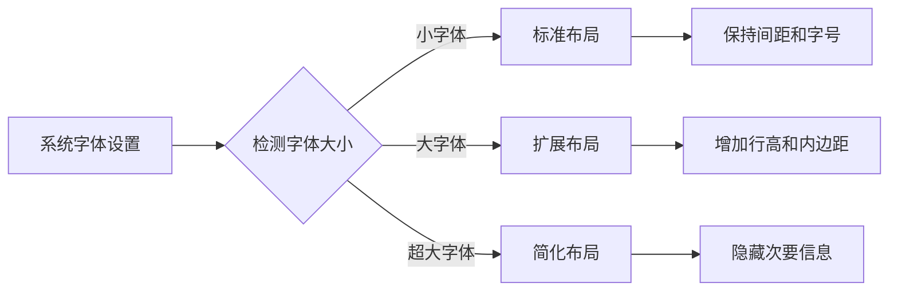
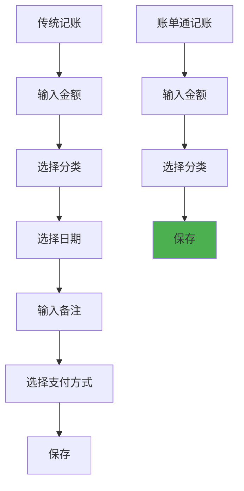
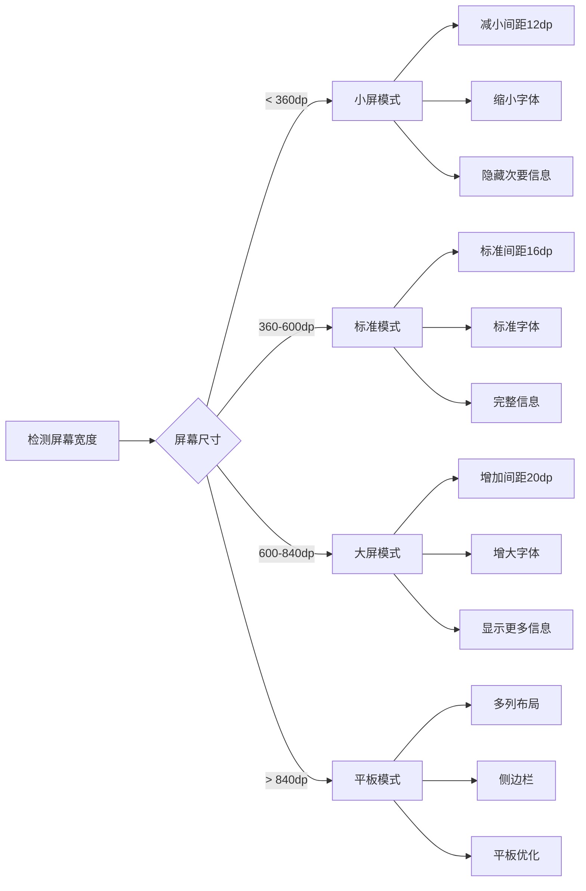

# 账单通 (BillTrack) 无障碍与响应式设计

## 1. 无障碍设计概述

账单通致力于为所有用户提供平等的使用体验，包括视觉、听觉、运动和认知能力不同的用户群体。本文档定义无障碍设计的规范和实施方案。

---

## 2. 视觉无障碍

### 2.1 颜色对比度

遵循WCAG 2.1 AA级别标准：

**最小对比度要求**：

| 元素类型 | 最小对比度 | 示例 |
|---------|-----------|------|
| 正文文字（<18sp） | 4.5:1 | #000000 on #FFFFFF |
| 大文字（≥18sp） | 3:1 | #212121 on #FFFFFF |
| 图形和图标 | 3:1 | 功能图标 |
| UI组件边框 | 3:1 | 输入框边框 |

**对比度检查清单**：

✓ 所有正文文字与背景对比度 ≥ 4.5:1
✓ 所有标题文字与背景对比度 ≥ 3:1
✓ 所有图标与背景对比度 ≥ 3:1
✓ 输入框边框与背景对比度 ≥ 3:1
✓ 按钮文字与背景对比度 ≥ 4.5:1

### 2.2 色盲友好设计

**设计原则**：
- 不仅依靠颜色传达信息
- 使用图标+颜色组合
- 提供文字标签
- 避免红绿对比

**实施策略**：

| 场景 | 颜色使用 | 辅助手段 |
|------|---------|---------|
| 支出/收入 | 红色/绿色 | 文字说明"支出"/"收入" |
| 预算状态 | 红色/橙色/绿色 | 文字说明"超支"/"警告"/"正常" |
| 错误提示 | 红色 | 图标+文字说明 |
| 成功提示 | 绿色 | 图标+文字说明 |
| 分类识别 | 多种颜色 | 图标+文字标签 |

### 2.3 字体缩放支持

**缩放级别**：
- 最小：系统设置的85%
- 默认：100%
- 最大：系统设置的200%

**布局适配**：


**实施规范**：
- 使用sp单位定义文字大小
- 使用dp单位定义间距
- 布局使用wrap_content或match_parent
- 避免固定高度，使用最小高度

### 2.4 屏幕阅读器支持

**语义化标签**：

| 组件 | 内容描述 | 提示 |
|------|---------|------|
| 金额输入框 | "输入金额" | "必填项" |
| 分类选择器 | "选择消费分类" | "餐饮、交通等" |
| 保存按钮 | "保存记录" | "双击执行" |
| 删除按钮 | "删除记录" | "将永久删除" |
| FAB | "快速记账" | "添加新记录" |

**状态通知**：
- 保存成功："记录已保存，金额¥28.50"
- 保存失败："保存失败，请检查输入"
- 删除成功："记录已删除"
- 加载中："正在加载，请稍候"

**焦点顺序**：
```
金额输入框 → 分类选择 → 日期选择 → 备注输入 → 保存按钮 → 取消按钮
```

---

## 3. 操作无障碍

### 3.1 触控目标尺寸

**最小尺寸要求**：

| 组件类型 | 最小尺寸 | 推荐尺寸 | 间距 |
|---------|---------|---------|------|
| 按钮 | 44x44dp | 48x48dp | 8dp |
| 链接 | 44x44dp | 48x48dp | 8dp |
| 输入框 | 44dp高 | 48dp高 | 8dp |
| 开关 | 48x28dp | 48x28dp | 8dp |
| 复选框 | 44x44dp | 48x48dp | 8dp |
| 单选框 | 44x44dp | 48x48dp | 8dp |
| 列表项 | 48dp高 | 56dp+ | - |

**实施示例**：
```xml
<!-- 按钮 -->
<Button
    android:layout_width="48dp"
    android:layout_height="48dp"
    android:minWidth="44dp"
    android:minHeight="44dp"
    android:padding="12dp" />

<!-- 列表项 -->
<TextView
    android:layout_width="match_parent"
    android:layout_height="56dp"
    android:paddingVertical="16dp"
    android:clickable="true"
    android:focusable="true" />
```

### 3.2 手势操作支持

**提供多种操作方式**：

| 功能 | 标准操作 | 替代操作 |
|------|---------|---------|
| 快速记账 | 点击FAB | 摇一摇、下拉 |
| 查看详情 | 点击列表项 | 长按菜单 |
| 删除记录 | 侧滑 | 长按菜单、详情页删除 |
| 编辑记录 | 点击编辑按钮 | 长按菜单 |
| 刷新列表 | 下拉 | 导航刷新按钮 |
| 关闭弹窗 | 向下滑动 | 点击外部、点击× |

**手势说明**：
- 在首次使用时展示手势说明
- 在设置中提供手势教程
- 关键手势提供视觉提示

### 3.3 键盘导航

**支持场景**：
- Android TV
- 带键盘的平板设备
- 外接键盘的手机

**导航规则**：
- Tab键：按视觉顺序导航
- Shift+Tab：反向导航
- Enter：确认/激活
- Esc：返回/关闭
- 方向键：在列表中移动

**焦点管理**：
```xml
<!-- 焦点顺序 -->
<LinearLayout
    android:descendantFocusability="afterDescendants">
    <EditText android:id="@+id/amount" />
    <Button android:id="@+id/category" />
    <Button android:id="@+id/save" />
</LinearLayout>
```

---

## 4. 听觉无障碍

### 4.1 震动反馈

**反馈级别**：

| 场景 | 震动时长 | 强度 |
|------|---------|------|
| 按钮点击 | 10ms | 轻 |
| 保存成功 | 50ms | 中 |
| 错误提示 | 25ms | 中 |
| 删除确认 | 50ms | 中 |
| 破坏性操作 | 100ms | 重 |

**权限处理**：
- 检测震动权限
- 无权限时提供视觉反馈替代
- 在设置中可开关震动

### 4.2 声音提示（可选）

**使用场景**：
- 保存成功：轻微提示音
- 预算警告：警告音
- 错误提示：错误音

**实施原则**：
- 默认关闭
- 用户可选择开启
- 尊重系统静音模式
- 提供音量控制

---

## 5. 认知无障碍

### 5.1 简化操作流程

**3秒记账原则**：
- 智能默认值
- 最少输入
- 自动完成
- 快速保存

**流程简化示例**：


### 5.2 清晰的语言

**语言规范**：
- 使用简单词汇
- 避免专业术语
- 提供上下文说明
- 使用完整句子

**示例对比**：

| 不推荐 | 推荐 |
|-------|------|
| "输入交易金额" | "输入金额" |
| "选择消费类别" | "选择分类" |
| "操作成功" | "保存成功" |
| "验证失败" | "金额必须大于0" |

### 5.3 错误预防与恢复

**预防性设计**：
- 实时验证
- 输入限制
- 确认提示
- 自动保存

**错误恢复**：
- 保留输入内容
- 明确错误原因
- 提供解决方案
- 简单重试

---

## 6. 响应式设计

### 6.1 屏幕尺寸适配

**断点系统**：

| 断点 | 宽度 | 设备类型 | 布局调整 |
|------|------|---------|---------|
| 小屏 | < 360dp | 小屏手机 | 单列，减小间距 |
| 标准屏 | 360-600dp | 标准手机 | 标准布局 |
| 大屏 | 600-840dp | 大屏手机 | 增加间距 |
| 超大屏 | > 840dp | 平板 | 多列布局 |

**适配策略**：



### 6.2 横竖屏适配

**支持横屏的页面**：
- 统计页：图表横屏显示
- 记录列表：可以横屏显示更多列

**强制竖屏的页面**：
- 快速记账弹窗
- 引导页面
- 设置页

**横屏适配示例**：
```xml
<!-- values-land/strings.xml -->
<resources>
    <string name="statistics_chart_height">300dp</string>
</resources>

<!-- values/port/strings.xml -->
<resources>
    <string name="statistics_chart_height">200dp</string>
</resources>
```

### 6.3 密度适配

**不同屏幕密度的资源**：

| 密度 | 限定符 | 比例 | 图标尺寸 |
|------|-------|------|---------|
| mdpi | - | 1x | 24x24dp |
| hdpi | -hdpi | 1.5x | 36x36dp |
| xhdpi | -xhdpi | 2x | 48x48dp |
| xxhdpi | -xxhdpi | 3x | 72x72dp |
| xxxhdpi | -xxxhdpi | 4x | 96x96dp |

**资源组织**：
```
res/
  drawable/
  drawable-hdpi/
  drawable-xhdpi/
  drawable-xxhdpi/
  drawable-xxxhdpi/
  values-sw360dp/  # 小于360dp
  values-sw600dp/  # 600dp以上
```

---

## 7. 性能与体验优化

### 7.1 加载体验

**骨架屏**：
- 数据加载时显示
- 模拟实际布局
- 减少等待焦虑

**渐进式加载**：
- 优先加载重要内容
- 图片延迟加载
- 列表分页加载

**加载状态**：
```
初始加载 → 显示骨架屏 → 数据加载完成 → 显示内容
           ↓
         加载失败 → 显示错误状态 → 提供重试
```

### 7.2 离线支持

**离线功能**：
- 核心功能完全离线
- 数据本地存储
- 无网络提示

**离线提示**：
```
┌─────────────────────────────────┐
│  📱                             │
│  当前离线状态                   │
│  核心功能可正常使用              │
│                                 │
│  [我知道了]                     │
└─────────────────────────────────┘
```

### 7.3 性能优化

**优化目标**：
- 启动时间 < 2秒
- 页面切换 < 300ms
- 记录保存 < 200ms
- 列表滚动 60fps

**优化策略**：
- 懒加载非关键资源
- 使用RecyclerView优化列表
- 避免过度嵌套布局
- 使用硬件加速

---

## 8. 无障碍测试清单

### 8.1 视觉测试

- [ ] 所有文字对比度 ≥ 4.5:1
- [ ] 色盲模式下可正常使用
- [ ] 放大200%仍可正常使用
- [ ] 屏幕阅读器可完整朗读
- [ ] 焦点顺序符合逻辑

### 8.2 操作测试

- [ ] 所有触控目标 ≥ 44x44dp
- [ ] 可仅使用手势完成核心功能
- [ ] 可仅使用键盘完成核心功能
- [ ] 震动反馈可关闭
- [ ] 所有操作可撤销

### 8.3 认知测试

- [ ] 新用户5分钟内上手
- [ ] 错误提示清晰易懂
- [ ] 操作流程简单直观
- [ ] 语言简单明了
- [ ] 提供帮助说明

### 8.4 兼容性测试

- [ ] 最小屏幕可正常使用
- [ ] 最大屏幕可正常使用
- [ ] 横屏可正常使用
- [ ] 不同系统版本可正常使用
- [ ] 不同辅助功能可正常使用

---

## 9. 无障碍开发规范

### 9.1 代码规范

**内容描述**：
```xml
<TextView
    android:contentDescription="@string/amount_label"
    android:text="@string/amount_value" />
```

**焦点管理**：
```xml
<EditText
    android:id="@+id/amount_input"
    android:focusable="true"
    android:focusableInTouchMode="true"
    android:nextFocusDown="@id/category_select"
    android:nextFocusForward="@id/category_select" />
```

**状态通知**：
```kotlin
// 保存成功
context.showToast(
    getString(R.string.save_success, amount),
    AccessibilityManager.TALKBACK_MODE
)
```

### 9.2 测试工具

**推荐工具**：
- TalkBack（Android屏幕阅读器）
- VoiceOver（iOS屏幕阅读器）
- Accessibility Scanner（Android）
- Contrast Checker（对比度检查）
- Color Oracle（色盲模拟）

**测试流程**：
1. 启用TalkBack
2. 完成核心任务流程
3. 检查所有元素朗读
4. 验证焦点顺序
5. 测试所有交互

---

## 10. 持续改进

### 10.1 用户反馈

**反馈渠道**：
- 应用内反馈入口
- 无障碍专用邮箱
- 用户调研
- 可用性测试

**反馈分析**：
- 定期分析反馈
- 识别无障碍问题
- 优先级排序
- 制定改进计划

### 10.2 合规性检查

**检查标准**：
- WCAG 2.1 AA级别
- 中国无障碍设计指南
- 平台无障碍规范
- 行业最佳实践

**检查频率**：
- 每个版本发布前
- 重大功能更新后
- 定期年度检查

---

*文档版本：v1.0*
*创建日期：2025-01-16*
*设计团队：UX Design Team*
