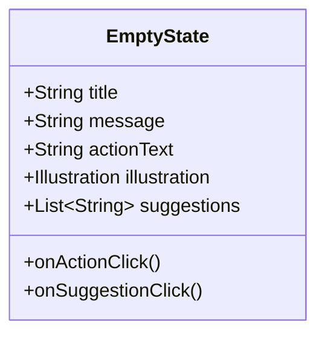
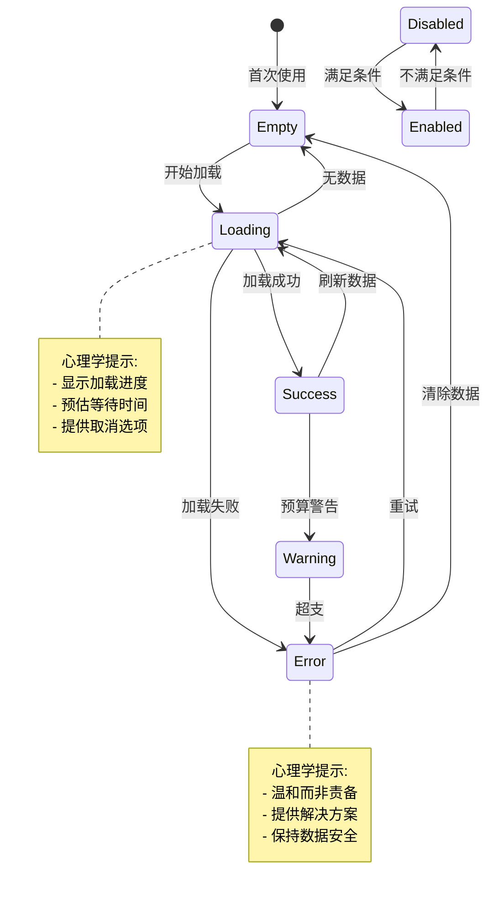

# 状态设计规范

## 1. 状态设计概述

### 1.1 设计哲学

基于心理学原理的状态设计，确保用户在任何系统状态下都能获得清晰、友好的反馈。

**核心原则**：
- **透明性**：系统状态始终对用户可见
- **预期管理**：明确的等待时间和结果预期
- **情感支持**：避免负面情绪，提供积极引导
- **恢复路径**：所有错误状态都有明确的恢复方法

---

## 2. 空状态设计 (Empty States)

### 2.1 空状态心理学

**心理学原理**：
- **首次使用**：提供引导和鼓励
- **数据清空**：避免恐慌，提供重建路径
- **搜索无结果**：提供替代方案

**设计目标**：
- 将"空"转化为"机会"
- 提供明确的下一步行动
- 保持用户信心和动力

### 2.2 空状态分类

#### 首次使用空状态

**场景**：用户首次进入应用，没有任何记录

**视觉设计**：
```
┌─────────────────────────────┐
│                             │
│         [插画]             │ ← 友好插画
│                             │
│    还没有记录，快去记一笔吧 │ ← 鼓励性文字
│                             │
│  ┌─────────────────────┐   │
│  │      + 记一笔        │   │ ← 行动按钮
│  └─────────────────────┘   │
│                             │
│  💡 小贴士：每天记录3笔，   │ ← 帮助提示
│     一周就能看到消费趋势    │
│                             │
└─────────────────────────────┘
```

**心理学设计要点**：
- **正面语言**："开始记录"而非"无记录"
- **行动导向**：提供明确的行动按钮
- **价值说明**：解释为什么应该记录
- **小贴士**：提供使用建议，降低学习焦虑

#### 搜索无结果空状态

**场景**：搜索关键词未找到匹配记录

**视觉设计**：
```
┌─────────────────────────────┐
│                             │
│         [放大镜插图]        │
│                             │
│    未找到"麦当劳"相关记录    │ ← 明确说明
│                             │
│  尝试其他关键词：           │ ← 建议
│  [肯德基] [汉堡] [快餐]     │
│                             │
│  ┌─────────────────────┐   │
│  │     清除搜索         │   │ ← 返回路径
│  └─────────────────────┘   │
│                             │
└─────────────────────────────┘
```

**心理学设计要点**：
- **温和表达**：避免"错误"、"失败"等负面词汇
- **提供建议**：给出替代方案
- **快速退出**：提供清除搜索的快捷方式

#### 分类空状态

**场景**：某个分类下没有记录

**视觉设计**：
```
┌─────────────────────────────┐
│  🍔 餐饮                     │ ← 分类图标
│  本月餐饮支出: ¥0.00        │ ← 统计信息
│                             │
│  本月还没有餐饮记录          │
│                             │
│  ┌─────────────────────┐   │
│  │      + 记一笔        │   │
│  └─────────────────────┘   │
│                             │
└─────────────────────────────┘
```

### 2.3 空状态组件规范



**视觉规范**：

| 元素 | 尺寸 | 颜色 | 字体 |
|------|------|------|------|
| 插画 | 120x120dp | 多色 | - |
| 标题 | 18sp | #212121 | Medium |
| 说明 | 14sp | #757575 | Regular |
| 按钮 | 48dp高 | 主题色 | 16sp Medium |

---

## 3. 加载状态设计 (Loading States)

### 3.1 加载状态心理学

**心理学原理**：
- **时间感知**：有动画比无动画感觉更快
- **进度透明**：显示进度比模糊等待减少焦虑
- **价值感知**：解释为什么等待增加耐心

**设计目标**：
- 让等待时间感觉更短
- 提供系统正在工作的证据
- 给出明确的结束预期

### 3.2 加载状态分类

#### 骨架屏加载 (Skeleton Loading)

**场景**：列表数据首次加载

**视觉设计**：
```
┌─────────────────────────────┐
│  [今天]  _笔  ¥__.__       │ ← 灰色占位块
├─────────────────────────────┤
│  [▓▓▓] ▓▓▓           ¥__│
│       ▓▓▓▓▓▓            │ │
│  ─────────────────────────  │
│  [▓▓▓] ▓▓▓            ¥__│
│       ▓▓▓▓▓            │ │
│  ...                        │
└─────────────────────────────┘
```

**心理学设计要点**：
- **结构预览**：展示内容结构，建立预期
- **微动画**：灰色块从左到右渐变，模拟加载
- **快速替换**：数据到达后立即替换，无闪烁

#### 进度条加载 (Progressive Loading)

**场景**：保存数据、导出文件等耗时操作

**视觉设计**：
```
┌─────────────────────────────┐
│  正在保存...                │ ← 标题
│  ═══════════════░░░░  75%   │ ← 进度条
│  预计剩余时间: 2秒          │ ← 时间预估
└─────────────────────────────┘
```

**心理学设计要点**：
- **进度可见**：显示百分比和进度条
- **时间预估**：显示剩余时间（如果可计算）
- **状态更新**：定期更新状态文字

#### 旋转加载器 (Spinner Loading)

**场景**：快速操作、按钮点击反馈

**视觉设计**：
```
┌─────────────────────────────┐
│                             │
│         [⟳]               │ ← 旋转动画
│                             │
│      正在加载...            │
│                             │
└─────────────────────────────┘
```

**使用场景**：
- 加载时间 < 3秒
- 无法确定具体进度
- 空间有限

### 3.3 加载状态最佳实践

| 加载时长 | 推荐组件 | 额外建议 |
|---------|---------|---------|
| < 1秒 | 无需加载状态 | 直接显示 |
| 1-3秒 | 旋转加载器 | 简洁动画 |
| 3-10秒 | 进度条 | 显示进度 |
| > 10秒 | 骨架屏 + 进度条 | 提供取消选项 |

---

## 4. 错误状态设计 (Error States)

### 4.1 错误状态心理学

**心理学原理**：
- **避免责备**：不要让用户感觉是他们的错
- **提供解决方案**：错误信息应包含解决方法
- **保持积极**：使用积极语言而非消极

**设计目标**：
- 将"错误"转化为"问题"
- 提供清晰的解决路径
- 维护用户信心

### 4.2 错误状态分类

#### 表单验证错误

**场景**：用户输入无效数据

**视觉设计**：
```
┌─────────────────────────────┐
│  输入金额                   │
│  ┌─────────────────────┐   │
│  │ abc                │ ←│ ← 输入框
│  └─────────────────────┘   │
│  ⚠️ 请输入有效的数字        │ ← 错误提示
│                             │
│  ┌─────────────────────┐   │
│  │        保存          │   │ ← 按钮(禁用)
│  └─────────────────────┘   │
└─────────────────────────────┘
```

**心理学设计要点**：
- **即时反馈**：输入时验证，而非提交后
- **温和提示**：红色边框 + 抖动动画，而非弹窗
- **具体说明**：明确说明什么是有效的输入
- **保持输入**：不自动清除错误输入

#### 网络错误

**场景**：网络连接失败

**视觉设计**：
```
┌─────────────────────────────┐
│                             │
│      [断网插图]            │
│                             │
│  网络连接失败                │
│  请检查网络设置后重试        │
│                             │
│  ┌─────────────────────┐   │
│  │      重试            │   │
│  └─────────────────────┘   │
│                             │
└─────────────────────────────┘
```

**心理学设计要点**：
- **友好插图**：使用轻松的插图缓解焦虑
- **明确原因**：说明为什么失败
- **解决方案**：提供重试按钮
- **保持上下文**：不丢失用户输入的数据

#### 系统错误

**场景**：应用崩溃或异常

**视觉设计**：
```
┌─────────────────────────────┐
│                             │
│      [bug插图]             │
│                             │
│  哎呀，出错了                │
│  我们已经记录了这个问题      │
│                             │
│  ┌─────────────────────┐   │
│  │      返回首页        │   │
│  └─────────────────────┘   │
│                             │
│  需要帮助? 联系支持         │
└─────────────────────────────┘
```

**心理学设计要点**：
- **道歉语气**："出了问题"而非"你错了"
- **记录问题**：告知问题已被记录
- **提供帮助**：提供支持联系方式
- **快速恢复**：提供返回首页的路径

### 4.3 错误信息写作规范

**负面示例**：
- ❌ "输入错误"
- ❌ "操作失败"
- ❌ "无效的数据"

**正面示例**：
- ✅ "请输入一个数字"
- ✅ "保存失败，请重试"
- ✅ "日期不能晚于今天"

**写作原则**：
1. 说明问题：出了什么问题
2. 解释原因：为什么会这样
3. 提供方案：如何解决

---

## 5. 成功状态设计 (Success States)

### 5.1 成功状态心理学

**心理学原理**：
- **即时强化**：成功反馈应及时
- **视觉奖励**：使用动画和颜色庆祝
- **行为强化**：鼓励重复该行为

**设计目标**：
- 确认操作成功
- 强化积极行为
- 提供后续行动建议

### 5.2 成功状态分类

#### 操作成功

**场景**：保存记录、修改设置

**视觉设计**：
```
┌─────────────────────────────┐
│                             │
│         [✓]               │ ← 成功图标
│                             │
│      已保存 ¥28.50         │ ← 确认信息
│                             │
│  ✓ 金额: ¥28.50            │ ← 详情
│  ✓ 分类: 餐饮 - 午餐        │
│  ✓ 日期: 今天 12:30        │
│                             │
│  ┌─────────────────────┐   │
│  │    继续记录          │   │ ← 主要操作
│  └─────────────────────┘   │
│  ┌─────────────────────┐   │
│  │    查看统计          │   │ ← 次要操作
│  └─────────────────────┘   │
│                             │
└─────────────────────────────┘
```

**心理学设计要点**：
- **视觉庆祝**：动画 + 主题色
- **确认信息**：明确说明完成了什么
- **后续引导**：提供下一步行动
- **快速关闭**：点击外部或自动关闭

#### 里程碑成功

**场景**：首次记录、连续记账7天

**视觉设计**：
```
┌─────────────────────────────┐
│                             │
│      [🎉 彩带动画]          │
│                             │
│      太棒了！               │
│   你已经连续记录7天了        │
│                             │
│  ┌─────────────────────┐   │
│  │      分享成就        │   │ ← 社交功能
│  └─────────────────────┘   │
│  ┌─────────────────────┐   │
│  │      继续保持        │   │
│  └─────────────────────┘   │
│                             │
└─────────────────────────────┘
```

**心理学设计要点**：
- **庆祝动画**：彩带、烟花等动画
- **成就感**：强调成就的意义
- **社交分享**：提供分享功能（可选）
- **持续鼓励**：鼓励继续保持

---

## 6. 警告状态设计 (Warning States)

### 6.1 警告状态心理学

**心理学原理**：
- **温和提醒**：而非严厉警告
- **渐进警示**：颜色从绿到红渐进
- **行动建议**：提供解决方案

**设计目标**：
- 提前预警潜在问题
- 提供解决建议
- 避免过度焦虑

### 6.2 警告状态分类

#### 预算警告

**场景**：预算使用率达到80%

**视觉设计**：
```
┌─────────────────────────────┐
│  本月预算                   │
│  ═════════════░░░░  80%    │ ← 黄色进度条
│                             │
│  ⚠️ 已使用80%的预算         │ ← 警告图标
│                             │
│  建议：控制餐饮支出          │ ← 行动建议
│  剩余: ¥1000 / 总计: ¥5000   │
│                             │
│  ┌─────────────────────┐   │
│  │   查看详细统计        │   │
│  └─────────────────────┘   │
│                             │
└─────────────────────────────┘
```

**颜色渐变策略**：

| 使用率 | 颜色 | 心理暗示 |
|--------|------|---------|
| 0-50% | 绿色 #4CAF50 | 健康 |
| 50-80% | 黄色 #FFC107 | 注意 |
| 80-100% | 橙色 #FF9800 | 警告 |
| > 100% | 红色 #FF5252 | 超支 |

**心理学设计要点**：
- **渐进警示**：颜色渐进变化，而非突变
- **积极建议**：提供建设性建议
- **剩余显示**：强调剩余而非已用

#### 删除警告

**场景**：删除重要数据

**视觉设计**：
```
┌─────────────────────────────┐
│  确认删除                   │
│  ═════════════════════════  │
│                             │
│  ⚠️ 此操作无法撤销          │ ← 警告图标
│                             │
│  确定要删除这条记录吗？      │
│                             │
│  ┌─────────────────────┐   │
│  │  餐饮 - 麦当劳       │   │ ← 内容预览
│  │  ¥28.50             │   │
│  └─────────────────────┘   │
│                             │
│      [取消]    [删除]       │ ← 危险操作按钮
└─────────────────────────────┘
```

**心理学设计要点**：
- **二次确认**：防止误操作
- **内容预览**：明确要删除什么
- **后果说明**：强调"无法撤销"
- **主次按钮**：取消按钮更突出

---

## 7. 禁用状态设计 (Disabled States)

### 7.1 禁用状态心理学

**心理学原理**：
- **明确原因**：说明为什么禁用
- **激活路径**：告知如何启用
- **视觉区分**：明确的视觉差异

**设计目标**：
- 清晰表达不可用状态
- 提供启用指导
- 避免用户困惑

### 7.2 禁用状态视觉规范

#### 按钮禁用

**视觉设计**：

```
正常状态:
┌─────────────────────────────┐
│         保存                │ ← 主题色背景
└─────────────────────────────┘

禁用状态:
┌─────────────────────────────┐
│         保存                │ ← 灰色背景
└─────────────────────────────┘   文字: 50%透明度
```

**颜色规范**：

| 状态 | 背景色 | 文字色 | 不透明度 |
|------|--------|--------|---------|
| 正常 | #4CAF50 | #FFFFFF | 100% |
| 禁用 | #E0E0E0 | #9E9E9E | 50% |

#### 输入框禁用

**视觉设计**：

```
正常状态:
┌─────────────────────────────┐
│ 请输入金额                  │ ← 白色背景
└─────────────────────────────┘   边框: 主题色

禁用状态:
┌─────────────────────────────┐
│ ¥28.50                     │ ← 灰色背景
└─────────────────────────────┘   边框: 灰色
                                    不可编辑
```

### 7.3 禁用状态最佳实践

**提供原因**：
- ❌ 禁用的按钮，无说明
- ✅ "保存（请先填写所有必填项）"

**提供路径**：
- ❌ "此功能不可用"
- ✅ "升级到高级版解锁此功能"

**保持一致**：
- 所有禁用状态使用相同的视觉语言
- 避免部分禁用（要么全部禁用，要么全部启用）

---

## 8. 状态转换设计

### 8.1 状态转换原则

**平滑过渡**：所有状态变化都有过渡动画

**可预测性**：状态转换符合用户预期

**反馈明确**：每个状态转换都有视觉反馈

### 8.2 状态转换矩阵



### 8.3 状态转换动画规范

| 转换类型 | 动画效果 | 持续时间 | 缓动函数 |
|---------|---------|---------|---------|
| 空状态 → 加载 | 淡出 + 淡入 | 300ms | ease-in-out |
| 加载 → 成功 | 淡出 + 成功图标缩放 | 400ms | ease-out |
| 加载 → 错误 | 淡出 + 错误状态弹入 | 300ms | ease-in |
| 禁用 → 启用 | 颜色渐变 + 不透明度 | 200ms | ease-in-out |

---

## 9. 状态设计总结

### 9.1 状态设计检查清单

**空状态**：
- ✅ 提供友好的插图或图标
- ✅ 使用鼓励性语言
- ✅ 提供明确的行动按钮
- ✅ 解释价值或提供帮助

**加载状态**：
- ✅ 显示加载进度或动画
- ✅ 预估等待时间（如果可能）
- ✅ 提供取消选项（长时间操作）
- ✅ 保持视觉一致性

**错误状态**：
- ✅ 使用温和而非责备的语言
- ✅ 明确说明问题原因
- ✅ 提供解决方案或重试选项
- ✅ 保持用户数据安全

**成功状态**：
- ✅ 即时确认操作成功
- ✅ 使用动画和颜色庆祝
- ✅ 提供后续行动建议
- ✅ 强化积极行为

**警告状态**：
- ✅ 使用渐进式颜色警示
- ✅ 提供建设性建议
- ✅ 强调剩余而非损失
- ✅ 提供明确的行动路径

**禁用状态**：
- ✅ 明确的视觉差异
- ✅ 说明禁用原因
- ✅ 提供启用路径
- ✅ 保持一致性

### 9.2 心理学设计原则总结

| 原则 | 说明 | 应用 |
|------|------|------|
| 透明性 | 系统状态始终可见 | 所有状态都有明确指示 |
| 预期管理 | 明确的等待和结果预期 | 加载时间、错误原因 |
| 情感支持 | 避免负面情绪 | 友好语言、积极引导 |
| 恢复路径 | 所有错误都有解决方案 | 重试、返回、帮助 |
| 即时反馈 | 及时响应用户操作 | 动画、颜色、触觉反馈 |

---

*文档版本：v1.0*
*创建日期：2025-01-16*
*最后更新：2025-01-16*
*设计师：Claude (UX Designer Agent)*
