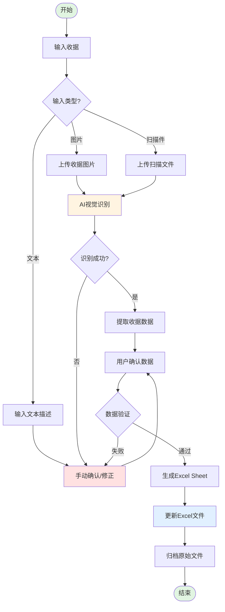
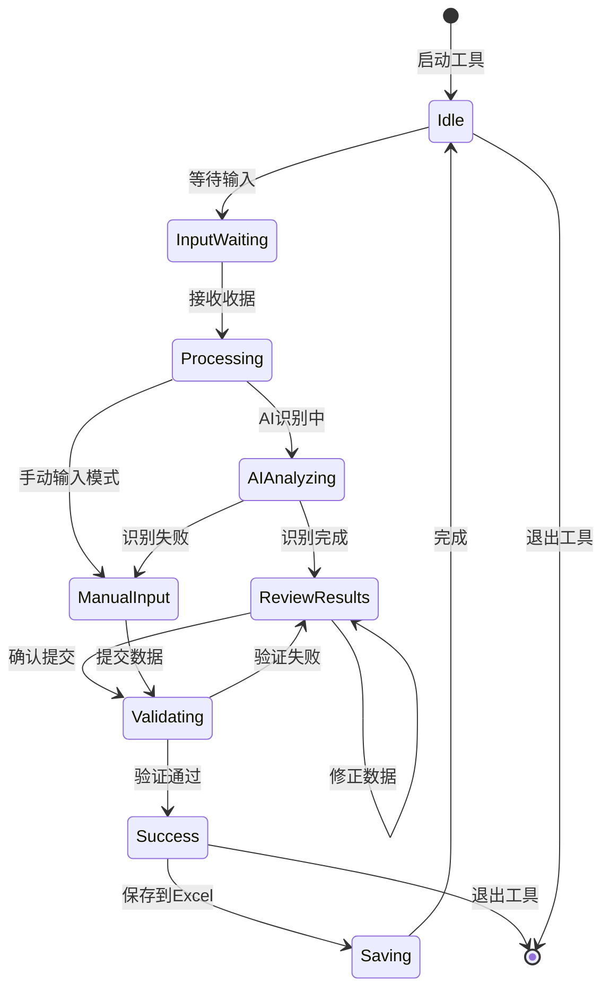
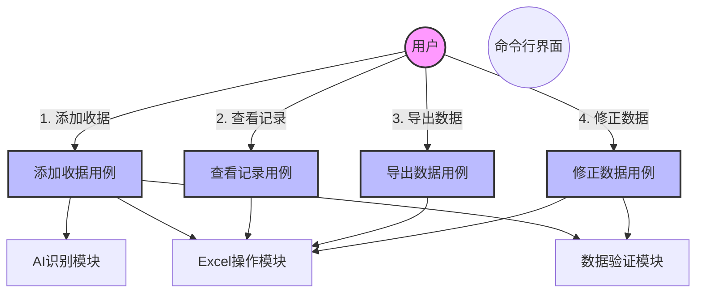
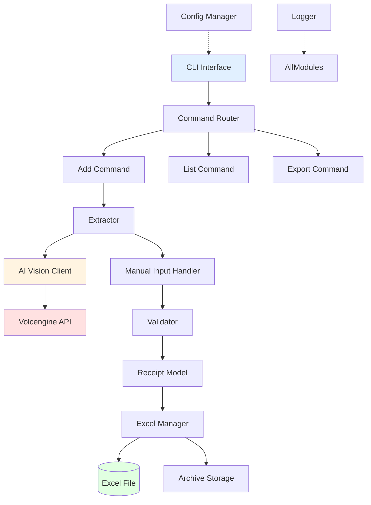
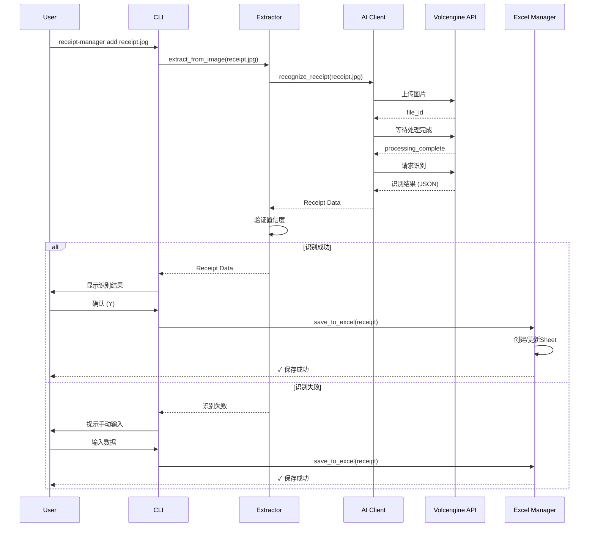
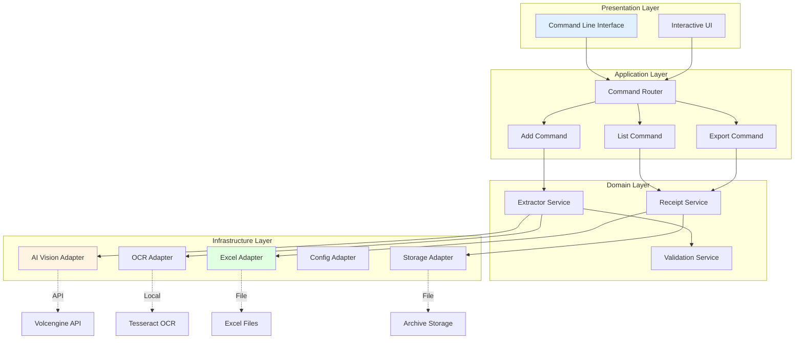

# 采购收据管理工具 - 产品设计文档

## 1. 产品概述

### 1.1 产品愿景
构建一个智能的命令行工具，通过AI视觉识别技术自动提取采购收据信息，并将其结构化地记录到Excel文件中，帮助用户高效管理采购记录。

### 1.2 目标用户
- 需要管理大量采购收据的个人用户
- 小型企业或团队的采购管理人员
- 需要定期整理报销凭证的办公人员

### 1.3 核心价值
- **自动化**: 通过AI识别减少手动录入工作量
- **结构化**: 自动生成标准化的Excel表格
- **灵活性**: 支持多种输入方式（图片、文本）
- **可追溯**: 保留原始收据和识别结果的关联关系

---

## 2. 用户流程设计

### 2.1 业务流程图 (BPD)



### 2.2 用户旅程状态图



### 2.3 核心用例图



---

## 3. CLI命令设计

### 3.1 命令结构

采用子命令模式，便于扩展和维护：

```bash
# 主命令
receipt-manager <command> [options]

# 可用子命令
receipt-manager add <file|text>     # 添加收据
receipt-manager list [date]         # 列出记录
receipt-manager export              # 导出数据
receipt-manager validate            # 验证数据完整性
receipt-manager init                # 初始化配置
receipt-manager help                # 显示帮助
```

### 3.2 命令详解

#### 3.2.1 添加收据 (add)

```bash
# 添加图片收据
receipt-manager add receipt.jpg --date 2025-01-20 --category "办公用品"

# 添加文本描述
receipt-manager add --text "超市购物: 牛奶x2, 面包x5, 总计85元" --date 2025-01-20

# 批量添加
receipt-manager add *.jpg --batch

# 交互式添加
receipt-manager add --interactive
```

**参数说明:**
- `<file>`: 收据图片文件路径
- `--text`: 文本描述模式
- `--date`: 收据日期 (默认: 今天)
- `--category`: 收据分类 (可选)
- `--batch`: 批量处理模式
- `--interactive`: 交互式模式
- `--no-ai`: 跳过AI识别，手动输入
- `--output`: 指定Excel文件路径

#### 3.2.2 列出记录 (list)

```bash
# 列出所有记录
receipt-manager list

# 列出特定日期
receipt-manager list --date 2025-01-20

# 按分类筛选
receipt-manager list --category "办公用品"

# 查看最近N条记录
receipt-manager list --recent 10

# 详细信息
receipt-manager list --detail
```

#### 3.2.3 导出数据 (export)

```bash
# 导出为CSV
receipt-manager export --format csv --output data.csv

# 导出为JSON
receipt-manager export --format json --output data.json

# 生成统计报告
receipt-manager export --report --output report.html
```

#### 3.2.4 初始化 (init)

```bash
# 初始化配置文件
receipt-manager init

# 指定配置文件路径
receipt-manager init --config ~/.config/receipt-manager/config.yaml
```

### 3.3 配置文件结构

```yaml
# config.yaml
excel:
  file_path: "~/Documents/采购记录.xlsx"
  template_path: "~/.config/receipt-manager/template.xlsx"

ai:
  enabled: true
  provider: "volcengine"  # volcengine, openai, local
  api_key: "${ARK_API_KEY}"
  model: "doubao-seed-1-6-251015"
  confidence_threshold: 0.8

categories:
  - "办公用品"
  - "餐饮"
  - "交通"
  - "日用品"
  - "其他"

validation:
  required_fields: ["date", "amount", "items"]
  date_format: "%Y-%m-%d"

storage:
  archive_path: "~/Documents/receipts/archive"
  keep_original: true
```

---

## 4. 功能模块划分

### 4.1 模块层次结构

```
receipt-manager/
├── core/                      # 核心业务逻辑
│   ├── receipt.py            # 收据数据模型
│   ├── extractor.py          # 信息提取器
│   ├── validator.py          # 数据验证器
│   └── aggregator.py         # 数据聚合器
├── ai/                       # AI识别模块
│   ├── vision_client.py      # 视觉大模型客户端
│   ├── ocr_engine.py         # OCR引擎
│   └── prompts.py            # Prompt模板
├── excel/                    # Excel操作模块
│   ├── manager.py            # Excel管理器
│   ├── formatter.py          # 格式化工具
│   └── template.py           # 模板管理
├── cli/                      # 命令行界面
│   ├── main.py               # CLI入口
│   ├── commands/             # 命令实现
│   │   ├── add.py
│   │   ├── list.py
│   │   ├── export.py
│   │   └── init.py
│   └── ui.py                 # 交互式界面
├── utils/                    # 工具模块
│   ├── config.py             # 配置管理
│   ├── logger.py             # 日志工具
│   └── file_handler.py       # 文件处理
└── tests/                    # 测试模块
    ├── test_receipt.py
    ├── test_ai.py
    └── test_excel.py
```

### 4.2 模块职责

#### 4.2.1 Core Module (核心模块)

**Receipt (收据模型)**
- 封装收据数据结构
- 提供数据序列化/反序列化
- 实现数据验证逻辑

**Extractor (信息提取器)**
- 协调AI识别和手动输入
- 提供统一的数据提取接口
- 处理提取失败的回退逻辑

**Validator (数据验证器)**
- 验证必填字段
- 检查数据格式
- 提供验证错误报告

**Aggregator (数据聚合器)**
- 按日期+主题聚合数据
- 计算汇总统计信息
- 生成报表数据

#### 4.2.2 AI Module (AI识别模块)

**VisionClient (视觉大模型客户端)**
- 封装火山引擎API调用
- 实现文件上传和进度显示
- 处理API响应和错误

**OCREngine (OCR引擎)**
- 集成Tesseract OCR
- 提供备用识别方案
- 处理文本提取和后处理

**Prompts (Prompt模板)**
- 管理AI识别的Prompt
- 支持多语言Prompt
- 可配置的Prompt版本

#### 4.2.3 Excel Module (Excel操作模块)

**Manager (Excel管理器)**
- 管理Excel文件的打开/保存
- 处理Sheet的创建/更新
- 维护文件锁定机制

**Formatter (格式化工具)**
- 格式化单元格样式
- 设置列宽和行高
- 应用条件格式

**Template (模板管理)**
- 加载Excel模板
- 验证模板格式
- 创建默认模板

#### 4.2.4 CLI Module (命令行界面)

**Main (CLI入口)**
- 解析命令行参数
- 路由到具体命令
- 全局错误处理

**Commands (命令实现)**
- 实现各个子命令逻辑
- 提供用户交互界面
- 显示进度和结果

**UI (交互式界面)**
- 提供交互式输入
- 显示确认对话框
- 实现数据编辑界面

---

## 5. UX设计考虑

### 5.1 交互原则

1. **渐进式披露**: 默认使用智能识别，失败时才要求手动输入
2. **即时反馈**: 显示处理进度和操作结果
3. **容错设计**: 允许撤销和修正操作
4. **默认值合理**: 提供合理的默认选项减少输入

### 5.2 关键交互场景

#### 场景1: 首次使用

```bash
$ receipt-manager add receipt.jpg

# 检测到首次使用，自动初始化
📋 首次使用，正在初始化配置...
✓ 配置文件已创建: ~/.config/receipt-manager/config.yaml
✓ Excel文件已创建: ~/Documents/采购记录.xlsx

📤 正在上传收据图片...
████████████████████████████████████████ 100% (2.3/2.3 MB)
✓ 上传完成

🤖 正在使用AI识别收据信息...
✓ 识别完成

📝 识别结果:
  日期: 2025-01-20
  商家: 永辉超市
  金额: ¥156.80
  商品清单:
    - 牛奶 x2 @ ¥12.50
    - 面包 x5 @ ¥8.00
    - 水果 x1.5kg @ ¥15.00

确认以上信息? [Y/n/a]: Y

✓ 收据已保存到: 2025-01-20_永辉超市
```

#### 场景2: AI识别失败

```bash
$ receipt-manager add blurry_receipt.jpg

📤 正在上传收据图片...
✓ 上传完成

🤖 正在使用AI识别收据信息...
⚠️  识别置信度过低 (0.45)，需要手动输入

📝 请手动输入收据信息:
  日期 [2025-01-20]:
  商家: 晨光文具
  总金额: 45.00
  商品清单 (一行一个，格式: 名称 数量 单价):
    > 笔记本 2 15.00
    > 中性笔 5 3.00
    > Ctrl+D 保存

✓ 收据已保存到: 2025-01-20_晨光文具
```

#### 场景3: 批量处理

```bash
$ receipt-manager add *.jpg --batch

发现 5 个收据文件:
  1. receipt1.jpg
  2. receipt2.jpg
  3. receipt3.jpg
  4. receipt4.jpg
  5. receipt5.jpg

开始批量处理...

[1/5] receipt1.jpg
  ✓ AI识别成功
[2/5] receipt2.jpg
  ⚠️  需要手动输入
[3/5] receipt3.jpg
  ✓ AI识别成功
[4/5] receipt4.jpg
  ✓ AI识别成功
[5/5] receipt5.jpg
  ✗ 识别失败: 文件损坏

处理完成: 成功 3/5，跳过 1/5，失败 1/5
```

### 5.3 错误处理和提示

| 错误类型 | 处理方式 | 用户提示 |
|---------|---------|---------|
| 文件不存在 | 跳过并继续 | ⚠️ 文件不存在: xxx.jpg |
| AI识别失败 | 回退到手动输入 | 🤖 AI识别失败，请手动输入 |
| 数据验证失败 | 显示错误并要求修正 | ❌ 金额格式错误，请重新输入 |
| Excel文件锁定 | 重试或提示 | ⏳ Excel文件被占用，正在等待... |
| 网络错误 | 重试3次 | 🌐 网络错误，正在重试 (1/3)... |

---

## 6. 技术架构

### 6.1 整体架构图



### 6.2 序列图: AI识别流程



### 6.3 组件图



---

## 7. 技术选型

### 7.1 核心依赖

| 类别 | 技术选型 | 版本要求 | 说明 |
|-----|---------|---------|------|
| Python版本 | Python | 3.10+ | 使用类型注解和现代语法 |
| CLI框架 | Click | 8.1+ | 优雅的命令行界面构建 |
| Excel操作 | openpyxl | 3.1+ | 支持xlsx格式的读写 |
| AI视觉 | volcenginesdkarkruntime | latest | 已有demo使用的火山引擎SDK |
| OCR | pytesseract | 0.3+ | 备用OCR方案 |
| 图像处理 | Pillow | 10.0+ | 图像预处理 |
| 配置管理 | pydantic | 2.0+ | 配置验证和设置管理 |
| 日志 | loguru | 0.7+ | 简单易用的日志库 |
| 进度显示 | rich | 13.0+ | 美观的终端输出 |
| 异步IO | asyncio | 内置 | 异步处理API调用 |

### 7.2 依赖文件

```txt
# requirements.txt
# Core
click>=8.1.0
pydantic>=2.0.0
pydantic-settings>=2.0.0

# Excel
openpyxl>=3.1.0
pandas>=2.0.0

# AI & Vision
volcenginesdkarkruntime>=0.1.0
pytesseract>=0.3.10
Pillow>=10.0.0

# Utilities
loguru>=0.7.0
rich>=13.0.0
python-dateutil>=2.8.0

# Development
pytest>=7.4.0
pytest-cov>=4.1.0
black>=23.7.0
mypy>=1.5.0
```

### 7.3 与现有代码集成

#### 7.3.1 复用视觉大模型Demo

复用 `/home/bughero/Documents/github/DeepLearning/python/llm/version/demo.py` 中的：

- `AsyncArk` 客户端封装
- `FileWithProgress` 文件上传进度显示
- 视频分析模式（扩展为图片分析）
- API调用错误处理模式

#### 7.3.2 参考MCP服务器架构

参考 `/home/bughero/Documents/github/DeepLearning/python/mcp/` 中的：

- 模块化项目结构
- 配置管理方式
- 日志记录规范
- 错误处理模式

#### 7.3.3 利用照片行为检测模块

参考 `/home/bughero/Documents/github/DeepLearning/python/photo_behavior_detection/` 中的：

- 图像预处理逻辑
- YOLO目标检测（可选增强）
- Tesseract OCR集成
- Pipeline处理模式

---

## 8. 开发计划

### 8.1 开发阶段

#### Phase 1: 基础框架 (Week 1-2)
- [ ] 项目结构搭建
- [ ] CLI框架集成 (Click)
- [ ] 配置管理系统
- [ ] 日志系统
- [ ] 数据模型定义

#### Phase 2: Excel操作 (Week 2-3)
- [ ] Excel管理器实现
- [ ] Sheet创建/更新逻辑
- [ ] 格式化工具
- [ ] 模板系统
- [ ] 单元测试

#### Phase 3: AI识别集成 (Week 3-4)
- [ ] 视觉大模型客户端封装
- [ ] 图片上传和识别
- [ ] Prompt模板设计
- [ ] 响应解析
- [ ] 错误处理和重试

#### Phase 4: 核心功能 (Week 4-5)
- [ ] 添加收据命令
- [ ] 列出记录命令
- [ ] 数据验证器
- [ ] 手动输入界面
- [ ] 交互式确认

#### Phase 5: 增强功能 (Week 5-6)
- [ ] 批量处理
- [ ] 数据导出
- [ ] 统计报告
- [ ] OCR备用方案
- [ ] 文件归档

#### Phase 6: 测试和优化 (Week 6-7)
- [ ] 端到端测试
- [ ] 性能优化
- [ ] 错误处理完善
- [ ] 文档编写
- [ ] 用户手册

### 8.2 关键里程碑

| 里程碑 | 交付物 | 完成标准 |
|-------|-------|---------|
| M1: 可运行的CLI | 基本命令框架 | 可以执行 `receipt-manager --help` |
| M2: Excel读写 | Excel管理器 | 可以创建和更新Excel文件 |
| M3: AI识别 | 视觉识别功能 | 可以识别收据图片并提取信息 |
| M4: 完整流程 | 端到端功能 | 可以从图片到Excel的完整流程 |
| M5: 生产就绪 | 完整功能 | 可以稳定处理各种收据 |

### 8.3 风险和缓解措施

| 风险 | 影响 | 缓解措施 |
|-----|------|---------|
| AI识别准确率不足 | 用户体验差 | 提供OCR备用方案和手动输入 |
| Excel文件格式变化 | 数据丢失 | 使用模板验证和备份机制 |
| API限流/故障 | 功能不可用 | 实现重试机制和离线模式 |
| 性能问题 | 批量处理慢 | 异步处理和进度显示 |
| 依赖兼容性 | 部署困难 | 虚拟环境和版本锁定 |

---

## 9. 测试策略

### 9.1 单元测试

```python
# tests/test_receipt.py
def test_receipt_creation():
    receipt = Receipt(
        date="2025-01-20",
        merchant="永辉超市",
        amount=156.80,
        items=[...]
    )
    assert receipt.date == "2025-01-20"
    assert receipt.is_valid()

# tests/test_ai_client.py
@pytest.mark.asyncio
async def test_ai_recognition():
    client = VisionClient()
    result = await client.recognize_receipt("test_receipt.jpg")
    assert result.confidence > 0.7
    assert result.merchant is not None

# tests/test_excel.py
def test_excel_manager():
    manager = ExcelManager("test.xlsx")
    manager.add_receipt(receipt)
    assert manager.sheet_exists("2025-01-20_永辉超市")
```

### 9.2 集成测试

```bash
# 测试完整流程
$ receipt-manager add tests/data/receipt1.jpg
$ receipt-manager list --date 2025-01-20
$ receipt-manager export --format csv
```

### 9.3 用户验收测试 (UAT)

创建测试用例集：

1. **基本功能测试**
   - [ ] 添加单个图片收据
   - [ ] 添加文本描述收据
   - [ ] 查看收据记录
   - [ ] 导出数据

2. **AI识别测试**
   - [ ] 清晰收据识别
   - [ ] 模糊收据处理
   - [ ] 识别失败回退
   - [ ] 多种格式收据

3. **边界情况测试**
   - [ ] 空文件处理
   - [ ] 大文件处理
   - [ ] 批量处理
   - [ ] 网络异常

4. **数据验证测试**
   - [ ] 必填字段验证
   - [ ] 格式验证
   - [ ] 重复数据检测

---

## 10. 部署和使用

### 10.1 安装方式

```bash
# 从源码安装
git clone https://github.com/bughero/DeepLearning.git
cd DeepLearning/python/mcp/receipt-manager
pip install -e .

# 或使用pip安装
pip install receipt-manager
```

### 10.2 快速开始

```bash
# 初始化配置
$ receipt-manager init

# 添加第一个收据
$ receipt-manager add receipt.jpg

# 查看所有记录
$ receipt-manager list

# 导出数据
$ receipt-manager export --format csv
```

### 10.3 配置示例

```yaml
# ~/.config/receipt-manager/config.yaml
excel:
  file_path: "~/Documents/采购记录.xlsx"

ai:
  enabled: true
  api_key: "your-api-key"
  model: "doubao-seed-1-6-251015"
```

---

## 11. 未来扩展

### 11.1 短期扩展 (3-6个月)

- [ ] 支持多种语言收据
- [ ] 移动端App (Flutter)
- [ ] 云端同步功能
- [ ] 收据分类自动识别
- [ ] 统计图表生成

### 11.2 长期扩展 (6-12个月)

- [ ] 多用户支持
- [ ] 权限管理系统
- [ ] 审批流程
- [ ] 与财务软件集成
- [ ] 机器学习优化

---

## 12. 附录

### 12.1 Excel表格模板

见附件: `/home/bughero/Documents/github/DeepLearning/python/mcp/receipt_manager/docs/excel_template.md`

### 12.2 Prompt模板示例

见附件: `/home/bughero/Documents/github/DeepLearning/python/mcp/receipt_manager/docs/prompts.md`

### 12.3 API文档

见附件: `/home/bughero/Documents/github/DeepLearning/python/mcp/receipt_manager/docs/api.md`

---

**文档版本**: v1.0
**最后更新**: 2025-01-20
**作者**: Claude (Product Architect)
