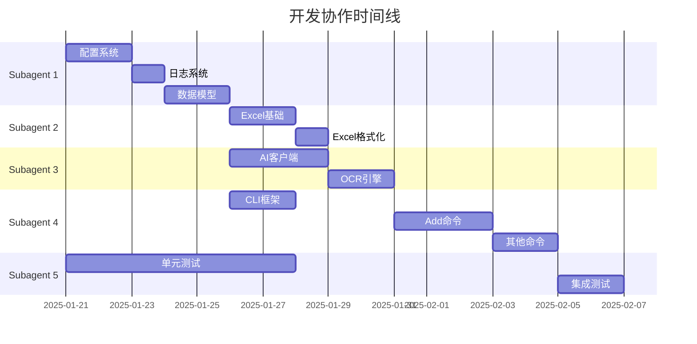

# 采购收据管理工具 - 实施计划

## 1. 项目规划

### 1.1 时间线概览

```
Week 1-2:  基础框架搭建
Week 3-4:  核心功能实现
Week 5-6:  增强功能和优化
Week 7:    测试和文档
```

### 1.2 团队分工建议

| 角色 | 职责 | 技能要求 |
|-----|------|---------|
| 产品负责人 | 需求管理、优先级决策 | 产品设计、用户体验 |
| 后端开发工程师 | 核心逻辑、AI集成 | Python、异步编程 |
| 前端/CLI工程师 | 命令行界面、交互设计 | Click、Rich |
| 测试工程师 | 测试用例、质量保证 | pytest、自动化测试 |
| DevOps工程师 | 部署、CI/CD | Docker、GitHub Actions |

---

## 2. 详细开发步骤

### Phase 1: 基础框架搭建 (Week 1-2)

#### Step 1.1: 项目初始化 (1天)

**任务清单:**
- [ ] 创建项目目录结构
- [ ] 初始化Git仓库
- [ ] 设置虚拟环境
- [ ] 创建requirements.txt
- [ ] 配置开发工具

**详细操作:**

```bash
# 创建项目目录
cd /home/bughero/Documents/github/DeepLearning/python/mcp
mkdir -p receipt_manager

cd receipt_manager

# 创建目录结构
mkdir -p receipt_manager/{cli,core,ai,excel,utils}
mkdir -p receipt_manager/cli/{commands,ui}
mkdir -p tests/{fixtures,unit,integration}
mkdir -p docs
mkdir -p logs

# 创建__init__.py
touch receipt_manager/__init__.py
touch receipt_manager/cli/__init__.py
touch receipt_manager/core/__init__.py
touch receipt_manager/ai/__init__.py
touch receipt_manager/excel/__init__.py
touch receipt_manager/utils/__init__.py

# 初始化Git
git init
echo "*.pyc\n__pycache__/\n*.py[cod]\n.venv/\nlogs/\n*.xlsx" > .gitignore

# 创建虚拟环境
python3 -m venv .venv
source .venv/bin/activate

# 创建requirements.txt
cat > requirements.txt << 'EOF'
# Core
click>=8.1.0
pydantic>=2.0.0
pydantic-settings>=2.0.0

# Excel
openpyxl>=3.1.0
pandas>=2.0.0

# AI & Vision
volcenginesdkarkruntime>=0.1.0
pytesseract>=0.3.10
Pillow>=10.0.0

# Utilities
loguru>=0.7.0
rich>=13.0.0
python-dateutil>=2.8.0
pyyaml>=6.0.0
tenacity>=8.0.0

# Development
pytest>=7.4.0
pytest-cov>=4.1.0
pytest-asyncio>=0.21.0
black>=23.7.0
mypy>=1.5.0
EOF

pip install -r requirements.txt
```

**验收标准:**
- [ ] 目录结构完整
- [ ] 虚拟环境可激活
- [ ] 依赖包安装成功
- [ ] 可以运行 `python -c "import receipt_manager"`

---

#### Step 1.2: 配置管理系统 (2天)

**任务清单:**
- [ ] 实现配置数据模型 (Pydantic)
- [ ] 实现配置加载/保存
- [ ] 创建默认配置文件
- [ ] 实现环境变量支持
- [ ] 编写配置测试

**文件清单:**
```
receipt_manager/utils/config.py
tests/test_config.py
config/config.yaml.example
```

**核心代码:**

```python
# receipt_manager/utils/config.py
from pathlib import Path
from typing import Optional
from pydantic import BaseModel, Field
import yaml

class ExcelConfig(BaseModel):
    file_path: Path = Field(default=Path("~/Documents/采购记录.xlsx"))
    auto_backup: bool = True

class AIConfig(BaseModel):
    enabled: bool = True
    api_key: str = ""
    model: str = "doubao-seed-1-6-251015"
    confidence_threshold: float = 0.8

class AppConfig(BaseModel):
    excel: ExcelConfig = Field(default_factory=ExcelConfig)
    ai: AIConfig = Field(default_factory=AIConfig)

    @classmethod
    def from_yaml(cls, path: Path) -> "AppConfig":
        with open(path, "r", encoding="utf-8") as f:
            data = yaml.safe_load(f)
        return cls(**data)

    def to_yaml(self, path: Path) -> None:
        with open(path, "w", encoding="utf-8") as f:
            yaml.dump(self.model_dump(), f, allow_unicode=True)
```

**测试用例:**

```python
# tests/test_config.py
def test_default_config():
    config = AppConfig()
    assert config.ai.enabled == True
    assert config.ai.confidence_threshold == 0.8

def test_config_from_yaml():
    config = AppConfig.from_yaml(Path("config/config.yaml"))
    assert isinstance(config, AppConfig)
```

**验收标准:**
- [ ] 可以创建默认配置
- [ ] 可以从YAML加载配置
- [ ] 可以保存配置到YAML
- [ ] 环境变量可以覆盖配置
- [ ] 所有测试通过

---

#### Step 1.3: 日志系统 (1天)

**任务清单:**
- [ ] 配置loguru
- [ ] 实现日志文件管理
- [ ] 添加日志格式化
- [ ] 实现日志轮转

**文件清单:**
```
receipt_manager/utils/logger.py
tests/test_logger.py
```

**核心代码:**

```python
# receipt_manager/utils/logger.py
import sys
from loguru import logger
from pathlib import Path

def setup_logger(
    log_dir: Path = Path("logs"),
    level: str = "INFO"
):
    logger.remove()

    log_dir.mkdir(parents=True, exist_ok=True)

    # 控制台输出
    logger.add(
        sys.stderr,
        format="<green>{time:HH:mm:ss}</green> | <level>{level: <8}</level> | <level>{message}</level>",
        level=level,
        colorize=True,
    )

    # 文件输出
    logger.add(
        log_dir / "receipt_manager_{time:YYYY-MM-DD}.log",
        format="{time:YYYY-MM-DD HH:mm:ss} | {level: <8} | {name}:{function}:{line} | {message}",
        level=level,
        rotation="10 MB",
        retention="7 days",
        compression="zip",
    )
```

**验收标准:**
- [ ] 控制台日志正常显示
- [ ] 日志文件正确创建
- [ ] 日志轮转正常工作
- [ ] 彩色输出正常

---

#### Step 1.4: 数据模型 (2天)

**任务清单:**
- [ ] 实现Receipt模型
- [ ] 实现ReceiptItem模型
- [ ] 实现ReceiptMetadata模型
- [ ] 实现数据验证
- [ ] 实现序列化/反序列化

**文件清单:**
```
receipt_manager/core/models.py
tests/test_models.py
```

**核心代码:**
参考 DATA_STRUCTURE.md 中的数据模型定义

**验收标准:**
- [ ] 所有模型可以正常创建
- [ ] 数据验证正常工作
- [ ] 可以序列化为JSON
- [ ] 可以从JSON反序列化
- [ ] 所有测试通过

---

#### Step 1.5: CLI框架 (2天)

**任务清单:**
- [ ] 使用Click创建主命令
- [ ] 实现help命令
- [ ] 实现version命令
- [ ] 创建命令路由
- [ ] 实现全局选项

**文件清单:**
```
receipt_manager/cli/main.py
receipt_manager/cli/commands/__init__.py
tests/test_cli.py
```

**核心代码:**

```python
# receipt_manager/cli/main.py
import click
from ..utils.config import load_config

@click.group()
@click.version_option(version="1.0.0")
@click.option("--config", "-c", type=click.Path(), help="配置文件路径")
@click.option("--verbose", "-v", is_flag=True, help="详细输出")
@click.pass_context
def cli(ctx, config, verbose):
    """采购收据管理工具"""
    ctx.ensure_object(dict)
    ctx.obj["config"] = load_config(config)
    ctx.obj["verbose"] = verbose

if __name__ == "__main__":
    cli(obj={})
```

**验收标准:**
- [ ] `receipt-manager --help` 正常显示
- [ ] `receipt-manager --version` 正常显示
- [ ] 命令路由正常工作
- [ ] 配置加载正常

---

### Phase 2: 核心功能实现 (Week 3-4)

#### Step 2.1: Excel操作模块 (3天)

**任务清单:**
- [ ] 实现ExcelManager
- [ ] 实现CellFormatter
- [ ] 实现Sheet创建
- [ ] 实现Sheet更新
- [ ] 实现概览Sheet

**文件清单:**
```
receipt_manager/excel/manager.py
receipt_manager/excel/formatter.py
receipt_manager/excel/styles.py
tests/test_excel.py
```

**开发步骤:**

1. **Day 1: ExcelManager基础**
   - [ ] 实现工作簿加载/创建
   - [ ] 实现Sheet检查
   - [ ] 实现文件保存

2. **Day 2: Sheet操作**
   - [ ] 实现Sheet创建
   - [ ] 实现基础信息写入
   - [ ] 实现商品明细写入
   - [ ] 实现汇总信息写入

3. **Day 3: 格式化和测试**
   - [ ] 实现单元格格式化
   - [ ] 实现样式应用
   - [ ] 编写单元测试
   - [ ] 手动测试

**测试用例:**

```python
# tests/test_excel.py
def test_create_new_excel():
    manager = ExcelManager(ExcelConfig(file_path=Path("test.xlsx")))
    receipt = create_test_receipt()
    manager.add_receipt(receipt)
    assert Path("test.xlsx").exists()

def test_sheet_creation():
    manager = ExcelManager(ExcelConfig(file_path=Path("test.xlsx")))
    receipt = create_test_receipt()
    manager.add_receipt(receipt)
    assert manager.sheet_exists(receipt.sheet_name)
```

**验收标准:**
- [ ] 可以创建新的Excel文件
- [ ] 可以正确写入收据数据
- [ ] 格式化正确应用
- [ ] 概览Sheet正确更新
- [ ] 所有测试通过

---

#### Step 2.2: AI视觉识别 (4天)

**任务清单:**
- [ ] 封装火山引擎API
- [ ] 实现图片上传
- [ ] 实现响应解析
- [ ] 实现Prompt模板
- [ ] 实现错误处理和重试

**文件清单:**
```
receipt_manager/ai/vision_client.py
receipt_manager/ai/prompts.py
receipt_manager/ai/image_utils.py
tests/test_ai.py
```

**开发步骤:**

1. **Day 1: API客户端封装**
   - [ ] 复用demo.py中的AsyncArk
   - [ ] 复用FileWithProgress
   - [ ] 实现基础API调用

2. **Day 2: 图片处理**
   - [ ] 实现图片上传
   - [ ] 实现上传进度显示
   - [ ] 实现文件等待处理

3. **Day 3: 响应解析**
   - [ ] 实现JSON提取
   - [ ] 实现数据映射
   - [ ] 实现置信度计算

4. **Day 4: Prompt和测试**
   - [ ] 设计Prompt模板
   - [ ] 实现错误处理
   - [ ] 实现重试机制
   - [ ] 编写测试

**核心代码:**
参考 TECHNICAL_ARCHITECTURE.md 中的VisionClient实现

**测试用例:**

```python
# tests/test_ai.py
@pytest.mark.asyncio
async def test_recognize_clear_receipt():
    client = VisionClient(AIConfig(api_key="test-key"))
    result = await client.recognize_receipt(Path("tests/fixtures/clear_receipt.jpg"))
    assert result.success == True
    assert result.confidence > 0.8
    assert result.receipt is not None

@pytest.mark.asyncio
async def test_recognize_blurry_receipt():
    client = VisionClient(AIConfig(api_key="test-key"))
    result = await client.recognize_receipt(Path("tests/fixtures/blurry_receipt.jpg"))
    assert result.confidence < 0.8
```

**验收标准:**
- [ ] 可以成功上传图片
- [ ] 可以正确识别清晰收据
- [ ] 可以处理模糊收据
- [ ] 错误处理正确
- [ ] 重试机制工作正常

---

#### Step 2.3: OCR备用方案 (2天)

**任务清单:**
- [ ] 集成Tesseract OCR
- [ ] 实现图像预处理
- [ ] 实现文本提取
- [ ] 实现结果解析

**文件清单:**
```
receipt_manager/ai/ocr_engine.py
tests/test_ocr.py
```

**开发步骤:**

1. **Day 1: Tesseract集成**
   - [ ] 安装Tesseract
   - [ ] 集成pytesseract
   - [ ] 实现基础OCR

2. **Day 2: 图像处理和解析**
   - [ ] 实现图像预处理
   - [ ] 实现文本后处理
   - [ ] 实现结果解析

**验收标准:**
- [ ] Tesseract正确安装
- [ ] 可以提取图片文本
- [ ] 预处理提高识别率
- [ ] 所有测试通过

---

#### Step 2.4: 提取器服务 (2天)

**任务清单:**
- [ ] 实现ExtractorService
- [ ] 协调AI和OCR
- [ ] 实现回退逻辑
- [ ] 实现结果验证

**文件清单:**
```
receipt_manager/core/extractor.py
tests/test_extractor.py
```

**验收标准:**
- [ ] 优先使用AI识别
- [ ] AI失败时使用OCR
- [ ] 都失败时抛出异常
- [ ] 所有测试通过

---

#### Step 2.5: 验证器服务 (1天)

**任务清单:**
- [ ] 实现ValidationService
- [ ] 实现字段验证
- [ ] 实现业务规则验证
- [ ] 实现错误报告

**文件清单:**
```
receipt_manager/core/validator.py
tests/test_validator.py
```

**验收标准:**
- [ ] 验证必填字段
- [ ] 验证金额一致性
- [ ] 提供详细错误信息
- [ ] 所有测试通过

---

### Phase 3: 增强功能 (Week 5-6)

#### Step 3.1: 添加收据命令 (3天)

**任务清单:**
- [ ] 实现add命令
- [ ] 实现单文件处理
- [ ] 实现批量处理
- [ ] 实现交互式输入
- [ ] 实现进度显示

**文件清单:**
```
receipt_manager/cli/commands/add.py
receipt_manager/cli/ui/interactive.py
receipt_manager/cli/ui/display.py
receipt_manager/cli/progress.py
tests/test_add_command.py
```

**开发步骤:**

1. **Day 1: 基础add命令**
   - [ ] 实现单文件处理
   - [ ] 集成Extractor
   - [ ] 集成Validator
   - [ ] 集成ExcelManager

2. **Day 2: 批量处理**
   - [ ] 实现批量文件扫描
   - [ ] 实现并发处理
   - [ ] 实现进度显示
   - [ ] 实现错误汇总

3. **Day 3: 交互式界面**
   - [ ] 实现手动输入表单
   - [ ] 实现数据确认
   - [ ] 实现数据编辑
   - [ ] 完善用户体验

**验收标准:**
- [ ] 可以添加单个收据
- [ ] 可以批量添加收据
- [ ] 交互式输入正常
- [ ] 进度显示正常
- [ ] 所有测试通过

---

#### Step 3.2: 列出记录命令 (2天)

**任务清单:**
- [ ] 实现list命令
- [ ] 实现筛选功能
- [ ] 实现排序功能
- [ ] 实现详细显示

**文件清单:**
```
receipt_manager/cli/commands/list.py
tests/test_list_command.py
```

**验收标准:**
- [ ] 可以列出所有记录
- [ ] 可以按日期筛选
- [ ] 可以按分类筛选
- [ ] 显示格式美观

---

#### Step 3.3: 导出数据命令 (2天)

**任务清单:**
- [ ] 实现export命令
- [ ] 实现CSV导出
- [ ] 实现JSON导出
- [ ] 实现统计报告

**文件清单:**
```
receipt_manager/cli/commands/export.py
tests/test_export_command.py
```

**验收标准:**
- [ ] 可以导出为CSV
- [ ] 可以导出为JSON
- [ ] 可以生成统计报告
- [ ] 所有测试通过

---

#### Step 3.4: 初始化命令 (1天)

**任务清单:**
- [ ] 实现init命令
- [ ] 创建配置文件
- [ ] 创建Excel模板
- [ ] 设置目录结构

**文件清单:**
```
receipt_manager/cli/commands/init.py
tests/test_init_command.py
```

**验收标准:**
- [ ] 可以创建默认配置
- [ ] 可以创建Excel模板
- [ ] 目录结构正确
- [ ] 所有测试通过

---

### Phase 4: 测试和优化 (Week 7)

#### Step 4.1: 单元测试完善 (2天)

**任务清单:**
- [ ] 补充所有模块的单元测试
- [ ] 提高测试覆盖率到80%+
- [ ] 添加边界条件测试
- [ ] 添加异常处理测试

**测试覆盖率目标:**
```
cli/         : 75%
core/        : 85%
ai/          : 80%
excel/       : 85%
utils/       : 90%
Overall      : 80%+
```

---

#### Step 4.2: 集成测试 (2天)

**任务清单:**
- [ ] 编写端到端测试
- [ ] 测试完整工作流
- [ ] 测试批量处理
- [ ] 测试错误恢复

**测试场景:**
1. 清晰收据识别流程
2. 模糊收据处理流程
3. 批量处理流程
4. 网络异常处理
5. 文件异常处理

---

#### Step 4.3: 性能优化 (1天)

**任务清单:**
- [ ] 分析性能瓶颈
- [ ] 优化图片上传
- [ ] 优化批量处理
- [ ] 实现缓存机制

---

#### Step 4.4: 文档编写 (2天)

**任务清单:**
- [ ] 编写README.md
- [ ] 编写用户手册
- [ ] 编写API文档
- [ ] 编写开发指南
- [ ] 编写部署指南

**文档清单:**
```
README.md
docs/USER_GUIDE.md
docs/API_REFERENCE.md
docs/DEVELOPMENT.md
docs/DEPLOYMENT.md
docs/FAQ.md
```

---

## 3. Subagent协作

### 3.1 协作矩阵

| Subagent | 负责模块 | 依赖 | 输出 |
|----------|---------|------|------|
| **Subagent 1: 基础架构** | 配置、日志、数据模型 | 无 | 配置系统、日志系统、数据模型 |
| **Subagent 2: Excel专家** | Excel操作模块 | 数据模型 | ExcelManager、Formatter |
| **Subagent 3: AI工程师** | AI识别、OCR | 数据模型 | VisionClient、OCREngine |
| **Subagent 4: CLI开发者** | 命令行界面 | 核心模块 | CLI命令、交互界面 |
| **Subagent 5: 测试工程师** | 测试和质量保证 | 所有模块 | 测试套件、测试报告 |

### 3.2 协作流程



### 3.3 接口定义

#### 3.3.1 Subagent 1 → Subagent 2/3/4

**输出接口:**
```python
# 配置接口
class AppConfig:
    excel: ExcelConfig
    ai: AIConfig
    validation: ValidationConfig

# 数据模型接口
class Receipt:
    receipt_id: str
    date: date
    merchant: str
    # ... 其他字段

    def validate(self) -> tuple[bool, List[str]]
    def to_dict(self) -> dict
```

#### 3.3.2 Subagent 2 → Subagent 4

**输出接口:**
```python
class ExcelManager:
    def add_receipt(self, receipt: Receipt) -> None
    def sheet_exists(self, sheet_name: str) -> bool
    def get_all_receipts(self) -> List[Receipt]
```

#### 3.3.3 Subagent 3 → Subagent 4

**输出接口:**
```python
class ExtractorService:
    def extract_from_image(self, image_path: Path) -> Receipt
    def extract_from_text(self, text: str) -> Receipt
```

---

## 4. 风险管理

### 4.1 技术风险

| 风险 | 影响 | 概率 | 缓解措施 |
|-----|------|------|---------|
| AI识别准确率不足 | 高 | 中 | 提供OCR备用、手动输入 |
| API限流/故障 | 高 | 低 | 实现重试、缓存机制 |
| Excel格式兼容性 | 中 | 中 | 使用标准格式、充分测试 |
| 依赖包冲突 | 低 | 中 | 虚拟环境、版本锁定 |

### 4.2 进度风险

| 风险 | 影响 | 概率 | 缓解措施 |
|-----|------|------|---------|
| 需求变更 | 中 | 中 | 迭代开发、MVP优先 |
| 技术难点 | 高 | 低 | 提前验证、寻求帮助 |
| 测试不足 | 高 | 中 | 持续集成、自动化测试 |

---

## 5. 质量保证

### 5.1 代码质量标准

```python
# 使用black格式化
black receipt_manager/

# 使用isort排序import
isort receipt_manager/

# 使用mypy类型检查
mypy receipt_manager/

# 使用flake8检查代码风格
flake8 receipt_manager/
```

### 5.2 测试质量标准

```bash
# 运行所有测试
pytest tests/

# 生成覆盖率报告
pytest --cov=receipt_manager --cov-report=html

# 检查覆盖率要求
pytest --cov=receipt_manager --cov-fail-under=80
```

### 5.3 CI/CD流程

```yaml
# .github/workflows/ci.yml
name: CI

on: [push, pull_request]

jobs:
  test:
    runs-on: ubuntu-latest
    steps:
      - uses: actions/checkout@v2
      - name: Set up Python
        uses: actions/setup-python@v2
        with:
          python-version: '3.10'
      - name: Install dependencies
        run: |
          pip install -r requirements.txt
      - name: Run tests
        run: |
          pytest --cov=receipt_manager --cov-report=xml
      - name: Check coverage
        run: |
          pytest --cov=receipt_manager --cov-fail-under=80
```

---

## 6. 交付清单

### 6.1 代码交付

- [ ] 源代码 (所有模块)
- [ ] 单元测试 (覆盖率80%+)
- [ ] 集成测试
- [ ] 配置文件示例

### 6.2 文档交付

- [ ] README.md
- [ ] 用户手册
- [ ] API文档
- [ ] 开发指南
- [ ] 部署指南
- [ ] FAQ

### 6.3 其他交付

- [ ] requirements.txt
- [ ] setup.py
- [ ] .gitignore
- [ ] LICENSE
- [ ] CHANGELOG.md

---

## 7. 后续支持

### 7.1 第一个月支持

- [ ] Bug修复
- [ ] 性能优化
- [ ] 小功能改进

### 7.2 长期规划

- [ ] 多语言支持
- [ ] 移动端App
- [ ] 云端同步
- [ ] 权限管理

---

**文档版本**: v1.0
**最后更新**: 2025-01-20
**预计完成日期**: 2025-03-15
