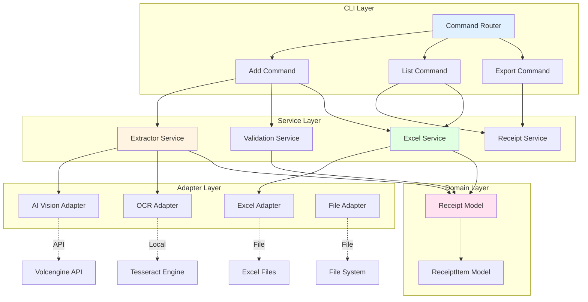

# 采购收据管理工具 - 技术架构设计

## 1. 系统架构概览

### 1.1 分层架构

```
┌─────────────────────────────────────────────────────────────┐
│                    Presentation Layer                       │
│  ┌──────────────────┐  ┌──────────────────┐  ┌────────────┐ │
│  │   CLI Interface  │  │ Interactive UI   │  │   API      │ │
│  │   (Click)        │  │   (Rich/Prompt)  │  │ (Future)   │ │
│  └──────────────────┘  └──────────────────┘  └────────────┘ │
└─────────────────────────────────────────────────────────────┘
                              │
                              ▼
┌─────────────────────────────────────────────────────────────┐
│                    Application Layer                        │
│  ┌──────────────┐  ┌──────────────┐  ┌──────────────────┐  │
│  │  Commands    │  │   Services   │  │  Workflows       │  │
│  │  - Add       │  │  - Receipt   │  │  - Recognition   │  │
│  │  - List      │  │  - Extractor │  │  - Validation    │  │
│  │  - Export    │  │  - Validator │  │  - Export        │  │
│  └──────────────┘  └──────────────┘  └──────────────────┘  │
└─────────────────────────────────────────────────────────────┘
                              │
                              ▼
┌─────────────────────────────────────────────────────────────┐
│                      Domain Layer                            │
│  ┌──────────────┐  ┌──────────────┐  ┌──────────────────┐  │
│  │  Models      │  │  Value Obj.  │  │  Domain Events   │  │
│  │  - Receipt   │  │  - Money     │  │  - ReceiptAdded  │  │
│  │  - Item      │  │  - DateRange │  │  - ReceiptVerified│ │
│  └──────────────┘  └──────────────┘  └──────────────────┘  │
└─────────────────────────────────────────────────────────────┘
                              │
                              ▼
┌─────────────────────────────────────────────────────────────┐
│                   Infrastructure Layer                      │
│  ┌──────────────┐  ┌──────────────┐  ┌──────────────────┐  │
│  │  Adapters    │  │   External   │  │   Utilities      │  │
│  │  - AI Vision │  │  - Volcengine│  │  - Logging      │  │
│  │  - OCR       │  │  - Tesseract │  │  - Config        │  │
│  │  - Excel     │  │  - File Sys  │  │  - File Handler  │  │
│  └──────────────┘  └──────────────┘  └──────────────────┘  │
└─────────────────────────────────────────────────────────────┘
```

### 1.2 核心组件关系



---

## 2. 模块详细设计

### 2.1 CLI Module

#### 2.1.1 目录结构

```
cli/
├── __init__.py
├── main.py                 # CLI入口
├── commands/               # 命令实现
│   ├── __init__.py
│   ├── base.py            # 基础命令类
│   ├── add.py             # 添加收据命令
│   ├── list.py            # 列出记录命令
│   ├── export.py          # 导出数据命令
│   ├── init.py            # 初始化命令
│   └── validate.py        # 验证命令
├── ui/                    # 用户界面
│   ├── __init__.py
│   ├── interactive.py     # 交互式界面
│   ├── forms.py           # 表单组件
│   └── display.py         # 显示组件
└── progress.py            # 进度显示
```

#### 2.1.2 核心代码示例

```python
# cli/main.py
import click
from pathlib import Path
from typing import Optional
from rich.console import Console
from rich.table import Table

from .commands.add import add_command
from .commands.list import list_command
from .commands.export import export_command
from .commands.init import init_command

console = Console()

@click.group()
@click.version_option(version="1.0.0")
@click.option(
    "--config",
    "-c",
    type=click.Path(exists=True),
    help="配置文件路径"
)
@click.option(
    "--verbose", "-v",
    is_flag=True,
    help="详细输出"
)
@click.pass_context
def cli(ctx: click.Context, config: Optional[str], verbose: bool):
    """采购收据管理工具 - 智能识别和管理您的采购收据"""
    ctx.ensure_object(dict)
    ctx.obj["config_path"] = config
    ctx.obj["verbose"] = verbose

    # 加载配置
    from ..utils.config import load_config
    ctx.obj["config"] = load_config(config)

cli.add_command(add_command)
cli.add_command(list_command)
cli.add_command(export_command)
cli.add_command(init_command)

if __name__ == "__main__":
    cli(obj={})


# cli/commands/add.py
import click
from pathlib import Path
from typing import Optional

from ..ui.display import display_receipt, display_progress
from ..ui.interactive import prompt_for_manual_input
from ...core.extractor import ExtractorService
from ...core.validator import ValidationService
from ...excel.manager import ExcelManager
from ...utils.logger import get_logger

logger = get_logger(__name__)

@click.command()
@click.argument(
    "input",
    type=click.Path(exists=True),
    required=False
)
@click.option(
    "--text",
    "-t",
    is_flag=True,
    help="文本输入模式"
)
@click.option(
    "--date",
    "-d",
    type=str,
    help="收据日期 (YYYY-MM-DD)"
)
@click.option(
    "--category",
    "-c",
    type=str,
    help="收据分类"
)
@click.option(
    "--batch",
    "-b",
    is_flag=True,
    help="批量处理模式"
)
@click.option(
    "--no-ai",
    is_flag=True,
    help="跳过AI识别，手动输入"
)
@click.option(
    "--interactive",
    "-i",
    is_flag=True,
    help="交互式模式"
)
@click.pass_context
def add_command(
    ctx: click.Context,
    input: Optional[str],
    text: bool,
    date: Optional[str],
    category: Optional[str],
    batch: bool,
    no_ai: bool,
    interactive: bool
):
    """添加采购收据"""
    config = ctx.obj["config"]

    if interactive:
        _interactive_add(config)
    elif text:
        _text_add(input, config, date, category)
    elif input:
        if batch:
            _batch_add(input, config, no_ai, date, category)
        else:
            _single_add(input, config, no_ai, date, category)
    else:
        raise click.BadArgumentUsage("必须指定输入文件或使用--text/--interactive")

def _single_add(
    file_path: str,
    config,
    no_ai: bool,
    date: Optional[str],
    category: Optional[str]
):
    """添加单个收据"""
    extractor = ExtractorService(config.ai, config.ocr)
    validator = ValidationService(config.validation)
    excel_mgr = ExcelManager(config.excel)

    try:
        with display_progress("正在处理收据"):
            if no_ai:
                receipt = prompt_for_manual_input(file_path, date, category)
            else:
                receipt = extractor.extract_from_image(
                    Path(file_path),
                    date_hint=date,
                    category_hint=category
                )

        # 验证
        is_valid, errors = validator.validate(receipt)
        if not is_valid:
            console.print("[red]验证失败:[/red]")
            for error in errors:
                console.print(f"  - {error}")
            raise click.Abort()

        # 显示结果
        display_receipt(receipt)

        # 确认
        if not click.confirm("确认保存?"):
            console.print("[yellow]已取消[/yellow]")
            return

        # 保存到Excel
        with display_progress("正在保存到Excel"):
            excel_mgr.add_receipt(receipt)

        console.print(f"[green]收据已保存到: {receipt.sheet_name}[/green]")

    except Exception as e:
        logger.exception("添加收据失败")
        console.print(f"[red]错误: {e}[/red]")
        raise click.Abort()
```

### 2.2 Core Module

#### 2.2.1 目录结构

```
core/
├── __init__.py
├── models.py               # 数据模型
├── extractor.py            # 信息提取服务
├── validator.py            # 数据验证服务
├── aggregator.py           # 数据聚合服务
└── events.py               # 领域事件
```

#### 2.2.2 Extractor Service

```python
# core/extractor.py
import asyncio
from pathlib import Path
from typing import Optional
from datetime import date
from loguru import logger

from .models import Receipt, RecognitionRequest, AIRecognitionResult
from ..ai.vision_client import VisionClient
from ..ai.ocr_engine import OCREngine
from ..utils.config import AIConfig, OCRConfig


class ExtractorService:
    """信息提取服务"""

    def __init__(self, ai_config: AIConfig, ocr_config: OCRConfig):
        self.ai_config = ai_config
        self.ocr_config = ocr_config
        self.vision_client = VisionClient(ai_config) if ai_config.enabled else None
        self.ocr_engine = OCREngine(ocr_config) if ocr_config.enabled else None

    async def extract_from_image_async(
        self,
        image_path: Path,
        date_hint: Optional[str] = None,
        merchant_hint: Optional[str] = None,
        category_hint: Optional[str] = None
    ) -> Receipt:
        """异步从图片提取收据信息"""

        # 1. 尝试AI视觉识别
        if self.vision_client:
            logger.info(f"尝试AI视觉识别: {image_path}")
            result = await self.vision_client.recognize_receipt(
                image_path,
                date_hint=date_hint,
                merchant_hint=merchant_hint,
                category_hint=category_hint
            )

            if result.is_reliable:
                logger.info(f"AI识别成功 (置信度: {result.confidence:.2f})")
                return result.receipt

            elif result.needs_verification:
                logger.warning(
                    f"AI识别置信度较低 ({result.confidence:.2f})，"
                    "需要人工验证"
                )
                # TODO: 调用人工验证流程
                return result.receipt

        # 2. 回退到OCR识别
        if self.ocr_engine:
            logger.info(f"回退到OCR识别: {image_path}")
            result = await self.ocr_engine.recognize_receipt(image_path)
            if result.success:
                return result.receipt

        # 3. 完全失败，抛出异常
        raise ExtractionError(
            "无法从图片中提取收据信息，请手动输入"
        )

    def extract_from_image(
        self,
        image_path: Path,
        date_hint: Optional[str] = None,
        merchant_hint: Optional[str] = None,
        category_hint: Optional[str] = None
    ) -> Receipt:
        """同步包装器"""
        return asyncio.run(self.extract_from_image_async(
            image_path, date_hint, merchant_hint, category_hint
        ))

    def extract_from_text(
        self,
        text: str,
        date_hint: Optional[str] = None,
        category_hint: Optional[str] = None
    ) -> Receipt:
        """从文本描述提取收据信息"""
        # TODO: 实现文本解析逻辑
        pass


class ExtractionError(Exception):
    """提取错误"""
    pass
```

#### 2.2.3 Validator Service

```python
# core/validator.py
from typing import List, Tuple
from loguru import logger

from .models import Receipt
from ..utils.config import ValidationConfig


class ValidationService:
    """数据验证服务"""

    def __init__(self, config: ValidationConfig):
        self.config = config

    def validate(self, receipt: Receipt) -> Tuple[bool, List[str]]:
        """验证收据"""
        errors = []

        # 1. 验证必填字段
        for field in self.config.required_fields:
            if not hasattr(receipt, field) or getattr(receipt, field) is None:
                errors.append(f"必填字段缺失: {field}")

        # 2. 验证商家名称
        if not receipt.merchant or not receipt.merchant.strip():
            errors.append("商家名称不能为空")

        # 3. 验证日期
        if receipt.date > date.today():
            errors.append("收据日期不能是未来日期")

        # 4. 验证金额
        if receipt.total <= 0:
            errors.append("总金额必须大于0")

        if not self.config.allow_negative_amount:
            if any(item.quantity <= 0 for item in receipt.items):
                errors.append("商品数量必须大于0")
            if any(item.unit_price < 0 for item in receipt.items):
                errors.append("商品单价不能为负数")

        # 5. 验证金额一致性
        if self.config.strict_amount_validation:
            calculated_total = (
                receipt.subtotal + receipt.tax - receipt.discount
            )
            if abs(calculated_total - receipt.total) > 0.01:
                errors.append(
                    f"金额不一致: 计算值({calculated_total:.2f}) != "
                    f"总计({receipt.total:.2f})"
                )

            items_total = sum(item.total_price for item in receipt.items)
            if abs(items_total - receipt.subtotal) > 0.01:
                errors.append(
                    f"商品小计不一致: 计算值({items_total:.2f}) != "
                    f"小计({receipt.subtotal:.2f})"
                )

        # 6. 验证商品列表
        if not receipt.items:
            errors.append("商品列表不能为空")

        is_valid = len(errors) == 0

        if is_valid:
            logger.info(f"收据验证通过: {receipt.receipt_id}")
        else:
            logger.warning(f"收据验证失败: {receipt.receipt_id}")
            for error in errors:
                logger.warning(f"  - {error}")

        return is_valid, errors

    def validate_batch(self, receipts: List[Receipt]) -> Tuple[int, List[Tuple[Receipt, List[str]]]]:
        """批量验证"""
        valid_count = 0
        invalid_receipts = []

        for receipt in receipts:
            is_valid, errors = self.validate(receipt)
            if is_valid:
                valid_count += 1
            else:
                invalid_receipts.append((receipt, errors))

        return valid_count, invalid_receipts
```

### 2.3 AI Module

#### 2.3.1 目录结构

```
ai/
├── __init__.py
├── vision_client.py         # 视觉大模型客户端
├── ocr_engine.py            # OCR引擎
├── prompts.py               # Prompt模板
└── image_utils.py           # 图像处理工具
```

#### 2.3.2 Vision Client

```python
# ai/vision_client.py
import asyncio
import os
import io
from pathlib import Path
from typing import Optional
from datetime import datetime
from loguru import logger

try:
    from volcenginesdkarkruntime import AsyncArk
except ImportError:
    AsyncArk = None

from ..core.models import Receipt, AIRecognitionResult, RecognitionMethod
from .prompts import RECEIPT_RECOGNITION_PROMPT
from ..utils.config import AIConfig


class FileWithProgress(io.IOBase):
    """带进度显示的文件包装类"""
    # (复用demo.py中的实现)
    pass


class VisionClient:
    """视觉大模型客户端"""

    def __init__(self, config: AIConfig):
        if AsyncArk is None:
            raise ImportError("volcenginesdkarkruntime 未安装")

        self.config = config
        self.client = AsyncArk(
            base_url="https://ark.cn-beijing.volces.com/api/v3",
            api_key=config.api_key or os.getenv("ARK_API_KEY"),
        )

    async def recognize_receipt(
        self,
        image_path: Path,
        date_hint: Optional[str] = None,
        merchant_hint: Optional[str] = None,
        category_hint: Optional[str] = None
    ) -> AIRecognitionResult:
        """识别收据图片"""
        start_time = datetime.now()

        try:
            # 1. 上传图片
            logger.info(f"上传图片: {image_path}")
            with FileWithProgress(str(image_path)) as f:
                file = await self.client.files.create(
                    file=f,
                    purpose="user_data",
                )

            logger.info(f"文件上传成功: {file.id}")

            # 2. 等待处理
            logger.info("等待文件处理...")
            await self.client.files.wait_for_processing(file.id)
            logger.info("文件处理完成")

            # 3. 构建Prompt
            prompt = self._build_prompt(
                date_hint=date_hint,
                merchant_hint=merchant_hint,
                category_hint=category_hint
            )

            # 4. 调用模型识别
            logger.info("调用模型识别...")
            response = await self.client.responses.create(
                model=self.config.model,
                input=[
                    {
                        "role": "user",
                        "content": [
                            {
                                "type": "input_image",
                                "file_id": file.id,
                            },
                            {
                                "type": "input_text",
                                "text": prompt,
                            },
                        ],
                    },
                ],
            )

            # 5. 解析响应
            logger.info("解析识别结果...")
            receipt, confidence = self._parse_response(response)

            # 设置元数据
            receipt.metadata.recognition_method = RecognitionMethod.AI_VISION
            receipt.metadata.recognition_confidence = confidence
            receipt.metadata.recognized_at = datetime.now().isoformat()
            receipt.metadata.original_file_path = str(image_path)

            processing_time = (datetime.now() - start_time).total_seconds()

            logger.info(
                f"识别完成: 置信度={confidence:.2f}, "
                f"耗时={processing_time:.2f}秒"
            )

            return AIRecognitionResult(
                success=True,
                confidence=confidence,
                receipt=receipt,
                raw_response=str(response),
                processing_time=processing_time,
            )

        except Exception as e:
            logger.exception("AI识别失败")
            processing_time = (datetime.now() - start_time).total_seconds()

            return AIRecognitionResult(
                success=False,
                confidence=0.0,
                errors=[str(e)],
                processing_time=processing_time,
            )

    def _build_prompt(
        self,
        date_hint: Optional[str] = None,
        merchant_hint: Optional[str] = None,
        category_hint: Optional[str] = None
    ) -> str:
        """构建识别Prompt"""
        prompt = RECEIPT_RECOGNITION_PROMPT

        if date_hint:
            prompt += f"\n\n提示: 收据日期是 {date_hint}"
        if merchant_hint:
            prompt += f"\n\n提示: 商家名称可能包含 '{merchant_hint}'"
        if category_hint:
            prompt += f"\n\n提示: 收据分类为 {category_hint}"

        return prompt

    def _parse_response(self, response) -> tuple[Receipt, float]:
        """解析模型响应"""
        import json
        import re
        from decimal import Decimal
        from datetime import date

        response_text = response.output_text if hasattr(response, "output_text") else str(response)

        # 提取JSON部分
        json_match = re.search(r'\{[\s\S]*\}', response_text)
        if not json_match:
            raise ValueError("响应中未找到JSON数据")

        data = json.loads(json_match.group())

        # 解析置信度
        confidence = data.get("confidence", 0.8)

        # 解析收据数据
        receipt = Receipt(
            receipt_id=data.get("receipt_id", f"R{datetime.now().strftime('%Y%m%d%H%M%S')}"),
            date=date.fromisoformat(data.get("date", date.today().isoformat())),
            merchant=data.get("merchant", ""),
            merchant_address=data.get("merchant_address"),
            merchant_phone=data.get("merchant_phone"),
            subtotal=Decimal(str(data.get("subtotal", 0))),
            tax=Decimal(str(data.get("tax", 0))),
            discount=Decimal(str(data.get("discount", 0))),
            total=Decimal(str(data.get("total", 0))),
            payment_method=data.get("payment_method"),
            transaction_id=data.get("transaction_id"),
            category=data.get("category"),
        )

        # 解析商品列表
        items = data.get("items", [])
        receipt.items = [
            ReceiptItem(
                name=item.get("name", ""),
                quantity=Decimal(str(item.get("quantity", 1))),
                unit_price=Decimal(str(item.get("unit_price", 0))),
                total_price=Decimal(str(item.get("total_price", 0))),
                category=item.get("category"),
                sku=item.get("sku"),
            )
            for item in items
        ]

        return receipt, confidence
```

#### 2.3.3 Prompt Template

```python
# ai/prompts.py

RECEIPT_RECOGNITION_PROMPT = """请仔细分析这张收据图片，提取出所有关键信息，以JSON格式输出。

请提取以下信息:

1. 基本信息:
   - receipt_id: 生成唯一ID (格式: R + YYYYMMDDHHmmss)
   - date: 收据日期 (YYYY-MM-DD格式)
   - merchant: 商家名称
   - merchant_address: 商家地址 (如果有)
   - merchant_phone: 商家电话 (如果有)

2. 金额信息:
   - subtotal: 商品小计 (数字)
   - tax: 税额 (数字，如果没有则为0)
   - discount: 折扣金额 (数字，如果没有则为0)
   - total: 总计金额 (数字)

3. 商品清单 (items数组):
   每个商品包含:
   - name: 商品名称
   - quantity: 数量 (数字)
   - unit_price: 单价 (数字)
   - total_price: 小计 (数字)
   - category: 商品分类 (如果可以识别)
   - sku: 商品编码 (如果有)

4. 支付信息:
   - payment_method: 支付方式 (现金/微信/支付宝/刷卡等)
   - transaction_id: 交易编号 (如果有)

5. 其他信息:
   - category: 收据分类 (办公用品/餐饮/交通/日用品/其他)
   - confidence: 识别置信度 (0-1之间的数字，表示识别的可靠程度)

输出格式示例:
```json
{
  "receipt_id": "R20250120153045",
  "date": "2025-01-20",
  "merchant": "永辉超市",
  "merchant_address": "北京市朝阳区xx路xx号",
  "merchant_phone": null,
  "subtotal": 145.50,
  "tax": 0.00,
  "discount": 0.00,
  "total": 145.50,
  "items": [
    {
      "name": "特仑苏牛奶",
      "quantity": 2,
      "unit_price": 12.50,
      "total_price": 25.00,
      "category": "食品",
      "sku": null
    },
    {
      "name": "全麦面包",
      "quantity": 5,
      "unit_price": 8.00,
      "total_price": 40.00,
      "category": "食品",
      "sku": null
    }
  ],
  "payment_method": "微信支付",
  "transaction_id": null,
  "category": "日用品",
  "confidence": 0.95
}
```

注意事项:
1. 如果某些信息无法识别，请填入null
2. 确保金额数值准确，注意小数点位置
3. 商品清单要完整，不要遗漏
4. confidence值根据图片清晰度和识别准确度给出
5. 只输出JSON，不要有其他说明文字
"""
```

### 2.4 Excel Module

#### 2.4.1 目录结构

```
excel/
├── __init__.py
├── manager.py               # Excel管理器
├── formatter.py             # 格式化工具
├── template.py              # 模板管理
└── styles.py                # 样式定义
```

#### 2.4.2 Excel Manager

```python
# excel/manager.py
from pathlib import Path
from typing import List, Optional
from datetime import date
from openpyxl import Workbook, load_workbook
from openpyxl.utils import get_column_letter
from loguru import logger

from ..core.models import Receipt
from ..utils.config import ExcelConfig
from .formatter import CellFormatter
from .template import TemplateManager


class ExcelManager:
    """Excel文件管理器"""

    def __init__(self, config: ExcelConfig):
        self.config = config
        self.formatter = CellFormatter()
        self.template_mgr = TemplateManager(config.template_path)
        self._workbook = None
        self._file_path = config.file_path.expanduser()

    def _load_workbook(self) -> Workbook:
        """加载工作簿"""
        if self._workbook is None:
            if self._file_path.exists():
                logger.info(f"加载Excel文件: {self._file_path}")
                self._workbook = load_workbook(self._file_path)
            else:
                logger.info(f"创建新的Excel文件: {self._file_path}")
                self._workbook = Workbook()
                self._initialize_workbook()
        return self._workbook

    def _initialize_workbook(self):
        """初始化工作簿"""
        # 删除默认Sheet
        if "Sheet" in self._workbook.sheetnames:
            self._workbook.remove(self._workbook["Sheet"])

        # 创建概览Sheet
        self._create_overview_sheet()

    def add_receipt(self, receipt: Receipt) -> None:
        """添加收据到Excel"""
        wb = self._load_workbook()
        sheet_name = receipt.sheet_name

        # 检查Sheet是否存在
        if sheet_name in wb.sheetnames:
            logger.info(f"更新Sheet: {sheet_name}")
            self._update_receipt_sheet(wb[sheet_name], receipt)
        else:
            logger.info(f"创建Sheet: {sheet_name}")
            self._create_receipt_sheet(wb, receipt)

        # 更新概览
        self._update_overview()

        # 保存文件
        self._save()

    def _create_receipt_sheet(self, wb: Workbook, receipt: Receipt):
        """创建收据Sheet"""
        ws = wb.create_sheet(title=receipt.sheet_name)

        # 1. 基础信息区 (1-10行)
        self._write_basic_info(ws, receipt)

        # 2. 商品明细区 (11行起)
        self._write_items_table(ws, receipt)

        # 3. 汇总信息区
        self._write_summary(ws, receipt)

        # 4. 应用格式
        self._apply_sheet_format(ws, receipt)

    def _write_basic_info(self, ws, receipt: Receipt):
        """写入基础信息"""
        # 标题
        ws.merge_cells("A1:F1")
        ws["A1"] = "收据信息"
        self.formatter.apply_header_style(ws["A1"])

        # 基本信息
        info_data = [
            (2, "A", "收据编号:", "B", str(receipt.receipt_id)),
            (3, "A", "收据日期:", "B", receipt.date.isoformat()),
            (4, "A", "商家名称:", "B", receipt.merchant),
            (5, "A", "商家地址:", "B", receipt.merchant_address or ""),
            (6, "A", "商家电话:", "B", receipt.merchant_phone or ""),
            (7, "A", "收据分类:", "B", receipt.category or ""),
            (8, "A", "项目归属:", "B", receipt.project or ""),
            (9, "A", "部门归属:", "B", receipt.department or ""),
            (10, "A", "备注:", "B", receipt.metadata.notes or ""),
        ]

        for row, label_col, label, value_col, value in info_data:
            ws[f"{label_col}{row}"] = label
            ws[f"{value_col}{row}"] = value
            self.formatter.apply_label_style(ws[f"{label_col}{row}"])
            self.formatter.apply_value_style(ws[f"{value_col}{row}"])

    def _write_items_table(self, ws, receipt: Receipt):
        """写入商品明细表"""
        start_row = 11

        # 表头
        ws.merge_cells(f"A{start_row}:H{start_row}")
        ws[f"A{start_row}"] = "商品明细"
        self.formatter.apply_header_style(ws[f"A{start_row}"])

        # 列标题
        headers = ["序号", "商品名称", "商品分类", "规格/SKU",
                   "数量", "单价", "小计", "备注"]
        for col, header in enumerate(headers, 1):
            cell = ws.cell(row=start_row + 1, column=col, value=header)
            self.formatter.apply_table_header_style(cell)

        # 数据行
        for i, item in enumerate(receipt.items, start_row + 2):
            ws.cell(row=i, column=1, value=i - start_row - 1)  # 序号
            ws.cell(row=i, column=2, value=item.name)
            ws.cell(row=i, column=3, value=item.category or "")
            ws.cell(row=i, column=4, value=item.sku or "")
            ws.cell(row=i, column=5, value=float(item.quantity))
            ws.cell(row=i, column=6, value=float(item.unit_price))
            ws.cell(row=i, column=7, value=float(item.total_price))
            ws.cell(row=i, column=8, value=item.description or "")

            # 应用金额格式
            self.formatter.apply_amount_style(ws.cell(row=i, column=6))
            self.formatter.apply_amount_style(ws.cell(row=i, column=7))

    def _write_summary(self, ws, receipt: Receipt):
        """写入汇总信息"""
        items_end_row = 11 + 1 + len(receipt.items) + 1
        summary_start = items_end_row + 2

        # 金额汇总
        ws.merge_cells(f"A{summary_start}:F{summary_start}")
        ws[f"A{summary_start}"] = "金额汇总"
        self.formatter.apply_header_style(ws[f"A{summary_start}"])

        summary_data = [
            (summary_start + 1, "商品小计:", float(receipt.subtotal)),
            (summary_start + 2, "税额:", float(receipt.tax)),
            (summary_start + 3, "折扣:", float(receipt.discount)),
            (summary_start + 4, "总计:", float(receipt.total)),
        ]

        for row, label, value in summary_data:
            ws[f"A{row}"] = label
            ws[f"B{row}"] = value
            self.formatter.apply_label_style(ws[f"A{row}"])
            if "总计" in label:
                self.formatter.apply_total_style(ws[f"B{row}"])
            else:
                self.formatter.apply_amount_style(ws[f"B{row}"])

        # 调整列宽
        for col in range(1, 9):
            ws.column_dimensions[get_column_letter(col)].width = 15

    def _apply_sheet_format(self, ws, receipt: Receipt):
        """应用Sheet格式"""
        # 设置行高
        for row in range(1, 12):
            ws.row_dimensions[row].height = 20

        # 设置边框
        # TODO: 应用边框样式

    def _create_overview_sheet(self):
        """创建概览Sheet"""
        wb = self._workbook
        ws = wb.create_sheet(title="概览", index=0)

        # 标题
        ws["A1"] = "采购收据概览"
        self.formatter.apply_header_style(ws["A1"])

        # 统计汇总区域
        ws["A3"] = "统计汇总"
        self.formatter.apply_header_style(ws["A3"])

        # 最近记录区域
        ws["A10"] = "最近记录"
        self.formatter.apply_header_style(ws["A10"])

    def _update_overview(self):
        """更新概览Sheet"""
        # TODO: 实现概览更新逻辑
        pass

    def _save(self):
        """保存Excel文件"""
        self._file_path.parent.mkdir(parents=True, exist_ok=True)
        self._workbook.save(self._file_path)
        logger.info(f"Excel文件已保存: {self._file_path}")

    def sheet_exists(self, sheet_name: str) -> bool:
        """检查Sheet是否存在"""
        wb = self._load_workbook()
        return sheet_name in wb.sheetnames

    def get_all_receipts(self) -> List[Receipt]:
        """获取所有收据"""
        # TODO: 从Excel读取收据数据
        pass
```

### 2.5 Utils Module

#### 2.5.1 目录结构

```
utils/
├── __init__.py
├── config.py                # 配置管理
├── logger.py                # 日志工具
├── file_handler.py          # 文件处理
└── validators.py            # 通用验证器
```

#### 2.5.2 Config Management

```python
# utils/config.py
import os
from pathlib import Path
from typing import Optional
import yaml
from pydantic import BaseModel

from ..core.models import AppConfig


DEFAULT_CONFIG_PATH = Path("~/.config/receipt-manager/config.yaml").expanduser()


def load_config(config_path: Optional[str] = None) -> AppConfig:
    """加载配置"""
    path = Path(config_path) if config_path else DEFAULT_CONFIG_PATH

    if path.exists():
        with open(path, "r", encoding="utf-8") as f:
            data = yaml.safe_load(f)
        return AppConfig(**data)
    else:
        # 返回默认配置
        return AppConfig()


def save_config(config: AppConfig, config_path: Optional[str] = None) -> None:
    """保存配置"""
    path = Path(config_path) if config_path else DEFAULT_CONFIG_PATH
    path.parent.mkdir(parents=True, exist_ok=True)

    with open(path, "w", encoding="utf-8") as f:
        yaml.dump(
            config.model_dump(mode="python"),
            f,
            allow_unicode=True,
            default_flow_style=False,
        )


def init_config(config_path: Optional[str] = None) -> AppConfig:
    """初始化配置"""
    config = AppConfig()
    save_config(config, config_path)
    return config
```

#### 2.5.3 Logger

```python
# utils/logger.py
import sys
from loguru import logger
from pathlib import Path


def setup_logger(
    log_file: Optional[Path] = None,
    level: str = "INFO",
    rotation: str = "10 MB",
    retention: str = "7 days"
):
    """配置日志系统"""
    logger.remove()

    # 控制台输出
    logger.add(
        sys.stderr,
        format="<green>{time:YYYY-MM-DD HH:mm:ss}</green> | "
               "<level>{level: <8}</level> | "
               "<cyan>{name}</cyan>:<cyan>{function}</cyan>:<cyan>{line}</cyan> | "
               "<level>{message}</level>",
        level=level,
        colorize=True,
    )

    # 文件输出
    if log_file:
        log_file.parent.mkdir(parents=True, exist_ok=True)
        logger.add(
            log_file,
            format="{time:YYYY-MM-DD HH:mm:ss} | "
                   "{level: <8} | "
                   "{name}:{function}:{line} | "
                   "{message}",
            level=level,
            rotation=rotation,
            retention=retention,
            compression="zip",
        )


def get_logger(name: str):
    """获取logger实例"""
    return logger.bind(name=name)
```

---

## 3. 与现有代码集成

### 3.1 复用视觉大模型Demo

从 `/home/bughero/Documents/github/DeepLearning/python/llm/version/demo.py` 复用:

1. **FileWithProgress类**: 文件上传进度显示
2. **AsyncArk客户端**: API调用封装
3. **错误处理模式**: 重试和超时处理
4. **响应解析**: JSON提取和验证

### 3.2 参考MCP服务器架构

从 `/home/bughero/Documents/github/DeepLearning/python/mcp/` 参考:

1. **项目结构**: 模块化组织
2. **配置管理**: YAML配置文件
3. **日志系统**: 统一的日志格式
4. **异步处理**: asyncio模式

### 3.3 利用照片行为检测模块

从 `/home/bughero/Documents/github/DeepLearning/python/photo_behavior_detection/` 参考:

1. **图像预处理**: 降噪、增强
2. **OCR集成**: Tesseract使用
3. **Pipeline模式**: 处理流程编排
4. **模型管理**: 加载和缓存

---

## 4. 性能优化

### 4.1 异步处理

```python
# 批量处理优化
async def process_batch_async(image_paths: List[Path]) -> List[Receipt]:
    """异步批量处理"""
    tasks = [
        extractor.extract_from_image_async(path)
        for path in image_paths
    ]
    return await asyncio.gather(*tasks, return_exceptions=True)
```

### 4.2 缓存策略

```python
from functools import lru_cache
import hashlib

def cache_key(image_path: Path) -> str:
    """生成缓存键"""
    with open(image_path, "rb") as f:
        return hashlib.md5(f.read()).hexdigest()

@lru_cache(maxsize=100)
def cached_recognize(image_path: str) -> Receipt:
    """带缓存的识别"""
    return extract_from_image(Path(image_path))
```

### 4.3 进度显示

```python
from rich.progress import Progress, SpinnerColumn, TextColumn, BarColumn

def with_progress(tasks: List[Task]):
    """带进度显示的任务处理"""
    with Progress(
        SpinnerColumn(),
        TextColumn("[progress.description]{task.description}"),
        BarColumn(),
        TextColumn("[progress.percentage]{task.percentage:>3.0f}%"),
        expand=True,
    ) as progress:
        task = progress.add_task("处理收据...", total=len(tasks))

        for task_item in tasks:
            process(task_item)
            progress.advance(task)
```

---

## 5. 错误处理

### 5.1 异常层次结构

```python
class ReceiptManagerError(Exception):
    """基础异常"""
    pass

class ExtractionError(ReceiptManagerError):
    """提取错误"""
    pass

class ValidationError(ReceiptManagerError):
    """验证错误"""
    pass

class ExcelError(ReceiptManagerError):
    """Excel操作错误"""
    pass

class ConfigurationError(ReceiptManagerError):
    """配置错误"""
    pass
```

### 5.2 重试机制

```python
from tenacity import retry, stop_after_attempt, wait_exponential

@retry(
    stop=stop_after_attempt(3),
    wait=wait_exponential(multiplier=1, min=2, max=10),
    reraise=True
)
async def call_ai_with_retry(image_path: Path) -> Receipt:
    """带重试的AI调用"""
    return await vision_client.recognize_receipt(image_path)
```

---

## 6. 测试策略

### 6.1 单元测试结构

```
tests/
├── __init__.py
├── conftest.py              # 测试配置
├── test_models.py           # 模型测试
├── test_extractor.py        # 提取器测试
├── test_validator.py        # 验证器测试
├── test_excel.py            # Excel管理器测试
├── test_ai.py               # AI客户端测试
└── fixtures/                # 测试数据
    ├── sample_receipt.jpg
    ├── blurry_receipt.jpg
    └── expected_results.json
```

### 6.2 集成测试

```python
# tests/test_integration.py
import pytest
from pathlib import Path

from receipt_manager.core.extractor import ExtractorService
from receipt_manager.core.validator import ValidationService
from receipt_manager.excel.manager import ExcelManager

@pytest.mark.asyncio
async def test_full_workflow():
    """测试完整工作流"""
    # 1. 提取
    extractor = ExtractorService(ai_config, ocr_config)
    receipt = await extractor.extract_from_image_async(
        Path("tests/fixtures/sample_receipt.jpg")
    )

    # 2. 验证
    validator = ValidationService(validation_config)
    is_valid, errors = validator.validate(receipt)
    assert is_valid, f"验证失败: {errors}"

    # 3. 保存
    excel_mgr = ExcelManager(excel_config)
    excel_mgr.add_receipt(receipt)
    assert excel_mgr.sheet_exists(receipt.sheet_name)
```

---

## 7. 部署和打包

### 7.1 项目结构

```
receipt_manager/
├── receipt_manager/         # 源代码
│   ├── __init__.py
│   ├── cli/
│   ├── core/
│   ├── ai/
│   ├── excel/
│   └── utils/
├── tests/
├── docs/
├── setup.py
├── pyproject.toml
├── README.md
└── requirements.txt
```

### 7.2 setup.py

```python
from setuptools import setup, find_packages

setup(
    name="receipt-manager",
    version="1.0.0",
    packages=find_packages(),
    install_requires=[
        "click>=8.1.0",
        "pydantic>=2.0.0",
        "openpyxl>=3.1.0",
        "volcenginesdkarkruntime>=0.1.0",
        "pytesseract>=0.3.10",
        "Pillow>=10.0.0",
        "loguru>=0.7.0",
        "rich>=13.0.0",
    ],
    entry_points={
        "console_scripts": [
            "receipt-manager=receipt_manager.cli.main:cli",
        ],
    },
    python_requires=">=3.10",
)
```

---

**文档版本**: v1.0
**最后更新**: 2025-01-20
